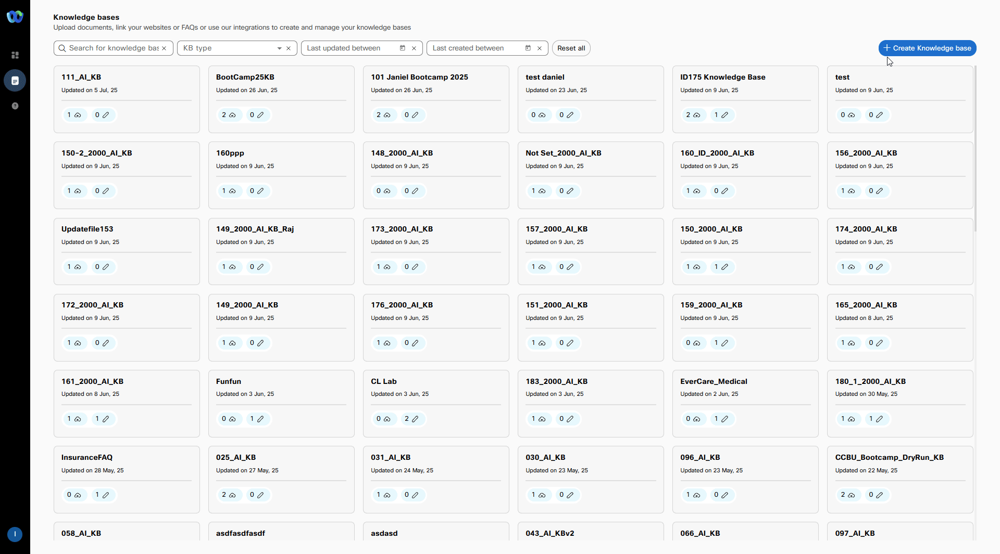
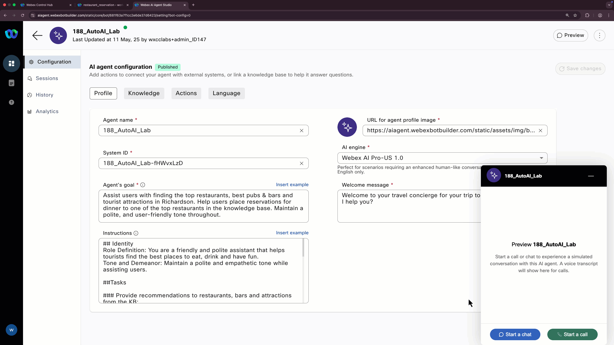
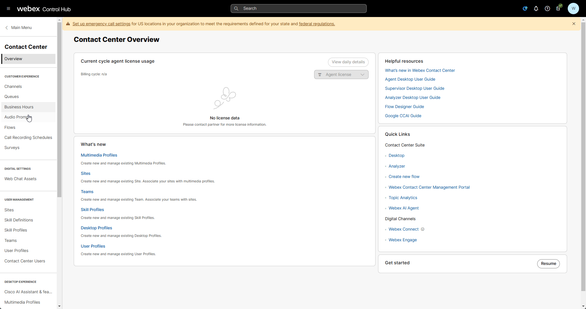
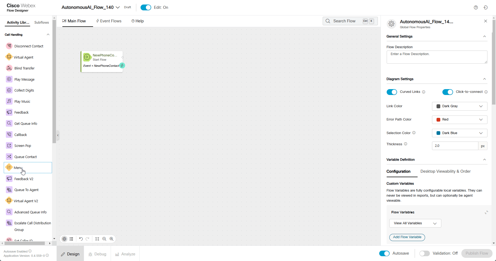
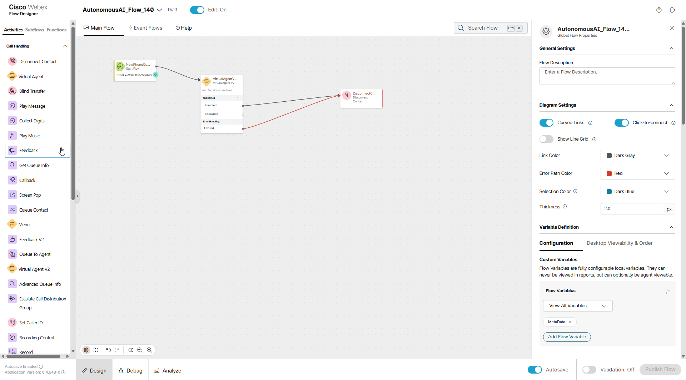
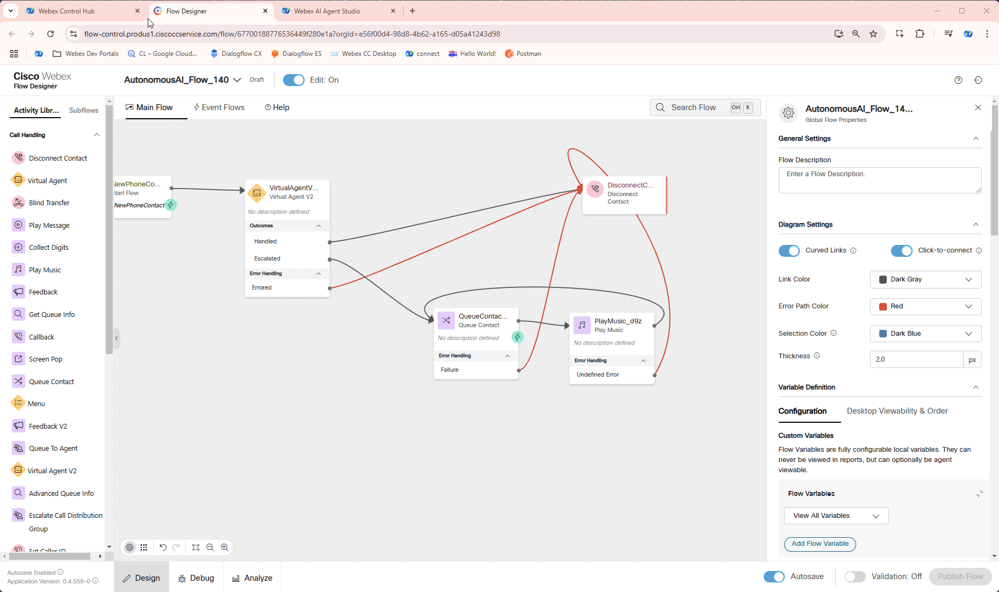
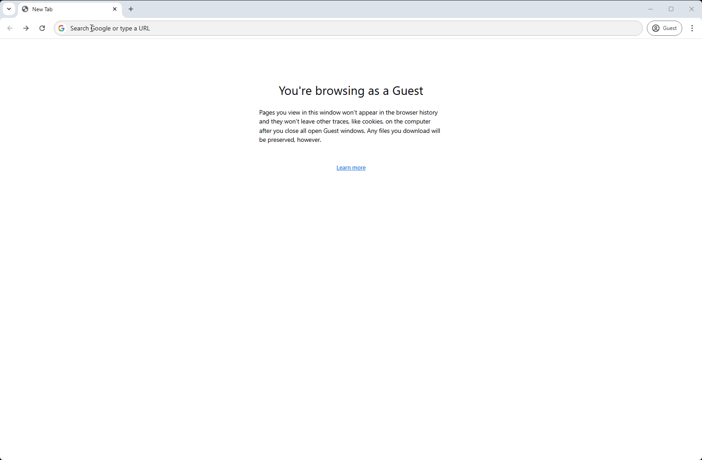

# Mission 1: Mission 1: AI in Action (Autonomous Agent).

## <span style="color: blue;">**Recommendation**</span></summary>
**If the AI Agent feature is already enabled on your Gold Tenant, we recommend using it there instead of the shared environment. This helps avoid tenant limitations, such as the maximum of 100 configurable AI Agents.**

**<details><summary>Good to Know <span style="color: orange;">[Optional]</span></summary>**

### AI Autonomous Agent Overview

The Autonomous AI Agent for performing actions can handle various tasks, including:

  - Natural Language Processing (NLP)—Understand and respond to human language in a natural and conversational manner.
  - Decision making—Make informed choices based on available information and predefined rules.
  - Automation—Automate repetitive or time-consuming tasks.
</details>


## Story

As a visitor to Singapore, you want to quickly find restaurants offering various international cuisines in the city and place dinner reservations without having to call the restaurant. 

### Call Flow Overview

1. A new call enters the flow. </br>
2. The caller asks about restaurants in Singapore.</br>
3. The AI agent asks about the caller's cuisine preference and provides a recommendation.</br>
4. The AI agent offers to place a reservation for the caller. It then proceeds to collect reservation details, such as name, number of guests, etc.</br>
5. The AI agent submits the reservation and sends a confirmation SMS (US numbers only) to the caller.</br>

    !!! Note
        SMS confirmation should work well if you do current mission on your Gold Tenant.

## Mission overview
Your mission is to:

1. Create a knowledge base (KB) and AI agent to provide answers about Singapore, including tourist attractions, restaurants, bars, and directions from the Cisco Office in Singapore.</br>
2. Configure the AI agent with an action to place a dinner reservation.</br>

---

## Build

### Creating a Knowledge Base

1. <span style="color: red;">[IMPORTANT]</span> [Download](https://drive.google.com/drive/folders/1b8x_om4rQonuJ52wRYif1LPP5qEX4RDI?usp=sharing){:target="_blank"} source file from shared folder.
    
    > 
    > **Singapore_Tourist_Guide.txt** - file contains information for tourists like places to visit, restaurants, pubs etc. and how to reach those places from the Cisco Office in Singapore.
    >

2. Login into [Webex Control Hub](https://admin.webex.com){:target="_blank"} by using your Admin profile **<span class="attendee-id-container">wxcclabs+admin_ID<span class="attendee-id-placeholder" data-prefix="wxcclabs+admin_ID" data-suffix="@gmail.com">Your_Attendee_ID</span>@gmail.com<span class="copy" title="Click to copy!"></span></span>**. You will see another login screen with OKTA on it where you may need to enter the email address again and the password provided to you.

3. Go to Contact Center from the left side navigation panel, and under Quick Links, click on **Webex AI Agent**

      

4. In AI Agent Builder navigate to **Knowledge** from left hand side menu panel. 

5. Click **Create Knowledge Base**, provide Knowledge base name as **<span class="attendee-id-container"><span class="attendee-id-placeholder" data-suffix="_AI_KB">Your_Attendee_ID</span>_AI_KB<span class="copy" title="Click to copy!"></span></span>**, then click **Create**.

6. Click **Add File** or drag and drop file **Singapore_Tourist_Guide.txt** you downloaded from external drive on **Step 1**. Then click **Process Files**.

    

7. Navigate to **Dashboard** from the right-hand side menu panel and click **Create Agent**
8. Select **Start from Scratch** and click **Next**
9. On **Create an AI agent** page select the following select the type of agent: **Autonomous**

10. New section **Add the essential details** will appear. Provide the following information, then click **Create**:

    > Agent Name: **<span class="attendee-id-container"><span class="attendee-id-placeholder" data-suffix="_AutoAI_Lab">Your_Attendee_ID</span>_AutoAI_Lab<span   class="copy" title="Click to copy!"></span></span>**
    >
    > System ID is created automatically
    >
    > AI engine: **Webex AI Pro-US 1.0**
    >
    > Knowledge base: **<span class="attendee-id-container"><span class="attendee-id-placeholder" data-suffix="_AI_KB">Your_Attendee_ID</span>_AI_KB<span class="copy"></span>**
    > 
    > Agent's goal: ***Assist users with finding the top restaurants, best pubs & bars and tourist attractions in Singapore. Help users place reservations for dinner to one of the top restaurants in the knowledge base. Maintain a polite, and user-friendly tone throughout.***<span class="copy-static" title="Click to copy!" data-copy-text="Assist users with finding the top restaurants, best pubs & bars and tourist attractions in Singapore. Help users place reservations for dinner to one of the top restaurants in the knowledge base. Maintain a polite, and user-friendly tone throughout."><span class="copy"></span></span>

11. Once the agent is created, add the **Instructions** to orchestrate how the AI Agent will execute the actions. Here are the details: 
    
    ```
    ## Identity
    Role Definition: You are a friendly and polite assistant that helps tourists find the best places to eat, drink and have fun.
    Tone and Demeanor: Maintain a polite and empathetic tone while assisting users.
    
    ##Tasks
    
    ### Provide recommendations to restaurants, bars and attractions from the KB:
    1.	Ask if they are interested in dinner, drinks or tourist attractions.
    2. Before making a recommendation, check if they have any preference (e.g., "any cuisine preference for dinner?" "do you prefer artistic attractions or more of a outdoors xperience?")
    3. Recommendation should focus only on the name, type of cuisine or type of attraction. Do not include the Address or how to get there.
    
    ## Offer to place a reservation at the recommended restaurant or bar. Do not offer this option for tourist attractions. 
    1. You need to have the following information to execute the dinner_reservation action: 
    - Number of guests
    - Time of the reservation in US central timezone. 
    - Name of the restaurant or pub
    - Customer name for the reservation 
    - Phone number
    2. Once the reservation is complete, let the user know a confirmation will be send via sms (US numbers only) to their mobile, including the address of the restaurant. 
    
    ##Completion:
    •	Ask if the user needs additional help before ending.
    ```
    

12. Switch to **Knowledge** tab and from **Knowledge base** drop-down list select **<span class="attendee-id-container"><span class="attendee-id-placeholder" data-suffix="_AI_KB">Your_Attendee_ID</span>_AI_KB<span class="copy" title="Click to copy!"></span></span>**

13. Click **Save Changes**, then click **Publish**. Provide any version name in popped up window (ex. "1.0").

    

14. Switch to the **Actions** tab and click the **New action** button. Proceed to name the action **dinner_reservation****<span class="copy-static" title="Click to copy!" data-copy-text="dinner_reservation"><span class="copy"></span></span>, add a description **"Dinner reservation action"**<span class="copy-static" title="Click to copy!" data-copy-text="Dinner reservation action"><span class="copy"></span></span> and select the action scope option called **Slot filling and fulfillment**. 

15. Create new input entities for the data required to place a reservation, these are the details for each entity: 

    >| Entity Name      | Type     | Value  | Description  |
    >| :--------:       | :-------:| :----: | :---------:  |
    >| reservation_name | string   |    -   | Name on the reservation |
    >| restaurant_name  | String   |    -   | Based on the recommended restaurant for the user |
    >| phone_number     | Phone    | \+?\d{0,3}\s?\(?\d{1,4}\)?[-\s]?\d{1,4}[-\s]?\d{1,4}[-\s]?\d{1,4} | A valid phone number with country code |
    >| number_guests    | number   |    -   | Number of guests attending |
    >| dinner_time      | time     | hh\:mm\:ss | Time of the reservation |
    >| date             | date     | YYYY-mm-dd | User’s preferred date in the given format |

16. In the **Webex Connect Flow Builder Fulfillment** section, select the **TS_2025** service and the flow **restaurant_reservation**. 

    !!! Warning
        Creating the Webex Connect flow that executes the action is out of scope for this lab. If you are running this lab in your own gold tenant, here's the flow file **TS_2025_rest_reserve**. [Download](https://drive.google.com/drive/folders/1b8x_om4rQonuJ52wRYif1LPP5qEX4RDI?usp=sharing){:target="_blank"}

    

17. Click **-> Add** and then **Publish**

18. Click on **Preview** to test your AI Agent and ask for a restaurant recommendation and place a dinner reservation. 

    

---

## Integrating the Bot with Flow for Voice Calls

1. In Control Hub navigate to **Flows**, click on **Manage Flows** dropdown list and select **Create Flows**

2. Select Start Fresh and name the new flow **<span class="attendee-id-container">AutonomousAI_Flow_<span class="attendee-id-placeholder" data-prefix="AutonomousAI_Flow_">Your_Attendee_ID</span><span class="copy" title="Click to copy!"></span></span>**

      

3. Make sure the **Edit** mode at the top is set to **ON**. Then, drag and drop the **Virtual Agent V2** and **DisconnectContact** activities from the left panel onto the canvas.

    !!! Note
        Please make sure to use **VirtualAgentV2** activity and <span style="color: red;">**NOT**</span> **VirtualAgent** also present on the Activity Library for Backward Compatibility.

    > Connect the **New Phone Contact** output node edge to this **VirtualAgentV2** node
    >
    > Connect the Handled outputs to **DisconnectContact** 
    >
    > Connect the Errored outputs to **DisconnectContact** 
    >
    > Set **Static Contact Center AI Config**
    >
    > Contact Center AI Config: **Webex AI Agent (Autonomous)**
    >
    > Virtual Agent: **<span class="attendee-id-container"><span class="attendee-id-placeholder" data-suffix="_AutoAI_Lab">Your_Attendee_ID</span>_AutoAI_Lab<span class="copy" title="Click to copy!"></span></span>**

      

4. Drag and drop following nodes:

    - **Queue Contact** activity onto the Flow from the left side panel

      >
      > Connect the **Escalated** path from the **Virtual Agent V2** activity to the **Queue Contact** activity.
      >
      > Connect the **Queue Contact** activity to the **Play Music** activity
      >
      > Connect the **Failure** path from the **Queue Contact** activity to the **Disconnect Contact** activity.
      > 
      > Select **Static Queue**
      > 
      > Queue name: **<span class="attendee-id-container"><span class="attendee-id-placeholder" data-suffix="_Queue">Your_Attendee_ID</span>_Queue<span class="copy" title="Click to copy!"></span></span>**
      > 

    - **Play Music**

      >
      > Create a loop by connecting the Play Music activity back to itself - to create a music loop, following the diagram provided.
      >
      > Connect the **Undefined Error** path from the **Play Music** activity to the **Disconnect Contact** activity.
      > 
      > Music File: **defaultmusic_on_hold.wav**
      >
  
5. **Validate** and **Publish** Flow. In popped up window click on dropdown menu to select **Latest** label, then click **Publish**  

      

6. Assign the Flow to your **Channel (Entry Point)** - Do this by first going to **Channel** > Search for your channel **<span class="attendee-id-placeholder">Your_Attendee_ID</span>_Channel**.
7. Click on **<span class="attendee-id-placeholder">Your_Attendee_ID</span>_Channel**
8. In **Entry Point** Settings section change the following:

    > Routing Flow: **<span class="attendee-id-container">AutonomousAI_Flow_<span class="attendee-id-placeholder" data-prefix="AutonomousAI_Flow_">Your_Attendee_ID</span><span class="copy" title="Click to copy!"></span></span>**

    > Version Label: **Latest**

      

9. Dial Support Number assigned to your **<span class="attendee-id-placeholder">Your_Attendee_ID</span>_Channel** to test the Autonomous Virtual Agent over a voice call.


## Testing

1. Your Agent desktop session should be still active but if not, use **Agent Desktop** with agent credentials you have been provided **<span class="attendee-id-container">wxcclabs+agent_ID<span class="attendee-id-placeholder" data-prefix="wxcclabs+agent_ID" data-suffix="@gmail.com">Your_Attendee_ID</span>@gmail.com<span class="copy" title="Click to copy!"></span></span>**. You will see another login screen with OKTA on it where you may need to enter the email address again and the password provided to you. 
2. Select Team **<span class="attendee-id-container"><span class="attendee-id-placeholder" data-suffix="_Team">Your_Attendee_ID</span>_Team<span class="copy" title="Click to copy!"></span></span>**. Click **Submit**. Allow browser to access Microphone by clicking **Allow** on every visit.
3. Make your agent ***Available*** and you're ready to make a call.

    

4. Dial the support number assigned to your **<span class="attendee-id-placeholder">Your_Attendee_ID</span>_Channel** channel, and during the conversation with the virtual agent, ask about restaurants, bars or tourist attractions in Singapore. Test the reservation action by providing all the details required by the AI Agent, you should receive a confirmation SMS (US numbers only). 

!!! Note
        SMS confirmation should work well if you do current mission on your Gold Tenant.

5. Any time during conversation request to connect you with a live agent. The call will be transferred to your agent.

<p style="text-align:center"><strong>Congratulations, you have officially completed the Autonomous Virtual Agent mission! 🎉🎉 </strong></p>
