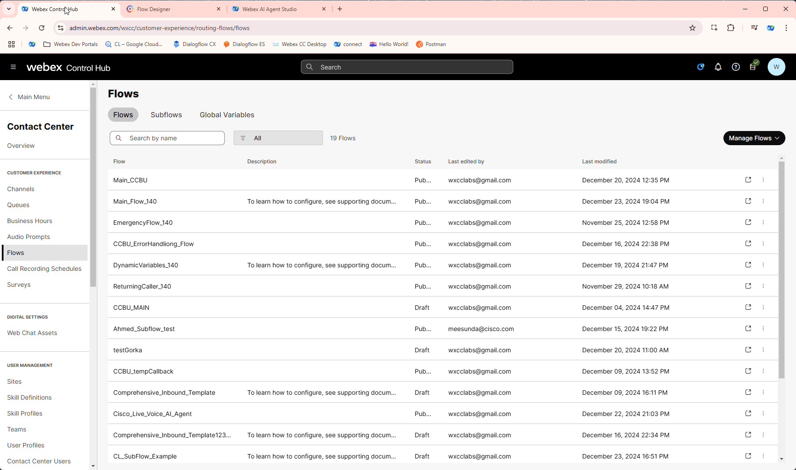

# Mission 3: Seamless AI to Human Agent Handoffs

> !!! Note
      This task relies on completing Mission 2 of the AI Track. Ensure that mission is completed to have a fully functional AI Scripted Agent feature in the Contact Center.

## Story

This lab is designed to explore how to pass contextual intelligence from AI Agents to Webex Contact Center agents. It involves leveraging AI Summaries for Webex AI  agent conversational transcripts . By completing this lab, you will gain practical skills and knowledge on how to provide the right context to agents to better handle customer queries.


## Call Flow Overview
1. A new call enters the flow.
2. The AI Agent engages with the caller by asking pre-configured questions.
3. The AI Agent gathers all necessary details and hands the call back to the flow.
4. The flow utilizes the last identified intent to route the call appropriately.

## Mission Details

Your mission is to:

1. Configure a smooth handoff to live human agent from AI Agent.
2. Modify Virtual Agent transcript
3. Configure routing based on last used intent
4. Use AI Assistant

## Build

### Transfer to Human Agent

1. Before you start this lab, please make sure the webex contact center **<span class="attendee-id-container"><span class="attendee-id-placeholder" data-suffix="_Channel">Your_Attendee_ID</span>_Channel<span class="copy" title="Click to copy!"></span></span>** is set your **<span class="attendee-id-container">TaskBot_Flow_<span class="attendee-id-placeholder" data-prefix="TaskBot_Flow_">Your_Attendee_ID</span><span class="copy" title="Click to copy!"></span></span>**.

      

2. In **Control Hub** select **Contact Center** from the left panel and then navigate to Flows from the left panel. Search and open your flow **<span class="attendee-id-container">TaskBot_Flow_<span class="attendee-id-placeholder" data-prefix="TaskBot_Flow_">Your_Attendee_ID</span><span class="copy" title="Click to copy!"></span></span>**. 

3. Switch the Edit button to **On** to enable Edit mode in the flow builder then drag and drop **Queue Contact** and **Play Music** nodes:

    - **Queue Contact**

      >
      > Connect the **Escalated** path from the **Virtual Agent V2** activity to the **Queue Contact** activity.
      >
      > Connect the **Queue Contact** activity to the **Play Music** activity
      >
      > Connect the **Failure** path from the **Queue Contact** activity to the **Disconnect Contact** activity.
      > 
      > Queue name: **<span class="attendee-id-container"><span class="attendee-id-placeholder" data-suffix="_Queue">Your_Attendee_ID</span>_Queue<span class="copy" title="Click to copy!"></span></span>**
      > 

    - **Play Music**

      >
      > Create a loop by connecting the Play Music activity back to itself - to create a music loop, following the diagram provided.
      >
      > Connect the **Undefined Error** path from the **Play Music** activity to the **Disconnect Contact** activity.
      > 
      > Music File: **defaultmusic_on_hold.wav**<span class="copy-static" data-copy-text="defaultmusic_on_hold.wav"><span class="copy" title="Click to copy!"></span></span>
      >
  
4. **Validate** and **Publish** Flow. In popped up window click on dropdown menu to select **Latest** label, then click **Publish**  

    


### Checkpoint: Transfer to Human Agent

1. Your Agent desktop session should be still active but if not, use **Agent Desktop** with agent credentials you have been provided **<span class="attendee-id-container">wxcclabs+agent_ID<span class="attendee-id-placeholder" data-prefix="wxcclabs+agent_ID" data-suffix="@gmail.com">Your_Attendee_ID</span>@gmail.com<span class="copy" title="Click to copy!"></span></span>**. You will see another login screen with OKTA on it where you may need to enter the email address again and the password provided to you. 
2. Select Team **<span class="attendee-id-container"><span class="attendee-id-placeholder" data-suffix="_Team">Your_Attendee_ID</span>_Team<span class="copy" title="Click to copy!"></span></span>**. Click **Submit**. Allow browser to access Microphone by clicking **Allow** on ever visit.
3. Make your agent ***Available*** and you're ready to make a call.

    

4. Dial the support number assigned to your **<span class="attendee-id-container"><span class="attendee-id-placeholder" data-suffix="_Channel">Your_Attendee_ID</span>_Channel<span class="copy" title="Click to copy!"></span></span>** channel and during the conversation with the virtual Agent, say, **"Please transfer me to an Agent."** Answer the call on the agent desktop when you receive a ring notification and verify the transcription is passed to Agent Desktop.

5. Once the call is answered, disconnect the call by clicking on the **End** button.

    

### Enable Real-Time Transcriptions

1. In **Control Hub** select Contact Center from the left panel and then navigate to Desktop Experience. Click on AI Assistant and make sure Real-time Transcriptions is enabled. Click on Manage flows from Real-time Transcription, search and open your **<span class="attendee-id-container">TaskBot_Flow_<span class="attendee-id-placeholder" data-prefix="TaskBot_Flow_">Your_Attendee_ID</span><span class="copy" title="Click to copy!"></span></span>**

2.	Switch the Edit button to **On** to enable Edit mode in the flow builder then add Global Variable **Transcription_required** to your flow.

3. Drag **Set Variable** node to canvas:

    > Variable: **Transcription_required**<span class="copy-static" title="Click to copy!" data-copy-text="Transcription_required"><span class="copy"></span></span>
    >
    > Set Value: **true**
    >
    > Connect the **Escalated** path of Virtual Agent V2 to **Set Variable**
    >
    > Connect the **Set Variable** activity to **Queue Contact** activity


    


4. Switch to **Event Flow** tab and add **Condition**, **Start Media Stream** and **EndFlow** nodes

    > Connect **AgentAnswer** event handler to *Condition* activity and set the Expression to **{{Transcription_required}}**<span class="copy-static" title="Click to copy!" data-copy-text="{{Transcription_required}}"><span class="copy"></span></span>
    >
    > Connect **Condition** True path to **Start Media Stream** activity
    >
    > Connect **Condition** False path to **EndFlow** activity
    >
    > Connect **Start Media Stream** activity to **EndFlow** activity

5. **Validate** and **Publish** the flow. In popped up window click on dropdown menu to select **Latest** label, then click **Publish**.

    

6. Switch to **Control Hub**. Navigate to **Team** under **User Management**, locate your Team **<span class="attendee-id-container"><span class="attendee-id-placeholder" data-suffix="_Team">Your_Attendee_ID</span>_Team<span class="copy" title="Click to copy!"></span></span>**.

7. Change **Desktop layout** to **RT_Transcript**. Then click **Save**. This layout will add a new tab for real-time transcript.

    

> **<details><summary>Changes in Desktop Layout<span style="color: orange;">[Optional]</span></summary>**
    ``` JSON
    {
    "comp": "md-tab",
    "attributes": {
    "slot": "tab",
    "class": "widget-pane-tab"
    },
    "children": [
    {
    "comp": "slot",
    "attributes": {
    "name": "RT_TRANSCRIPT_TAB"
    }
    }
    ],
    "visibility": "RT_TRANSCRIPT"
    },
    {
    "comp": "md-tab-panel",
    "attributes": {
    "slot": "panel",
    "class": "widget-pane"
    },
    "children": [
    {
    "comp": "slot",
    "attributes": {
    "name": "RT_TRANSCRIPT"
    }
    }
    ],
    "visibility": "RT_TRANSCRIPT"
    },
    ```
</details>

### Checkpoint: Enable Real-time Transcription

1. Your Agent desktop session should be still active but if not, use **Agent Desktop** with agent credentials you have been provided **<span class="attendee-id-container">wxcclabs+agent_ID<span class="attendee-id-placeholder" data-prefix="wxcclabs+agent_ID" data-suffix="@gmail.com">Your_Attendee_ID</span>@gmail.com<span class="copy" title="Click to copy!"></span></span>**. You will see another login screen with OKTA on it where you may need to enter the email address again and the password provided to you. 
2. Select Team **<span class="attendee-id-container"><span class="attendee-id-placeholder" data-suffix="_Team">Your_Attendee_ID</span>_Team<span class="copy" title="Click to copy!"></span></span>**. Click **Submit**. Allow browser to access Microphone by clicking **Allow** on ever visit.
3. Make your agent ***Available*** and you're ready to make a call.

    

4. Dial the support number assigned to your **<span class="attendee-id-container"><span class="attendee-id-placeholder" data-suffix="_Channel">Your_Attendee_ID</span>_Channel<span class="copy" title="Click to copy!"></span></span>** channel and during the conversation with the virtual Agent, say, **"Please transfer me to an Agent."** Answer the call on the agent desktop when you receive a ring notification and verify the transcription is passed to Agent Desktop.

    

5. Once the call is answered, disconnect the call by clicking on the **End** button.


### Disable Virtual Agent Transcript

1. Open your flow **<span class="attendee-id-container">TaskBot_Flow_<span class="attendee-id-placeholder" data-prefix="TaskBot_Flow_">Your_Attendee_ID</span><span class="copy" title="Click to copy!"></span></span>** and switch **Edit: Off** mode to **Edit: On** if it's not.
2. Select the **Virtual Agent v2** activity and, in the right side panel, scroll down and notice the option for **Enable Conversation Transcript**.
3. Disable the **Virtual Agent v2** transcript by unchecking **Enable Conversation Transcript** option.
4. **Validate** and **Publish** Flow. In popped up window click on dropdown menu to select **Latest** label, then click **Publish** .

    

### Checkpoint: Disable Virtual Agent Transcript
1. Make sure your agent is **Available** and if not, login to you Desktop as explained in previous Quick Test (see above)
2. Dial into the same support and observe that the conversation transcript is **Not available** on the Agent Desktop when **Enable Conversation Transcript** is unchecked.

    

### Routing Based on Last Intent

1. <span style="color: red;">**[IMPORTANT]**</span> Please make sure to Enable the Virtual Agent transcript by checking **Enable Conversation Transcript** option for the **Virtual Agent V2** activity. Select the **Virtual Agent V2** activity and, in the right side panel, scroll down and notice the option for **Enable Conversation Transcript**. 

2. Enable the **Virtual Agent v2** transcript by checking **Enable Conversation Transcript** option.

    

3. Add 2 new flow variables: 
    
    >
    > Name: **`last_intent`**<span class="copy-static" data-copy-text="last_intent"><span class="copy" title="Click to copy!"></span></span>
    >
    > Type: **`String`**<span class="copy-static" data-copy-text="String"><span class="copy" title="Click to copy!"></span></span>
    >
    > Default Value: **`empty`**
    >
    > Name: **`vameta`**<span class="copy-static" data-copy-text="vameta"><span class="copy" title="Click to copy!"></span></span>
    >
    > Type: **`JSON`**<span class="copy-static" data-copy-text="JSON"><span class="copy" title="Click to copy!"></span></span>
    >
    > Default Value: **`{}`**<span class="copy-static" data-copy-text="{}"><span class="copy" title="Click to copy!"></span></span>
    >

    


4. Drag **Set Variable** node to canvas:

    > Activity Name: **`VA_Metadata`**<span class="copy-static" data-copy-text="VA_Metadata"><span class="copy" title="Click to copy!"></span></span>
    >
    > Variable: **`vameta`**<span class="copy-static" data-copy-text="vameta"><span class="copy" title="Click to copy!"></span></span>
    >
    > Set To Variable: **`VirtualAgentV2_`<span style="color: red;">**<span style="color: red;">**<>**</span>**</span>`.MetaData`**
    > 
    > Connect **`Escalated`** edge of **VirtualAgent** to the **VA_Metadata** node
    >

    !!! Note
        <span style="color: red;"><*></span> in VirtualAgentV2 name is autogenerated and is different in all cases. You shouldn't be confused as you have only one VirtualAgentV2 node in the current flow


    

5. Drag and drop the **Parse** activity to the flow

    >
    > Connect the **VA_Metadata** activity to the **Parse** activity.
    >
    > Input variable: **`VirtualAgentV2_`<span style="color: red;">**<span style="color: red;">**<>**</span>**</span>`.MetaData`**
    >
    > Content Type: **`JSON`**<span class="copy-static" data-copy-text="JSON"><span class="copy" title="Click to copy!"></span></span>
    >
    > Output Variable: **`last_intent`**<span class="copy-static" data-copy-text="last_intent"><span class="copy" title="Click to copy!"></span></span>
    >
    > Path Expression: **`$.previous-intent.name`**<span class="copy-static" data-copy-text="$.previous-intent.name"><span class="copy" title="Click to copy!"></span></span>

    

6. Drag and drop the **Condition** activity to the flow

    >
    > Connect the **Parse** activity to the **Condition** activity.
    >
    > Connect the **False** output from the **Condition** activity to the **Queue Contact** activity
    > 
    > Expression : **{{ last_intent == "Book appointment" }}**

7. Add **Play Message**: 
    
    > Enable Text-To-Speech
    >
    > Select the Connector: **Cisco Cloud Text-to-Speech**
    >
    > Click the Add Text-to-Speech Message button and paste text: **Routing to an agent skilled at booking an appointment.**<span class="copy-static" data-copy-text="Routing to an agent skilled at booking an appointment."><span class="copy" title="Click to copy!"></span></span>
    >
    > Delete the Selection for Audio File
    >
    > Connect **True** exit path of **Condition** node created in **Step 5** to this **Play Message** node
    > 
    > Connect **Play Message** node to **Queue Contact**
    >

8. **Validate** and **Publish** Flow. In popped up window click on dropdown menu to select **Latest** label, then click **Publish** 

    

### Checkpoint: Last Intent Based Routing
    
1. Make sure your agent is **Available** and if not, login to you Desktop as explained in previous Quick Test (see above)
2. Make a call to your test number. During your interaction with the Virtual Agent start requesting for an appointment and then request a transfer to a live agent by saying, **"Please transfer me to an Agent."** If the last intent was "Book appointment", you will hear the Text-to-Speech message: **"Routing to an agent skilled at booking an appointment."**. 

    <!-- md:option type:note -->
    
    !!! note "Sample Conversation"
        "I would like to Book  an appointment"
    
        What date are you considering for your visit 
    
        "Feb 20th"
    
        Could tell us preferred time for your visit 
    
        "3PM"
    
        Which doctor you want appointment with
      
        "Dr John"
    
        What is name of the  patience 
    
        "Peter<any name>"
    
        Could you tell us patience Date of Birth
    
        "Please transfer me to an agent "

3. Answer the call on the agent desktop when it rings.
4. End the call and go back to your flow and click on **Analyze** tab at the bottom of the canvas. Observe the last call behavior.
5. Open Debug tool and open your last call. Click on **VA_Metadata** which is our renames Set Variable. See that metadata from **VirtualAgentV2_<*>.MetaData** was written into **vameta** flow variable we created on **Step 3**.
  

6. Copy JSON from debugger and paste it into [https://jsonpath.com/](https://jsonpath.com/){:target="_blank"} inputs.
7. Change Debug mode to Design in Flow Designer and copy the path from Parse node into JSONPath of the [https://jsonpath.com/](https://jsonpath.com/){:target="_blank"}. You should get last intent name as "Book Apppointement"

  

### Checkpoint: AI assistant
1. Click on the AI assistant icon located on the top right navigation pane in Agent Desktop.

    

2. Dial the support number assigned to your **<span class="attendee-id-container"><span class="attendee-id-placeholder" data-suffix="_Channel">Your_Attendee_ID</span>_Channel<span class="copy" title="Click to copy!"></span></span>** and initiate a conversation with below

3. During the interaction with the virtual Agent, request a transfer by saying, **"Please transfer me to an Agent."** Answer the call on the agent desktop upon receiving the ring notification.

4. Observe that, after answering the call, a summary of the Virtual Agent interaction is now displayed on the agent desktop

  

<p style="text-align:center"><strong>Congratulations, you have officially completed the Intelligent Virtual Agent Handoffs mission! 🎉🎉 </strong></p>

