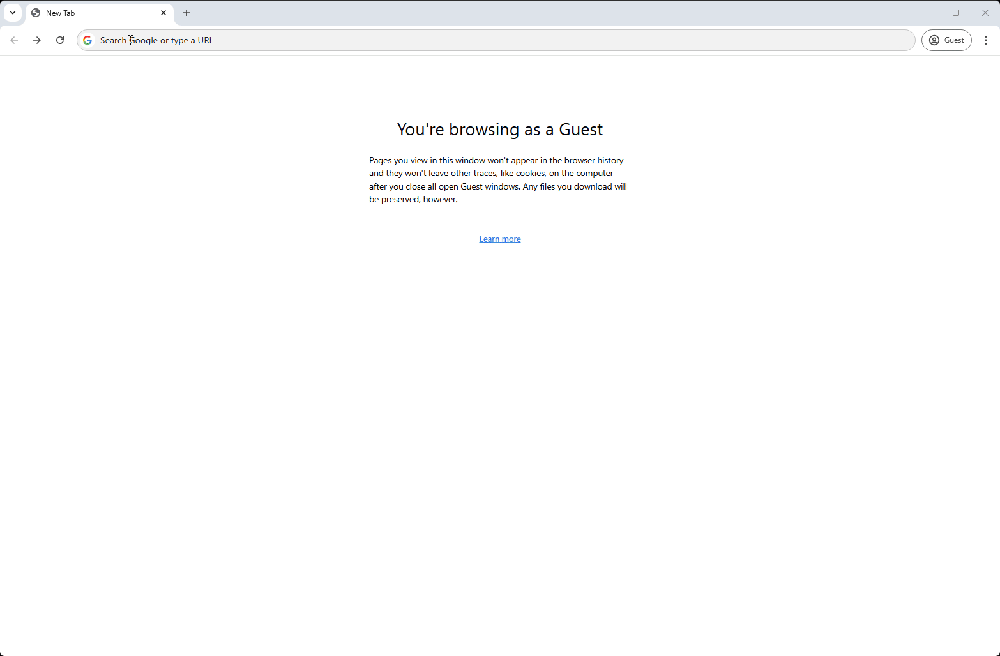

# Mission 4: AI Assistant - Call Drop Summary

## Story

As the agent answers the call, a Webex Contact Center AI popup appears, summarizing the previous conversation before the call was dropped. Armed with this insight, the agent seamlessly picks up where they left off, ensuring a smooth customer experience.

### Call Flow Overview

1. You are going to use your **Main_Flow_Your_Attendee_ID** to test Call Drop Summary.  
2. To simulate one of the required Termination Types your agent will transfer the call to a "dummy" queue with no agents avaialble in it.
3. After second call to your agent Call Drop Summary will popup. 

## Mission overview
Your mission is to:

1. The current mission does not include any configuration steps, but rather testing only. 
2. Your task is to test AI Assistant Call Drop Summary feature 

!!! Note
    This model requires meaningful audio to transcribe and provide a summary of the conversation. You will need to simulate both the customer and the agent speaking. If you have any questions, reach out to the lab instructors for help. 

    For the current mission, an optimal way to test is by using your cellphone with the Webex App installed. However, if you use the same device for both the caller and the agent, here’s a tip: mute your cellphone when speaking as the agent and mute your Agent Desktop when speaking as the customer.
---

## Testing

1. Switch to Control Hub and navigate to **Channels** under Customer Experience Section
  
    >
    > Locate your Inbound Channel (you can use the search): **Your_Attendee_ID_Channel**
    >
    > Select the Routing Flow: **Main_Flow_Your_Attendee_ID**
    >
    > Select the Version Label: **Latest**
    >
    > Click Save in the lower right corner of the screen

2. Your Agent desktop session should be still active but if not, use **Agent Desktop** with agent credentials you have been provided **wxcclabs+agent_IDYour_Attendee_ID@gmail.com**. You will see another login screen with OKTA on it where you may need to enter the email address again and the password provided to you. 
2. Select Team **Your_Attendee_ID_Team**. Click **Submit**. Allow browser to access Microphone by clicking **Allow** on every visit.
3. Make your agent ***Available*** and you're ready to make a call.

    

4. Dial the support number assigned to your **Your_Attendee_ID_Channel** channel.

5. Answer the call on Agent Desktop and use the provided script to simulate an agent/customer conversation (minimum 30 seconds).

    <!-- md:option type:note -->
    
    !!! note "Call Drop Summary Script"
        **Agent**: Good morning, thank you for calling Airway Express. My name is Michelle. How can I assist you today? 
        **You**: Hi Michelle, I'm having an issue trying to make an adjustment to a flight I have with you. I booked a flight from Amsterdam to London, but now I need to add a leg to go from London to New York a couple of days later. I just can't seem to do it through the website. 
        **Agent**: I'm sorry to hear you're experiencing issues with our app. I can definitely help you with that. Could I have your flight confirmation number to start with, please? 
        **You**: <..Silence..> 
        **Agent**: Hello, hello, hello 

6. From the Agent Call Controls, transfer the call to transfer call to the Queue **CCBU_ExecDemo_Q_CallDrop**. Click the “Queue” radio button to search for this Queue.

  

7. **Wait for the call to timeout and disconnect. This simulates an accidental call drop.**

    !!! Note
        Since the call drop must be system initiated, the queue **CCBU_ExecDemo_Q_CallDrop** has been pre-configured with a maximum time in queue of 10 seconds (pictured on screenshot from Control Hub). Wait in the queue for about 10 seconds for the system to drop the call "automatically". 
    
    

8. Make sure your agent session is active and your agent is in **Available** state.

9. Dial the support number assigned to your **Your_Attendee_ID_Channel** channel again. This will simulate a customer calling back after a call was dropped and trying to connect again to resolve the original issue.

10. Accept the call on the Agent Desktop. The AI Assistant notifies the agent of the available call drop summary.

11. Open the AI Assistant to review the summary. This summary can be used by the agent to pick up where the previous agent left off, reducing customer frustration and need for them to repeat themselves.

<strong>Congratulations, you have officially completed the Call Drop Summary lab! 🎉🎉 </strong>

