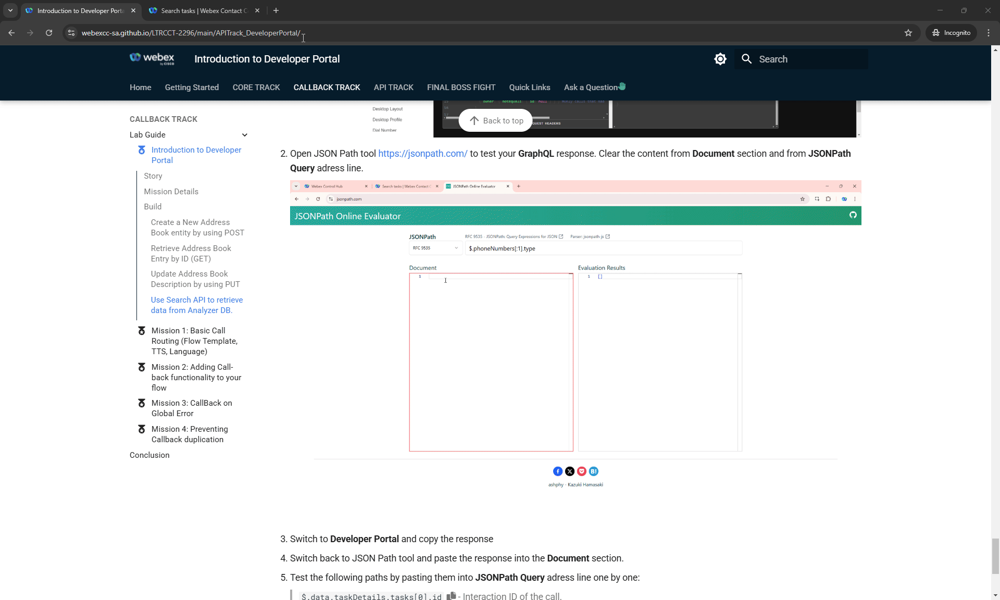

# Introduction to Developer Portal

## Story

Webex Contact Center APIs enable automation, customization, and integration with external applications. By leveraging these APIs, administrators can streamline processes, enhance agent efficiency, and improve customer interactions. In this introduction mission, we will explore how to interact with the Developer Portal and execute different types of API calls.


## Mission Details
In this mission, attendees will learn how to interact with Webex Contact Center APIs by performing API calls via the  [**Developer Portal**](https://developer.webex-cx.com/){:target="_blank"}. Specifically, we will work with the Address Book feature.

**<details><summary>Good to Know <span style="color: orange;">[Optional]</span></summary>**

**Understanding API Calls with Real-Life Comparisons**

APIs (Application Programming Interfaces) allow different systems to communicate by sending and receiving structured requests. Here are the most common API call types, explained with real-world analogies:

1. **GET – Retrieving Information**</br>
**Analogy**: Checking your bank balance at an ATM. You request information, and the system provides it without making any changes.</br>
**Example Use Case**: Retrieving a customer’s interaction history in Webex Contact Center before routing their call.</br>

2. **POST – Creating New Data**</br>
**Analogy**: Ordering a new item online. You submit details, and a new order (or record) is created in the system.</br>
**Example Use Case**: Creating a new customer support ticket when an issue is reported during a call.</br>

3. **PUT – Updating Existing Data**</br>
**Analogy**: Changing your home address in an online banking system. Instead of adding a new address, the existing one is replaced.</br>
**Example Use Case**: Updating a customer’s preferred contact method in a CRM system.</br>

4. **PATCH – Modifying Partial Data**</br>
**Analogy**: Updating your phone number on a social media profile without changing other details like your name or email.</br>
**Example Use Case**: Changing only the priority level of an existing support ticket.</br>

5. **DELETE – Removing Data**</br>
**Analogy**: Canceling a hotel reservation. The record is removed, preventing further use.</br>
**Example Use Case**: Deleting a scheduled callback request if the customer no longer needs assistance.</br>

6. **Webhooks – Automated Notifications**</br>
**Analogy**: Receiving an SMS alert when your package is out for delivery. Instead of requesting updates repeatedly, you get notified when something happens.</br>
**Example Use Case**: Notifying an agent when a VIP customer joins the queue.</br>

7. **SEARCH API (GraphQL Queries) – Retrieving Specific Data Efficiently**</br>
**Analogy**: Using a restaurant menu app to filter only "vegan dishes under $10" instead of browsing the entire menu. Unlike traditional GET requests that return all data, GraphQL allows users to request exactly what they need.</br>
**Example Use Case**: Searching for all unresolved support tickets assigned to a specific agent without loading unnecessary ticket details.</br>

APIs streamline operations by automating tasks, integrating systems, and enhancing customer experiences. Understanding these core calls helps optimize workflows in platforms like Webex Contact Center.
</details>

---

## Build

### Create a New Address Book entity by using POST

1. Open [**Developer Portal**](https://developer.webex-cx.com/){:target="_blank"} and click on **Sign In**. 
   Your login will be of the format **<span class="attendee-id-container">wxcclabs+admin_ID<span class="attendee-id-placeholder" data-prefix="wxcclabs+admin_ID" data-suffix="@gmail.com">Your_Attendee_ID</span>@gmail.com<span class="copy" title="Click to copy!"></span></span>**. You will see another login screen with OKTA on it where you may need to enter the email address again and the password provided to you.

2. Click on **Documentation** which is on top right corner of the portal page.

    

3. On Menu pannel on the left, scroll down to **API Reference** section and click on **Address Book**. Observe available API calls

    !!!Note
        **Address Book Overview**</br>
        Address Book is available in the Webex Contact Center Agent Desktop. Agents can make outbound calls using Address Books, selecting numbers from pre-configured lists instead of entering them manually in the 'Start a New Call' field. Administrators can configure and manage Address Books via the Webex Contact Center APIs.

4. Scroll down and click on **Create a new Address Book**, then click on **Try Out**.

    

5. Clear **Request Body** content. Paste the following body and replace the *`<Your_Attendee_ID>`* with your **attendee ID**. Click on **Run**.

    > 
    > Request Body:
    ``` JSON
    {
        "name": "AddressBook_<Your_Attendee_ID>",
        "parentType": "ORGANIZATION"
    }
    ```
    > 
    > Expected Response: **201 Response**
    ``` JSON
    {
      "organizationId": "e56f00d4-98d8-4b62-a165-d05a41243d98",
      "id": "4aa50a6b-a520-4221-bc9d-a050c111061f",
      "version": 0,
      "name": "AddressBook_140",
      "parentType": "ORGANIZATION",
      "createdTime": 1738585491913,
      "lastUpdatedTime": 1738585491913
    }

    ```

    

6. Switch to [Webex Control Hub](https://admin.webex.com){:target="_blank"} and navigate to **Address Book** under **Desktop Experience Section**. Locate your new created **<span class="attendee-id-container">AddressBook_<span class="attendee-id-placeholder" data-prefix="AddressBook_">Your_Attendee_ID</span><span class="copy" title="Click to copy!"></span></span>**

7. You should see your new created **<span class="attendee-id-container">AddressBook_<span class="attendee-id-placeholder" data-prefix="AddressBook_">Your_Attendee_ID</span><span class="copy" title="Click to copy!"></span></span>**. There are still no Address Book entries so let's add them.

8. On the same **Address Book** configuration page, copy the **AddressBook_<span class="attendee-id-placeholder">AddressBook_</span>** **ID** into notepad.

    

9. Switch to **Developer Portal** and select **Address Book** again from left menu pane.

    

10. Click on **Create a new Address Book Entry**, then switch to **Try Out** tab within the same page. 

11. In the **Parameters** section paste **ID** you copied on **Step 8** of the current mission into **addressBookId** field.

12. Clear **Request Body** content and paste the following body, then click on **Run** button.

    > 
    > Request Body:
    ``` JSON
    {
      "name": "TAC Number",
      "number": "+14085267209"
    }
    ```
    >
    > Expected Response: **201 Response**
    ``` JSON
    {
      "organizationId": "e56f00d4-98d8-4b62-a165-d05a41243d98",
      "id": "133ec7d9-7873-40b6-be40-43e071430268",
      "version": 0,
      "name": "TAC Number",
      "number": "+14085267209",
      "createdTime": 1738773041509,
      "lastUpdatedTime": 1738773041509
    }
    ```

    

12. Switch to [Webex Control Hub](https://admin.webex.com){:target="_blank"}. Your **Address Book** configuration page should still be open. **Refresh** the page.

13. But if not open, locate and open your **<span class="attendee-id-container">AddressBook_<span class="attendee-id-placeholder" data-prefix="AddressBook_">Your_Attendee_ID</span><span class="copy" title="Click to copy!"></span></span>**

14. You should see your new created **Entry List** with Name **Tac Number** and Contact Number **+14085267209**.

    

---

### Retrieve Address Book Entry by ID (GET)

We will retrieve information about your newly created address book using a GET API call.

1. Switch to **Developer Portal** and select **Address Book** again from left menu pane.

2. Locate and open **Get specific Address Book by ID**, then switch to **Try Out** tab.

    

3. Paste the same **AddressBook_<span class="attendee-id-placeholder">AddressBook_</span>** **ID** into **id** cell of **Parameters** section. You can quickly copy it by switching back to Control Hub. Then click **Run**.

    >
    > Expected Response: **200 Response**
    ``` JSON
    {
      "id": "115358d7-5c46-4988-9a50-e7f40c3b7daf",
      "name": "AddressBook_140",
      "description": "",
      "parentType": "ORGANIZATION",
      "createdTime": 1738771074000,
      "lastUpdatedTime": 1738773007000
    }
    ```
    


### Update Address Book Description by using PUT

1. Switch to **Developer Portal** and select **Address Book** again from left menu pane.

2. Locate and open **Update specific Address Book by ID**, then switch to **Try Out** tab.

    

3. Paste the same **AddressBook_<span class="attendee-id-placeholder">AddressBook_</span>** ID into **id** cell of **Parameters** section. You can quickly copy **name** and **id** by switching back to Control Hub. 

4. Clear **Request Body** content and paste the following body. Then click **Run**.
    
    > Replace value ***YourAddressBook_Name*** to your **<span class="attendee-id-container">AddressBook_<span class="attendee-id-placeholder" data-prefix="AddressBook_">Your_Attendee_ID</span><span class="copy" title="Click to copy!"></span></span>**
    >
    > Replace ***YouAddressBook_ID*** to actual AddressBook_<span class="attendee-id-placeholder">AddressBook_</span> **ID**
    > 
    > Request Body:
    ``` JSON
    {
      "name": "YourAddressBook_Name",
      "id": "YouAddressBook_ID",
      "parentType": "ORGANIZATION",
      "description": "Testing PUT requests from Developer Portal"
    }
    ```
    > 
    > Expected Response: **200 Response**
    ``` JSON
    {
      "organizationId": "e56f00d4-98d8-4b62-a165-d05a41243d98",
      "id": "115358d7-5c46-4988-9a50-e7f40c3b7daf",
      "version": 5,
      "name": "AddressBook_140",
      "description": "Testing PUT requests from Developer Portal",
      "parentType": "ORGANIZATION",
      "createdTime": 1738771074000,
      "lastUpdatedTime": 1738775594832
    }
    ```

5. Switch to [Webex Control Hub](https://admin.webex.com){:target="_blank"}. Your **Address Book** configuration page should still be open. **Refresh** the page to validate Description change.


### Use Search API to retrieve data from Analyzer DB.

!!! Note
    When working with Webex Contact Center (WxCC) GraphQL queries, timestamps are represented in **Epoch time (Unix timestamp)** format. This format counts the number of seconds (or milliseconds) that have elapsed since **January 1, 1970 (UTC)**. </br>
    If you need to convert a regular date/time into Epoch format or vice versa, you can use this online converter: [https://www.epochconverter.com/](https://www.epochconverter.com/){:target="_blank"}</br>
    Ensure that your queries and filters use the correct time format to retrieve accurate results.

1. Switch to **Developer Portal** then locate and select **Search** from **API REFERENCE** menu

2. Click on **Search tasks** and then switch to **Try Out** tab
  

3. Click on **Maximize Screen**, clear the text from **GraphQL** query window. Then paste the following query. 


    > Request Body:
    ``` JSON
    {
      #Global CAD Variables: Usage of taskDetails Object to retrieve the Value of Global Variables
      taskDetails(
        # NOTE: from and to are mandatory arguments that take the Epoch timestamp in milliseconds
        from: 1738833921000 #This can be set to Date.now() - (days * 24 * 60 * 60 * 1000) for lookback in days
        to: 1738834701000 #This can be set to Date.now() in millis
        filter: {
          #Filter the type of Task
          and: [
            { channelType: { equals: telephony } } #Telephony calls only
            { origin: { equals: "+14694097607" } } #Customer ANI
            { status: { equals: "ended" } } #Final Disposition
            { direction: { equals: "inbound" } } #Inbound call only
            { isActive: { equals: false } } #Resolved call only
            { owner: { notequals: { id: null } } } #Only calls that had an Owner
          ]
        }
      ) {
        tasks {
          id #TaskId-SessionId-CallId      
          status #Status
          totalDuration #CallTime
          origin #ANI
          destination #DNIS
          lastAgent {
            #Agent
            id
            name
          }
          stringGlobalVariables(name: "Global_Language") {
            #GlobalCADVariable
            name
            value
          }
        }
      }
    } 
    ```

    !!! Note
        Current query is configured to search calls with following details from Analyzer database:

        1. Time range: From **Thursday, February 6, 2025 9:25:21 AM** to **Thursday, February 6, 2025 10:38:21 AM GMT+01:00**.

        2. Telephony inbound calls only.

        3. Calls only from **+14694097607**.

        4. Ended calls only.

        5. Calls that were assigned to an owner (agent).

     > 
    > Expected Response: **200 Response**
    ``` JSON
    {
      "data": {
        "taskDetails": {
          "tasks": [
            {
              "id": "d1364618-49a4-41f5-8b5f-a8da4d12e56c",
              "status": "ended",
              "totalDuration": 35562,
              "origin": "+14694097607",
              "destination": "+14694096861",
              "lastAgent": {
                "id": "b9b45479-756f-4c55-8663-8ae7800a9a18",
                "name": "Agent140 Lab"
              },
              "stringGlobalVariables": {
                "name": "Global_Language",
                "value": "en-AU"
              }
            }
          ]
        }
      }
    }
    ```
   
    !!! Note 
        Output of the query is configured to represent the following information

        1. **ID** of the call
        
        2. Status of the call
        
        3. Total duration of the call
        
        4. Origin of the call. Who called.
        
        5. Destination of the call. Entry Point number.
        
        6. Agent, whoc accepted the call: ID and Name
        
        7. Language selected by the caller. Represented as **Global_Language** variable

    


4. Open JSON Path tool [https://jsonpath.com/](https://jsonpath.com/){:target="_blank"} to test your **GraphQL** response. Clear the content from **Document** section and from **JSONPath Query** address line.

5. Switch to **Developer Portal** and copy the response 

6. Switch back to JSON Path tool and paste the response into the **Document** section.
  


7. Test the following paths by pasting them into **JSONPath Query** address line one by one:

    >
    > `$.data.taskDetails.tasks[0].id`<span class="copy-static" data-copy-text="$.data.taskDetails.tasks[0].id"><span class="copy" title="Click to copy!"></span></span> - Interaction ID of the call.
    >  
    > `$.data.taskDetails.tasks[0].status`<span class="copy-static" data-copy-text="$.data.taskDetails.tasks[0].status"><span class="copy" title="Click to copy!"></span></span> - Status of the call.
    > 
    > `$.data.taskDetails.tasks[0].totalDuration`<span class="copy-static" data-copy-text="$.data.taskDetails.tasks[0].totalDuration"><span class="copy" title="Click to copy!"></span></span> - Total Duration of the call.
    > 
    > `$.data.taskDetails.tasks[0].destination`<span class="copy-static" data-copy-text="$.data.taskDetails.tasks[0].destination"><span class="copy" title="Click to copy!"></span></span> - Call destination. This is the number essigned to Entry Point.
    > 
    > `$.data.taskDetails.tasks[0].lastAgent.id`<span class="copy-static" data-copy-text="$.data.taskDetails.tasks[0].lastAgent.id"><span class="copy" title="Click to copy!"></span></span> - Agent ID who accepted the call.
    > 
    > `$.data.taskDetails.tasks[0].lastAgent.name`<span class="copy-static" data-copy-text="$.data.taskDetails.tasks[0].lastAgent.name"><span class="copy" title="Click to copy!"></span></span> - Agent name who accepted the call.
    > 
    > `$.data.taskDetails.tasks[0].stringGlobalVariables.Global_Language`<span class="copy-static" data-copy-text="$.data.taskDetails.tasks[0].stringGlobalVariables.Global_Language"><span     class="copy" title="Click to copy!"></span></span> - Language Global Variable that was used in the flow.
    > 
    > `$.data.taskDetails.tasks[0].stringGlobalVariables.value`<span class="copy-static" data-copy-text="$.data.taskDetails.tasks[0].stringGlobalVariables.value"><span class="copy" title="Click to copy!"></span></span> - Language selected by a caller.
    > 
    


<p style="text-align:center"><strong>Congratulations, you have successfully completed Introduction to Developer Portal mission! 🎉🎉 </strong></p>
