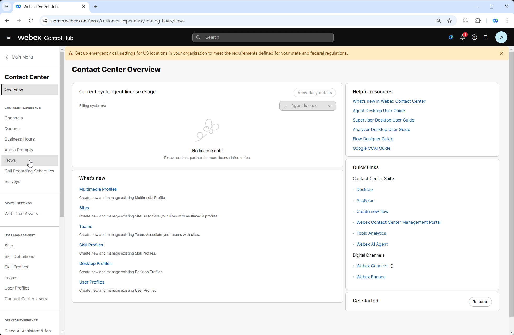
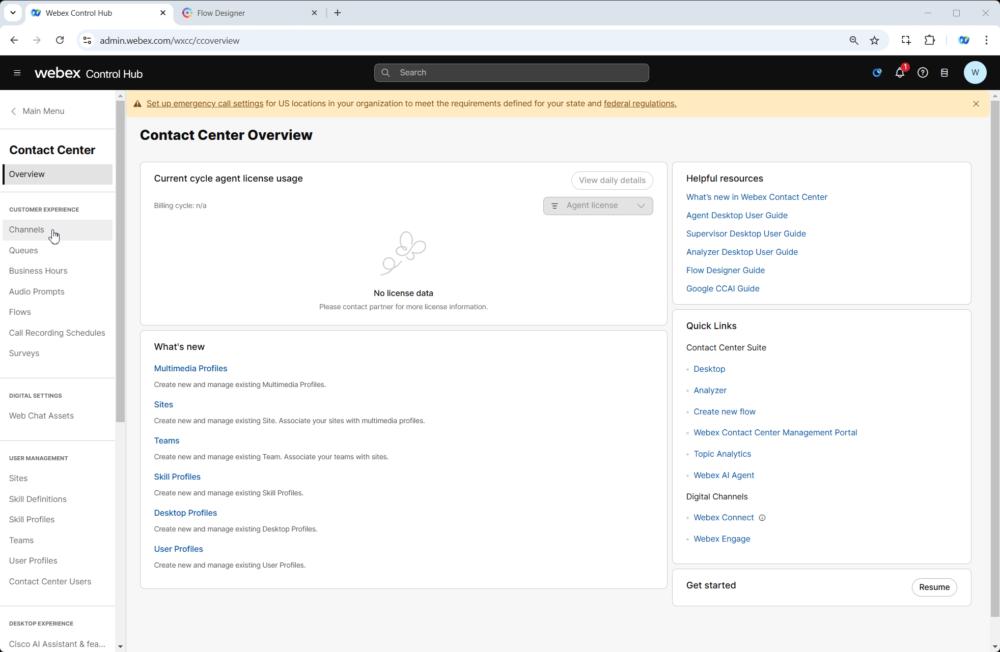

# Mission 2: Routing facilitation

## Story 
The primary objective of this new feature is to enhance nodes activities to include a dynamic variable-based selection option to make your flow smaller and simpler to adjust. You will learn how to use **Dynamic Variables** in multiple nodes including **GoTo**, **Business Hours**, **Queue** and other nodes. 

## Call Flow Overview

1. When call arrives fetch the data from **MockAPI** based on your Dialed Number
2. Write the data into respective preconfigured flow variables. These variables are being used in all consequent nodes.
3. Business Hours entity configured to cover EMEA timezone. Call should go through WorkingHours exit edge in normal behavior.
4. Play Message nodes have been configured to play messages received from API call

## Mission Details

Your mission is to:
1. Create a new flow by using pre-defined flow template
2. Request the data from external database and parse it into flow variables which are coming with a flow template.
3. You do not need to create Business Hours, Channels and additional Flows as they have been pre-configured for you.

> **

Good to Know [Optional]
**
>
> We are going to imitate a real API server by providing realistic responses to requests. For that we chose Server [**MockAPI**](https://mockapi.io/){:target="_blank"}.
> 
> For more information of how you can use MockAPI please watch these Vidcasts: 
[**[ADVANCED] Use MockAPI to enhance your Demos - PART 1**](https://app.vidcast.io/share/ce058b71-109e-4929-b9ca-46b83d94f7e3){:target="_blank"} and [**[ADVANCED] Use MockAPI to enhance your Demos - PART 2**](https://app.vidcast.io/share/1e259a34-7e9e-44d9-aa5a-5d76e07256a3){:target="_blank"}
> 
> 

## Build

1. Switch to Control Hub, then navigate to **Flows**, click on **Manage Flows** dropdown list and select **Create Flows**

2. New Tab will be opened. Navigate to **Flow Templates**

3. Choose **Dynamic Variable Support** and click **Next**. You can open **View Details** and to see observe flow structure and read flow description.

4. Name you flow as **DynamicVariables_Your_Attendee_ID**. Then click on Create Flow.

    

5. Observe preconfigured nodes and flow variables. If you have questions please reach out to lab proctor.
    
    - **FetchFlowSettings** node is used to access external database over API and parse the result by writing response result into respective Flow Variables which have been preconfigured for you already.
    - **SetVariable_mwn** node writes complete API response into debug variable so you could see the complete API call result in Debug tool. It's been taken from **FetchFlowSettings.httpResponseBody** output variable of **FetchFlowSettings** node
    - All **Play Message** and **Play Music** nodes have been preconfigured to play TTS messages taken from respective API response
    - **BusinessHours_os2** node set to bussinesshours variable which is your business hour entity **Your_Attendee_ID_Bussiness_Hours**
    - **QueueContact_a62** node set to queue variable which is your queue entity **Your_Attendee_ID_Queue**
    - Some **GoTo** nodes are configured to use variables and some have static values. We will adjust them while going through further steps. 

    

6. Select **FetchFlowSettings** HTTP Node and paste your GET request in Request URL field by replacing a templated one.
    ***https://674481b1b4e2e04abea27c6e.mockapi.io/flowdesigner/Lab/DynVars?dn={{NewPhoneContact.DNIS | slice(2) }}***

 
    > **

**Test your API Source**[Optional]
**
    > 
    > 1. Test your API resource. **https://674481b1b4e2e04abea27c6e.mockapi.io/flowdesigner/Lab/DynVars?dn={DNIS}**
    > 
    > 2. Replace DNIS with the provided DNIS number stripping +1
    >
    > [Example:] If your number **+14694096861**, then your GET Query should be ***https://674481b1b4e2e04abea27c6e.mockapi.io/flowdesigner/Lab/DynVars?dn=4694096861***
    >
    > 3. Open Chrome browser and past your URL. You should get the follwoing result
    > 
    > 
    > 
    > 4. Test JSON Path in the following tool [https://jsonpath.com/](https://jsonpath.com/){:target="_blank"}
    > 
    > 5. Paste your GET URL into the Browser address line and copy the output in square brackets (including brackets)
    >
    > 6. Open [https://jsonpath.com/](https://jsonpath.com/){:target="_blank"} and paste the copied response into **Inputs** window
    >
    > 7. In **JSONPath** box copy and paste one of the path expression from **FetchFlowSettings** to verify your results.
    >
    > 
    > 

7. In the same node, under Parsing Settings add **[0]** after **$** sign. This needs to be done due to output structure of API response. 
 
    

8. Open a **Queue** Node and set **Fallback Queue** to **CCBU_Fallback_Queue**. That is needed to make sure the call will find an end queue in case API GET call fails.

9. Open **GoTo_x19** node and set:

    > Destination Type: **Flow**
    >
    > Static Flow
    >
    > Flow: **CCBU_ErrorHandling_Flow**
    >
    > Choose Version Label: **Latest**
    
10. Open **GoTo_8ca** and set:

    > Destination Type: **Entry Point**
    >
    > Static Entry Point
    >
    > Entry Point: **CCBU_ErrorHandling_Channel**

 
11. Repeat node settings in **Step 9** for **GoTo_uyn**

12. Repeat node settings in **Step 10** for **GoTo_dbr**

    

13. **Validate** and **Publish** flow

14. In Popped up window click on dropdown menu to select **Latest** label, then click **Publish**

15. Switch to Control Hub and navigate to **Channels** under Customer Experience Section
    
    > 
    > Locate your Inbound Channel (you can use the search):  **Your_Attendee_ID_Channel**
    > 
    > Select the Routing Flow: **DynamicVariables_Your_Attendee_ID**
    > 
    > Select the Version Label: **Latest**
    > 
    > Click **Save** in the lower right corner of the screen

    

## Testing

1. Your Agent desktop session should be still active but if not, use **Agent Desktop** with agent credentials you have been provided **wxcclabs+agent_IDYour_Attendee_ID@gmail.com**. You will see another login screen with OKTA on it where you may need to enter the email address again and the password provided to you. 

2. Select Team **Your_Attendee_ID_Team**. Click **Submit**. Allow browser to access Microphone by clicking **Allow** on ever visit.

3. Make your agent ***Available*** and you're ready to make a call.

    

4. Change the status of your agent to **Available** and make a call to test you flow. If everyhing configured as per instructions you should hear a **welcome1** message that is a value of ***$[0].welcomePrompt1*** and then ***$[0].welcomePrompt2***. Finally the call should land on the ***$[0].queue***

### [Optional] Test other variables

5. You can do the same trick we did in Mission 2 of Core Track and use **Override** option to change the logic. Overrides as well as Business hours have been preconfigured for you. Now we need to apply it on your **Your_Attendee_ID_Bussiness_Hours** entity. Open **Your_Attendee_ID_Bussiness_Hours** in **Control Hub**, scroll down to Additional Settings and select **Overrides_Hours** from Override dropdown list. Then click Save.
    
    !!! Note
        Override Hours entity overwrites Working Hours and set to duration of current Technical Summit. 

    

6. Make a new call to be redirected to flow ***$[0].goToFlow*** where the following message can be heard: **"Thanks you for call. You are now on Error Handling flow and will be redirected to Global Support line in a moment. Good bye."**

7. Now we need to revert the configuration we made in Step 1. Open **Your_Attendee_ID_Bussiness_Hours** in **Control Hub** in **Control Hub**, scroll down to **Additional Settings** and select **None** from Override dropdown list. Then click **Save**.

    

<strong>Congratulations, you have succesfully completed Routing Facilitation mission! 🎉🎉 </strong>

