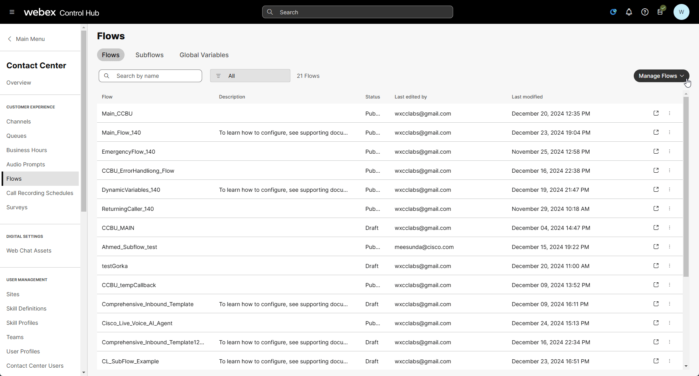
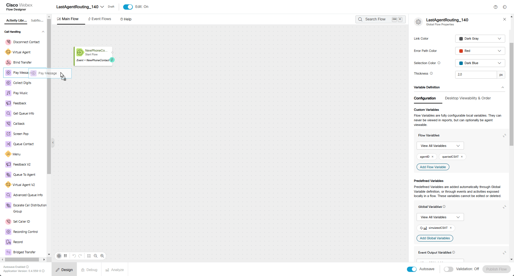
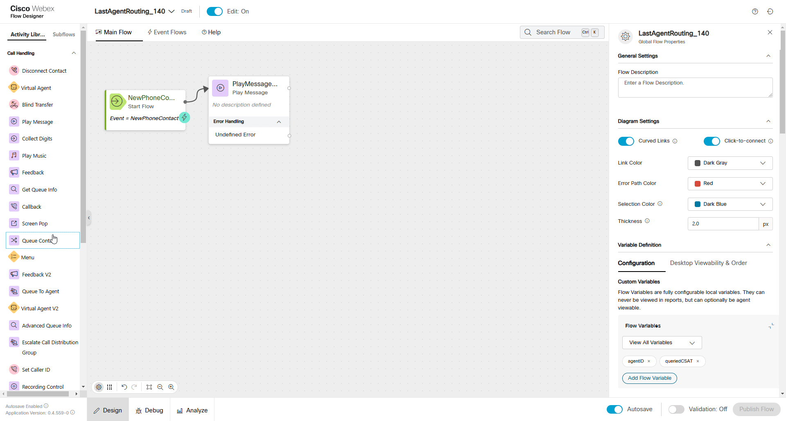
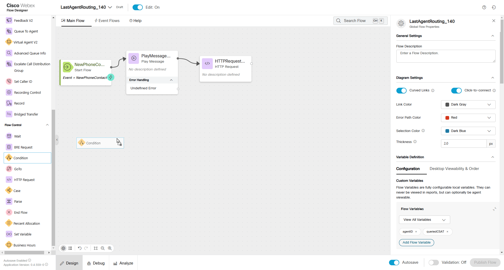
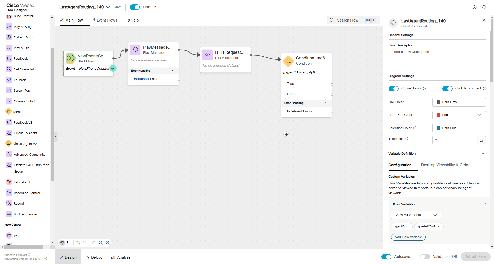
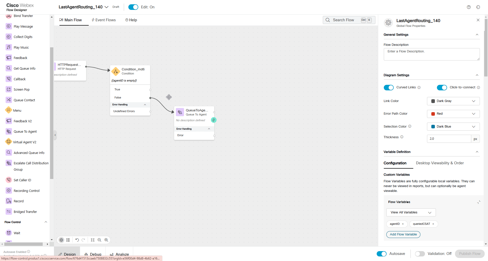
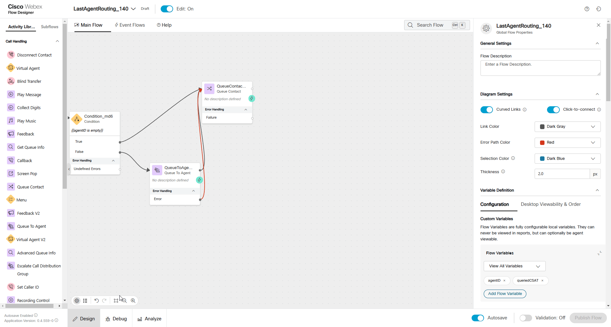
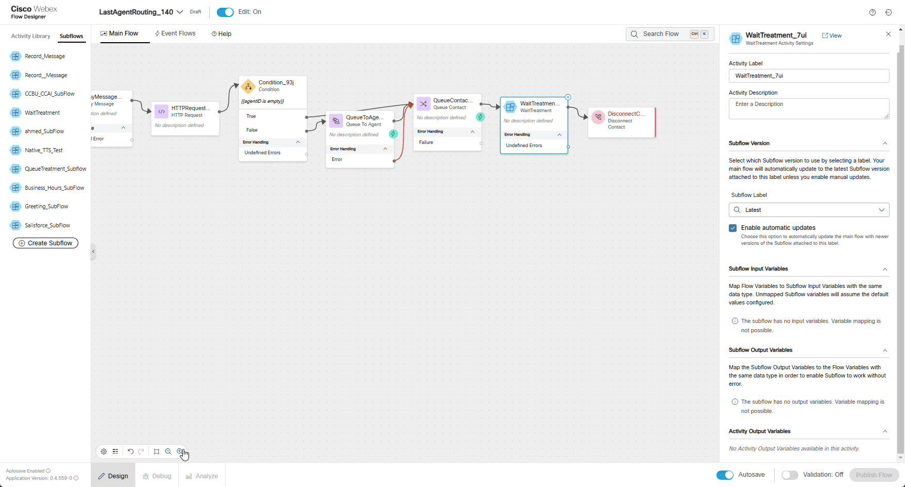

# Mission 5: Last Agent Routing

## Story
A common request for returning customers calling into a contact center is to work with the last person with which they had a good experience.  This may be because they are already familiar with what the customer needs or it may just be that the customer is familiar with the agent and enjoyed their last interaction. With the new Auto CSAT feature in the Webex Contact Center we can automatically account for this request and route to the last agent which had a high Auto CSAT with the customer.  

!!! Note
    Because this is a lab environment and you will be playing both the role of the customer and agent, we are going to use a simulated CSAT as it would be difficult to properly score a call in these conditions.  


### High Level Explanation
1. New call comes into the flow
2. Call the Search API to find the last agent with which they had a good CSAT
3. If the agent is available, we will route the call to that agent
4. If the agent is not available or if no recent good CSAT scores exits for the caller, we will route the call to the queue for the next available agent. 

!!! Note
  We are going to touch Subflow which is the feature that enables easier management of complex flows by breaking down commonly used and repeated portions into reusable subflows. This improves readability of flows, increases reusability of repeated functionality in the subflow, as well as improves development time since there is no redundant design of the same flows.</br>
  Subflows also introduce the ability to share commonly used subroutines between developers, between customers and will help unlock a library of subflows available in the marketplace.


## Preconfigured elements
1. Wait treatment Subflow which will provide Music in Queue and Queue Messages. 
2. Connector for calling Webex Contact Center APIs
3. Agent Editable and Reportable Global Variable for our simulated CSAT

---

## Build

1. Create a flow named **<span class="attendee-id-container">LastAgentRouting_<span class="attendee-id-placeholder" data-prefix="LastAgentRouting_">Your_Attendee_ID</span><span class="copy" title="Click to copy!"></span></span>** and add these flow variables:
  
    - Callback Status variable:
    
      >
      > Name: **agentID**<span class="copy-static" data-copy-text="agentID"><span class="copy" title="Click to copy!"></span></span>
      >
      > Type: **String**
      >
      > Default Value: **empty**
    
    - Callback Connect Time variable:
      
      >
      > Name: **queriedCSAT**<span class="copy-static" data-copy-text="queriedCSAT"><span class="copy" title="Click to copy!"></span></span>
      >
      > Type: **Decimal**
      >
      > Default Value: **0.0**<span class="copy-static" data-copy-text="0.0"><span class="copy" title="Click to copy!"></span></span>

2. Add the Global Variable **simulatedCSAT**<span class="copy-static" data-copy-text="simulatedCSAT"><span class="copy" title="Click to copy!"></span></span> to the flow

    >
    > There are no values to set because it has already been configured globally

      

3. Add a **Play Message** node 
    
    >
    > Connect the **New Phone Contact** node edge to this **Play Message** node
    >
    > Enable Text-To-Speech
    >
    > Select the Connector: **Cisco Cloud Text-to-Speech**
    >
    > Click the Add Text-to-Speech Message button
    >
    > Delete the Selection for Audio File
    >
    > Text-to-Speech Message: ***Welcome to Mission 5 of Advanced Routing mission.***<span class="copy-static" data-copy-text="Welcome to Mission 5 of Advanced Routing mission."><span class="copy" title="Click to copy!"></span></span>

      

3.  Add an **HTTP Request** node for our query
    
    >
    > Connect the output node edge from the **Play Message** node to this node
    >
    > Select Use Authenticated Endpoint
    >
    > Connector: **WxCC_API**
    > 
    > Path: **/search**
    > 
    > Method: **POST**
    > 
    > Content Type: **Application/JSON**
    >
    > Copy this GraphQL query into the request body:
    ```JSON
    {"query":"query simulatedCSAT($from:Long! $to:Long! $timeComparator:QueryTimeType $filter:TaskFilters $name:String!){task(from:$from,to:$to,timeComparator:$timeComparator,filter:$filter){tasks{owner{name id}simulatedCSAT:doubleGlobalVariables(name:$name){name value}}}}","variables":{"from":"{{now() | epoch(inMillis=true) - 604800000}}","to":"{{now() | epoch(inMillis=true)}}","timeComparator":"endedTime","filter":{"and":[{"status":{"equals":"ended"}},{"origin":{"equals":"{{NewPhoneContact.ANI}}"}},{"doubleGlobalVariables":{"name":{"equals":"simulatedCSAT"},"value":{"gte":3}}}]},"name":"simulatedCSAT"}}
    ```
    > <details><summary>Expanded Query For Understanding (optional)</summary>
    ```GraphQL
    query simulatedCSAT(
      $from: Long!
      $to: Long!
      $timeComparator: QueryTimeType
      $filter: TaskFilters
      $name: String!
    ) {
      task(from: $from, to: $to, timeComparator: $timeComparator, filter: $filter) {
        tasks {
          owner {
            name #Agent Name
            id #Agent ID
          }
          simulatedCSAT: doubleGlobalVariables(name: $name) {
            name
            value #Value of the simulatedCSAT
          }
        }
      }
    }
    ```
    ```JSON
    Variables:
    
    {
      "from": "{{now() | epoch(inMillis=true) - 604800000}}", # time now - 1 week represented in EPOCH time(ms)
      "to": "{{now() | epoch(inMillis=true)}}", # time now represented in EPOCH time(ms)
      "timeComparator": "endedTime",
      "filter": {
        "and": [
          {
            "status": {
              "equals": "ended"
            }
          },
          {
            "origin": {
              "equals": "{{NewPhoneContact.ANI}}"
            }
          },
          {
            "doubleGlobalVariables": { #Filtering on the Global Variable simulatedCSAT to be greater or equal to 3 
              "name": {
                "equals": "simulatedCSAT" 
              },
              "value": {
                "gte": 3
              }
            }
          }
        ]
      },
      "name": "simulatedCSAT" #The Alias name used for the global variable in the returned fields
    }
    ```
    </details>

    > Parse Settings:
    >
    > - Content Type: **JSON**
    >
    > - Output Variable: `agentID`<span class="copy-static" data-copy-text="agentID"><span class="copy" title="Click to copy!"></span></span>
    >
    > - Path Expression: `$.data.task.tasks[0].owner.id`<span class="copy-static" data-copy-text="$.data.task.tasks[0].owner.id"><span class="copy" title="Click to copy!"></span></span>
    >
    > - Output Variable: `queriedCSAT`<span class="copy-static" data-copy-text="queriedCSAT"><span class="copy" title="Click to copy!"></span></span>
    >
    > - Path Expression: `$.data.task.tasks[0].simulatedCSAT.value`<span class="copy-static" data-copy-text="$.data.task.tasks[0].simulatedCSAT.value"><span class="copy" title="Click to copy!"></span></span>
    >

      

4. Add a **Condition** node

    >
    > Connect the output node edge from teh **HTTP Request** node to this node
    > 
    > We will connect the **True** node in a future step.
    >
    > Expression: `{{agentID is empty}}`<span class="copy-static" data-copy-text="{{agentID is empty}}"><span class="copy" title="Click to copy!"></span></span>
    >
      

5.  Add a **Queue To Agent** node

    >
    > Connect the **False** node edge of the **Condition** node created in previous step to this **Queue To Agent**.
    > 
    > Agent Variable: **agentID**<span class="copy-static" data-copy-text="agentID"><span class="copy" title="Click to copy!"></span></span>
    >
    > Agent Lookup Type: **ID**<span class="copy-static" data-copy-text="ID"><span class="copy" title="Click to copy!"></span></span>
    >
    > Set Contact Priority: **True**
    >
    > Select Static Priority
    >
    > Static Priority Value: **P1**
    >
    > Reporting Queue: **<span class="attendee-id-container"><span class="attendee-id-placeholder" data-suffix="_Queue">Your_Attendee_ID</span>_Queue<span class="copy" title="Click to copy!"></span></span>**
    >
    > Park Contact if Agent Unavailable: **False**
    >
    > Recovery Queue: **<span class="attendee-id-container"><span class="attendee-id-placeholder" data-suffix="_Queue">Your_Attendee_ID</span>_Queue<span class="copy" title="Click to copy!"></span></span>**
    >


      

6. Add a **Queue Contact** node

    >
    > Connect **Queue To Agent** Output and Error node edges created in previous step to this **Queue Contact**
    >
    > Connect the **True** node edge from the **Condition** node created in **Step 4** to this node
    > 
    > Select Static Queue
    >
    > Queue: **<span class="attendee-id-container"><span class="attendee-id-placeholder" data-suffix="_Queue">Your_Attendee_ID</span>_Queue<span class="copy" title="Click to copy!"></span></span>**
    >
      


7. Add a **Subflow** node and **DisconnectContact** node

    >
    > In the Activity Library pane on the left side of the screen, click **Subflows**
    >
    > Find the **Subflow** names **WaitTreatment** and drag it onto the flow canvas like you would any other node.
    >
    > Connect the output node edge from this node to the **DisconnectContact** node.
    >
    > Connect the **Queue Contact** node edge that we created in previous step to this **Subflow** node
    >
    > Subflow Label: **Latest**
    >
    > Enable automatic updates: **True**
    >
    > Subflow Input Variables: **None**
    >
    > Subflow Output Variables: **None**
    >
         

    <details><summary>Check your flow</summary></details>

10.  Publish your flow

    > Turn on Validation at the bottom right corner of the flow builder
    >
    > If there are no Flow Errors, Click **Publish**
    >
    > Add a publish note
    >
    > Add Version Label(s): **Latest** 
    >
    > Click **Publish** Flow

11. Map your flow to your inbound channel
    
    > Navigate to Control Hub > Contact Center > Channels
    >
    > Locate your Inbound Channel (you can use the search): **<span class="attendee-id-container"><span class="attendee-id-placeholder" data-suffix="_Channel">Your_Attendee_ID</span>_Channel<span class="copy" title="Click to copy!"></span></span>**
    >
    > Select the Routing Flow: **<span class="attendee-id-container">LastAgentRouting_<span class="attendee-id-placeholder" data-prefix="LastAgentRouting_">Your_Attendee_ID</span><span class="copy" title="Click to copy!"></span></span>**
    >
    > Select the Version Label: **Latest**
    >
    > Click Save in the lower right corner of the screen

        
---

## Testing
1. Your Agent desktop session should be still active but if not, use **Agent Desktop** with agent credentials you have been provided **<span class="attendee-id-container">wxcclabs+agent_ID<span class="attendee-id-placeholder" data-prefix="wxcclabs+agent_ID" data-suffix="@gmail.com">Your_Attendee_ID</span>@gmail.com<span class="copy" title="Click to copy!"></span></span>**. You will see another login screen with OKTA on it where you may need to enter the email address again and the password provided to you.
2. On your Agent Desktop, set your status to available
      1. Using Webex, place a call to your Inbound Channel number **<span class="attendee-id-container"><span class="attendee-id-placeholder" data-suffix="_Channel">Your_Attendee_ID</span>_Channel<span class="copy" title="Click to copy!"></span></span>**
      2. You should be offered a call, click on the accept button. (You may want to mute the mic on both Webex and the Agent Desktop)
      3. In the Agent Desktop you will see a new field in Call Information section where you can edit the Simulated CSAT.  Enter a value of **2.9**<span class="copy-static" data-copy-text="2.9"><span class="copy" title="Click to copy!"></span></span> and click save.
      4. After a few moments end the call and select a wrap-up code.
3. Using Webex, place another call to your Inbound Channel number **<span class="attendee-id-container"><span class="attendee-id-placeholder" data-suffix="_Channel">Your_Attendee_ID</span>_Channel<span class="copy" title="Click to copy!"></span></span>**
      1. You should be offered the call, click on the accept button.
      2. Enter a value of **3.7**<span class="copy-static" data-copy-text="3.7"><span class="copy" title="Click to copy!"></span></span> in for Simulated CSAT and click save.
      3. After a few moments end the call and select a wrap-up code.
4. In your Flow:
      1. Open the debugger
      2. Select the first interaction (at the bottom of the list)
      3. Trace the steps taken in the flow
      4. Open the last interaction 
      5. Trace the steps taken in the flow
5. Answer these questions:
      1. Did the second call get routed to your agent via the Queue To Agent node?
         1. Why or why not
6. On your Agent Desktop, set your status to not be available
7. Using Webex, place another call to your Inbound Channel number **<span class="attendee-id-container"><span class="attendee-id-placeholder" data-suffix="_Channel">Your_Attendee_ID</span>_Channel<span class="copy" title="Click to copy!"></span></span>**
8. After you hear the queue treatment start, change your status to available on the agent desktop.
      1. You should be offered the call, click on the accept button.
      2. Enter a value of **2.8**<span class="copy-static" data-copy-text="2.8"><span class="copy" title="Click to copy!"></span></span> in for Simulated CSAT and click save.
      3. After a few moments end the call and select a wrapup code.
9. In your Flow:
      1. Open the debugger
      2. Select the last interaction
      3. Trace the steps taken in the flow
10. Answer these questions:
      1. Was the call routed to the Queue to Agent node?
      2. What happened next?
         1. Why?
         2. What will happen if you call in again starting in the Available status?
11. Make sure that you are in Available status on the agent desktop.
12. Using Webex, place another call to your Inbound Channel number **<span class="attendee-id-container"><span class="attendee-id-placeholder" data-suffix="_Channel">Your_Attendee_ID</span>_Channel<span class="copy" title="Click to copy!"></span></span>**
      1. You should be offered the call, click on the accept button.
      2. After a few moments end the call and select a wrapup code.
13. In your Flow:
      1. Open the debugger
      2. Select the last interaction
      3. Trace the steps taken in the flow
14. Answer the following questions:
      1. Was the call offered to you from the Queue to Agent node?
      2. What was the value of the variable queriedCSAT (look in the HTTP node step)
         1. Why?
      3. How do you think that you could change the logic/criteria to meet other business needs? 

---

<p style="text-align:center"><strong>Congratulations, you have officially completed Last Agent Routing mission! 🎉🎉 </strong></p>
