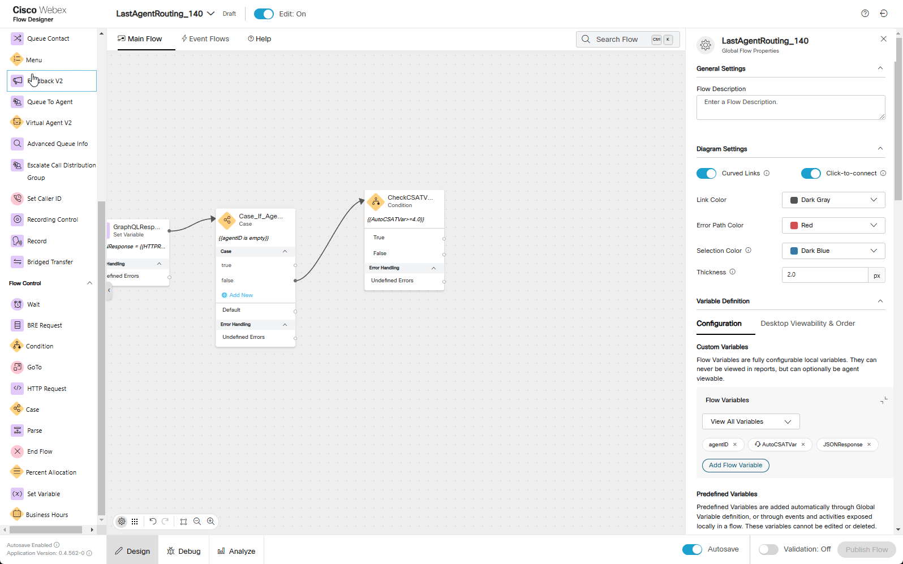

# Mission 3: Last Agent Routing

## Story
A common request for returning customers calling into a contact center is to work with the last person with which they had a good experience.  This may be because they are already familiar with what the customer needs or it may just be that the customer is familiar with the agent and enjoyed their last interaction. With the new Auto CSAT feature in the Webex Contact Center we can automatically account for this request and route to the last agent which had a high Auto CSAT with the customer.  

<span style="color: red;">**[IMPORTANT]** Since this is a lab environment where you will act as both the customer and the agent, accurately scoring a call will be challenging. Additionally, AutoCSAT has not been taught due to the insufficient number of calls required for AI to learn and generate proper scoring. In this lab, we will use a Global Variable to store the score, which is also used for AutoCSAT teaching. With a sufficient number of provided scores, AutoCSAT will eventually be able to score calls automatically.</span>

!!! Note
    **Configuration page of AutoCSAT**
    

## Call Flow Overview
1. New call comes into the flow
2. Call the Search API to find the last agent with whom they had a good AutoCSAT
3. If the AutoCSAT is greater or equal **4** and agent is available, we will route the call to that agent
4. If the agent is not available or if no recent good AutoCSAT scores exist for the caller, we will route the call to the queue for the next available agent. 

## Mission Details

Your mission is to:

1. Create a new flow from the scratch. </br>
2. Build a Search API query to request information from Analyzer database and parse it into flow variables.</br>
3. Prioritize the call if conditions match and route the call to agent.</br>

### Preconfigured elements
1. Wait treatment Subflow which will provide Music in Queue and Queue Messages. 
2. AutoCSAT flow **CCBU_PostCallSurvey_AutoCSAT**<span class="copy-static" data-copy-text="CCBU_PostCallSurvey_AutoCSAT"><span class="copy" title="Click to copy!"></span></span> has been created to help contact centers efficiently gather customer feedback through a simple automated post-call survey using DTMF tones.

---

## Build

1. Create a flow named **<span class="attendee-id-container">LastAgentRouting_<span class="attendee-id-placeholder" data-prefix="LastAgentRouting_">Your_Attendee_ID</span><span class="copy" title="Click to copy!"></span></span>** and add these flow variables:
  
    - Agent ID variable:
    
      >
      > Name: **agentID**<span class="copy-static" data-copy-text="agentID"><span class="copy" title="Click to copy!"></span></span>
      >
      > Type: **String**
      >
      > Default Value: **empty**

    - Variable to write HTTP Response into it:
    
      >
      > Name: **JSONResponse**<span class="copy-static" data-copy-text="JSONResponse"><span class="copy" title="Click to copy!"></span></span>
      >
      > Type: **String**
      >
      > Default Value: **empty**

    - String type AutoCSAT variable:
    
      >
      > Name: **AutoCSATVar**<span class="copy-static" data-copy-text="AutoCSATVar"><span class="copy" title="Click to copy!"></span></span>
      >
      > Type: **Decimal**
      >
      > Default Value: **0.0**<span class="copy-static" data-copy-text="0.0"><span class="copy" title="Click to copy!"></span></span>
      >
      > Switch on **Make Agent Viewable**
      >
      > Desktop Label: **Auto CSAT**

      

2. Add a **Play Message** node 
    
    >
    > Connect the **New Phone Contact** node edge to this **Play Message** node
    >
    > Enable Text-To-Speech
    >
    > Select the Connector: **Cisco Cloud Text-to-Speech**
    >
    > Click the Add Text-to-Speech Message button
    >
    > Delete the Selection for Audio File
    >
    > Text-to-Speech Message: ***Welcome to the last agent routing mission.***<span class="copy-static" data-copy-text="Welcome to the last agent routing mission."><span class="copy" title="Click to copy!"></span></span>

      

3.  Add an **HTTPRequest** node for our query
    
    >
    > Activity Label: **GraphQL_Query**<span class="copy-static" data-copy-text="GraphQL_Query"><span class="copy" title="Click to copy!"></span></span>
    >
    > Connect the output node edge from the **Play Message** node to this node
    >
    > Select Use Authenticated Endpoint
    >
    > Connector: **WxCC_API**
    > 
    > Request Path: **/search**<span class="copy-static" data-copy-text="/search"><span class="copy" title="Click to copy!"></span></span>
    > 
    > Method: **POST**
    > 
    > Content Type: **Application/JSON**
    >
    > Copy this GraphQL query into the request body:
    ```JSON
     {"query":"query($from: Long!, $to: Long!)\n{\n  taskDetails(\n      from: $from\n      to: $to\n    filter: {\n      and: [\n       { lastEntryPoint: { id: { equals: \"{{NewPhoneContact.EntryPointId}}\" } } }\n       { status: { equals: \"ended\" } }\n       { doubleGlobalVariables: {name:{equals:\"AutoCSAT_GV\"}, value: {gte:4} } }\n\n        ]\n    }\n  ) {\n    tasks {\n      csatScore  \n      autoCsat\n      owner {\n        id\n        name\n      }\n      doubleGlobalVariables(name: \"AutoCSAT_GV\"){\n        name\n        value\n      }\n\n    }\n  }\n}","variables":{"from":"{{now() | epoch(inMillis=true) - 1800000}}","to":"{{now() | epoch(inMillis=true)}}"}}
    ```
    > <details><summary>Expanded Query For Understanding (optional)</summary>
    ```GraphQL
    
    query($from: Long!, $to: Long!)
      {
        taskDetails(
            from: $from
            to: $to
          filter: {
            and: [
             { lastEntryPoint: { id: { equals: "{{NewPhoneContact.EntryPointId}}" } } }
             { status: { equals: "ended" } }
             { doubleGlobalVariables: {name:{equals:"AutoCSAT_GV"}, value: {gte:4} } }
      
              ]
          }
        ) {
          tasks {  
            autoCsat
            owner {
              id
              name
            }
            doubleGlobalVariables(name: "AutoCSAT_GV"){
              name
              value
            }
      
          }
        }
      }
  
    ```
    ```JSON
    Expected Response:
    
    {
        "data": {
            "taskDetails": {
                "tasks": [
                    {
                        "csatScore": 0,
                        "autoCsat": null,
                        "owner": {
                            "id": "b9b45479-756f-4c55-8663-8ae7800a9a18",
                            "name": "Agent140 Lab"
                        },
                        "doubleGlobalVariables": {
                            "name": "AutoCSAT_GV",
                            "value": 4.0
                        }
                    }
                ]
            }
        }
    }
    ```
    </details>

    > Parse Settings:
    >
    > - Content Type: **JSON**
    >
    > - Output Variable: `agentID`<span class="copy-static" data-copy-text="agentID"><span class="copy" title="Click to copy!"></span></span>
    > - Path Expression: `$.data.taskDetails.tasks[0].owner.id`<span class="copy-static" data-copy-text="$.data.taskDetails.tasks[0].owner.id"><span class="copy" title="Click to copy!"></span></span>
    >
    > Click **Add New** button to add another Output Variable as follows:
    >
    > - Output Variable: `AutoCSATVar`<span class="copy-static" data-copy-text="AutoCSATVar"><span class="copy" title="Click to copy!"></span></span>
    > - Path Expression: `$.data.taskDetails.tasks[0].doubleGlobalVariables.value`<span class="copy-static" data-copy-text="$.data.taskDetails.tasks[0].doubleGlobalVariables.value"><span class="copy" title="Click to copy!"></span></span>
    >

      

4. Add **Set Variable** node
    
    >
    > Activity Label: **GraphQL_Response**<span class="copy-static" data-copy-text="GraphQL_Response"><span class="copy" title="Click to copy!"></span></span>
    >
    > Connect **GraphQL_Query** to this node
    >
    > We will connect **Set Variable** node in next step
    >
    > Variable: **JSONResponse**<span class="copy-static" data-copy-text="JSONResponse"><span class="copy" title="Click to copy!"></span></span>
    >
    > Set To Variable: **GraphQL_Query.httpResponseBody**<span class="copy-static" data-copy-text="GraphQL_Query.httpResponseBody"><span class="copy" title="Click to copy!"></span></span>
    >

      

5. Add a **Case** node

    >
    > Activity Label: **Case_If_AgentIDEmpty**<span class="copy-static" data-copy-text="Case_If_AgentIDEmpty"><span class="copy" title="Click to copy!"></span></span>
    > 
    > Connect the output node edge from teh **GraphQL_Response** node to this node
    >
    > Select **Build Expression**
    >
    Expression: `{{agentID is empty}}`<span class="copy-static" data-copy-text="{{ agentID is empty}}"><span class="copy" title="Click to copy!"></span></span>
    >
    > Change **Case 0** to **true**
    >
    > Change **Case 1** to **false**
    >
    > We will connect the **true** and **false** in future steps.  
    
    

6. Add a **Condition** node

    >
    > Activity Label: **CheckCSATValue**<span class="copy-static" data-copy-text="CheckCSATValue"><span class="copy" title="Click to copy!"></span></span>
    >
    > Connect **false** exit of **Case** node to this node
    > 
    > We will connect the **True** and **False** output edges in future steps.
    >
    > Expression: `{{AutoCSATVar>=4.0}}`<span class="copy-static" data-copy-text="{{AutoCSATVar>=4.0}}"><span class="copy" title="Click to copy!"></span></span>
    >
    >

    

7.  Add a **Queue To Agent** node

    >
    > Connect the **True** node edge of the **CheckCSATValue** node created in previous step to this **Queue To Agent**.
    > 
    > Agent Variable: **agentID**<span class="copy-static" data-copy-text="agentID"><span class="copy" title="Click to copy!"></span></span>
    >
    > Agent Lookup Type: **ID**<span class="copy-static" data-copy-text="ID"><span class="copy" title="Click to copy!"></span></span>
    >
    > Enable the toggle **Set Contact Priority**
    >
    > Select **Static Priority**
    >
    > Static Priority Value: **P1**
    >
    > Reporting Queue: **<span class="attendee-id-container"><span class="attendee-id-placeholder" data-suffix="_Queue">Your_Attendee_ID</span>_Queue<span class="copy" title="Click to copy!"></span></span>**
    >
    > Leave the toggle **Park Contact if Agent Unavailable** disabled
    >
    > Recovery Queue: **<span class="attendee-id-container"><span class="attendee-id-placeholder" data-suffix="_Queue">Your_Attendee_ID</span>_Queue<span class="copy" title="Click to copy!"></span></span>**
    >

    

8. Add a **Queue Contact** node

    >
    > Connect the **False** node edge from the **CheckCSATValue** node created in **Step 6** to this node
    >
    > Connect **true** node edge of **Case_If_AgentIDEmpty** node created in **Step 5** to this node
    >
    > Connect **Default** node edge of **Case_If_AgentIDEmpty** node created in **Step 5** to this node
    > 
    > Connect **Queue To Agent** Output and Error node edges created in previous step to this **Queue Contact**
    >
    > Select **Static Queue**
    >
    > Queue: **<span class="attendee-id-container"><span class="attendee-id-placeholder" data-suffix="_Queue">Your_Attendee_ID</span>_Queue<span class="copy" title="Click to copy!"></span></span>**
    >
    

9. Add a **Subflow** node and **DisconnectContact** node

    >
    > In the Activity Library pane on the left side of the screen, click **Subflows**
    >
    > Find the **Subflow** names **WaitTreatment** and drag it onto the flow canvas like you would any other node.
    >
    > Connect the output node edge from this node to the **DisconnectContact** node.
    >
    > Connect the **Queue Contact** node edge that we created in previous step to this **Subflow** node
    >
    > Subflow Label: **Latest**
    >
    > Leave **Enable automatic updates** check box, checked
    >
    > Subflow Input Variables: **None**
    >
    > Subflow Output Variables: **None**
    >
    

10. Navigate to **Event Flows** and add **GoTo** node to the canvas.

    >
    > Connect **AgentDisconnect** event node edge this node
    >
    > Destination Type: **Flow**
    >
    > Select Static Flow
    >
    > Flow: **CCBU_PostCallSurvey_AutoCSAT**<span class="copy-static" data-copy-text="CCBU_PostCallSurvey_AutoCSAT"><span class="copy" title="Click to copy!"></span></span>
    >
    > Choose Version Label: **Latest**

    <details><summary>Check your Main Flow</summary></details>

11.  Publish your flow

    > Turn on Validation at the bottom right corner of the flow builder
    >
    > If there are no Flow Errors, Click **Publish**
    >
    > Add a publish note
    >
    > Add Version Label(s): **Latest** 
    >
    > Click **Publish** Flow

     

12. Map your flow to your inbound channel
    
    > Navigate to Control Hub > Contact Center > Channels
    >
    > Locate your Inbound Channel (you can use the search): **<span class="attendee-id-container"><span class="attendee-id-placeholder" data-suffix="_Channel">Your_Attendee_ID</span>_Channel<span class="copy" title="Click to copy!"></span></span>**
    >
    > Select the Routing Flow: **<span class="attendee-id-container">LastAgentRouting_<span class="attendee-id-placeholder" data-prefix="LastAgentRouting_">Your_Attendee_ID</span><span class="copy" title="Click to copy!"></span></span>**
    >
    > Select the Version Label: **Latest**
    >
    > Click Save in the lower right corner of the screen

    
---

## Testing
1. Your Agent desktop session should be still active but if not, use **Agent Desktop** with agent credentials you have been provided **<span class="attendee-id-container">wxcclabs+agent_ID<span class="attendee-id-placeholder" data-prefix="wxcclabs+agent_ID" data-suffix="@gmail.com">Your_Attendee_ID</span>@gmail.com<span class="copy" title="Click to copy!"></span></span>**. You will see another login screen with OKTA on it where you may need to enter the email address again and the password provided to you.
2. On your Agent Desktop, set your status to available
      1. Using Webex, place a call to your Inbound Channel number **<span class="attendee-id-container"><span class="attendee-id-placeholder" data-suffix="_Channel">Your_Attendee_ID</span>_Channel<span class="copy" title="Click to copy!"></span></span>**
      2. You should be offered a call, click on the accept button. (You may want to mute the mic on both Webex and the Agent Desktop)
      3. End the call from Agent Desktop and you should hear an invitation to rate your experience with us on a scale of 1 to 5.
      4. Select **4** or **5** on Webex App keypad.
3. In your flow, open the debugger and select the latest call from the list (on top of the list).
      1. Trace the steps taken in the flow
      2. Select **GraphQL_Query** and scroll down the details panel on the right-hand side to **Modified Variables**. They should be empty since there are no CSAT scores at the moment you made the first call.
      3. **Case_If_AgentIDEmpty** should exit via **true** node edge as the **GraphQL_Query** had no response, hence the call arrived to your agent via **<span class="attendee-id-container"><span class="attendee-id-placeholder" data-suffix="_Queue">Your_Attendee_ID</span>_Queue<span class="copy" title="Click to copy!"></span></span>** and not via **QueueToAgent** node.
       

4. Make sure your agent status is set to **Available**

5. Using Webex App, place another call to your Inbound Channel number **<span class="attendee-id-container"><span class="attendee-id-placeholder" data-suffix="_Channel">Your_Attendee_ID</span>_Channel<span class="copy" title="Click to copy!"></span></span>**
      1. You should be offered the call, click on the accept button.
      2. If everything set correctly you should see Auto CSAT set to **4.0**
      3. End the call and select a wrap-up code if asked.
6. In your flow, open the debugger and select the latest call from the list (on top of the list).
      1. Trace the steps taken in the flow
      2. Select **GraphQL_Query** and scroll down the details panel on the right-hand side to **Modified Variables**. You should see that now **agentID** and **AutoCSATVar** have assigned values.
      3. Select **GraphQLResponse**. In details panel on the right-hand side you should see **Modified Variables** has a JSON response.

        !!! Note
            In JSON Response the **autoCsat** is set to **null**.  This is expected because the lab environment lacks sufficient data to train the AI model for accurate scoring.
            
      
      4. **Case_If_AgentIDEmpty** should exit via **false** node edge as the **GraphQL_Query** is not empty.
      5. **CheckCSATValue** is now either equals **4** or **5** (depends on what you selected on previous call) which matches the condition hence the call arrived to your agent via **QueueToAgent** node.

    
---

<p style="text-align:center"><strong>Congratulations, you have officially completed Last Agent Routing mission! 🎉🎉 </strong></p>
