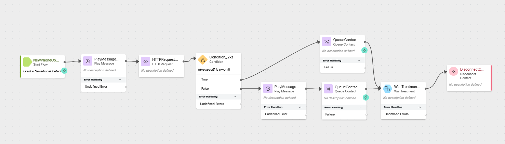

# Mission 4: Routing Returning Callers

!!! Note
    We are intentionally adding a bit of complexity to this lab by removing GIFs and screenshots. This approach will help you gain a deeper understanding of how to build and configure Webex Contact Center logic.
    If you encounter any difficulties while configuring steps in this mission, feel free to ask one of the instructors for assistance.


## Story
When a customer calls back into the contact center within ten minutes of their last call ending, we can assume there was a dropped call, missed callback, or they need additional assistance from their last interaction.  We are going to prioritize their call in the queue so that they can finish their business.

## Call Flow Overview

1. New call comes into the flow</br>
2. Call the Search API to check if the ANI (caller's number) had a call which ended in the last 10 minutes.</br>
3. If the caller had a connected call which ended within the last 10 minutes, we will play a message and will queue the call with a higher priority so they will get assigned to the next available agent.</br>
4. If the caller did not end a call with the contact center in the previous 10 minutes, we will queue the call normally.</br>

## Mission Details

Your mission is to:</br>
1. Create a new flow from scratch. </br>
2. Build a Search API query to request information from Analyzer database and parse it into flow variables.</br>
3. Build a condition that matches use case scenario and route the call to agent.</br>

!!! Note
    We are going to touch Subflow which is the feature that enables easier management of complex flows by breaking down commonly used and repeated portions into reusable subflows. This improves readability of flows, increases reusability of repeated functionality in the subflow, as well as improves development time since there is no redundant design of the same flows.

    Subflows also introduce the ability to share commonly used subroutines between developers, between customers and will help unlock a library of subflows available in the marketplace.


---

### Preconfigured Elements

1. Wait treatment Subflow which will provide Music in Queue and Queue Messages. 
2. Connector for calling Webex Contact Center APIs

---

## Build

1. Create a flow named **<span class="attendee-id-container">ReturningCaller_<span class="attendee-id-placeholder" data-prefix="ReturningCaller_">Your_Attendee_ID</span><span class="copy" title="Click to copy!"></span></span>** then create a flow variable 
    
    > Name: **previousID**<span class="copy-static" data-copy-text="previousID"><span class="copy" title="Click to copy!"></span></span>
    >
    > Type: **String**
    >
    > Default Value: Leave empty


2. Add a **Play Message** node for our welcome message

    > Connect the **New Phone Contact** output node edge to this **Play Message** node
    >
    > Enable Text-To-Speech
    >
    > Select the Connector: **Cisco Cloud Text-to-Speech**
    >
    > Click the Add Text-to-Speech Message button
    >
    > Delete the Selection for Audio File
    >
    > Text-to-Speech Message: **Welcome to the advanced routing and API integrations lab.**<span class="copy-static" data-copy-text="Welcome to the advanced routing and API integrations lab."><span class="copy" title="Click to copy!"></span></span>
    >


3. Add an **HTTP Request** node for our query

    > Connect the output node edge from the **Play message** node to this node
    > 
    > Select Use Authenticated Endpoint
    >
    > Connector: **WxCC_API**
    > 
    > Request Path: **/search**
    > 
    > Method: **POST**
    > 
    > Content Type: **Application/JSON**
    >
    > Copy this GraphQL query into the request body:
    ```JSON
    {"query":"query lastTen($from:Long! $to:Long! $timeComparator:QueryTimeType $filter:TaskFilters){task(from:$from,to:$to,timeComparator:$timeComparator,filter:$filter){tasks{id status channelType createdTime endedTime origin destination direction terminationType isActive isCallback lastWrapupCodeName}}}","variables":{"from":"{{now() | epoch(inMillis=true) - 600000}}","to":"{{now() | epoch(inMillis=true)}}","timeComparator":"endedTime","filter":{"and":[{"status":{"equals":"ended"}},{"origin":{"equals":"{{NewPhoneContact.ANI}}"}},{"connectedCount":{"gte":1}}]}}}
    ```
    <details><summary>Expanded Query For Understanding (optional)</summary>
    ```GraphQL
    query lastTen(
      $from: Long!
      $to: Long!
      $timeComparator: QueryTimeType
      $filter: TaskFilters
    ) {
      task(from: $from, to: $to, timeComparator: $timeComparator, filter: $filter) {
        tasks {
          id
          status
          channelType
          createdTime
          endedTime
          origin
          destination
          direction
          terminationType
          isActive
          isCallback
          lastWrapupCodeName
        }
      }
    }
    ```
    ``` JSON
    Variables:
    {
      "from": "{{now() | epoch(inMillis=true) - 600000}}", # time now - 10 minutes represented in EPOCH time(ms)
      "to": "{{now() | epoch(inMillis=true)}}", # time now represented in EPOCH time(ms)
      "timeComparator": "endedTime",
      "filter": {
        "and": [
          {
            "status": {
              "equals": "ended"
            }
          },
          {
            "origin": {
              "equals": "{{NewPhoneContact.ANI}}" # ANI or caller phone number
            }
          },
          {
            "connectedCount": {
              "gte": 1
            }
          }
        ]
      }  
    }
    ```
    </details>
     
    > Parse Settings:
    > 
    > Content Type: **`JSON`**
    >
    > Output Variable: **previousID**<span class="copy-static" data-copy-text="previousID"><span class="copy" title="Click to copy!"></span></span>
    >
    > Path Expression: `$.data.task.tasks[0].id`<span class="copy-static" data-copy-text="$.data.task.tasks[0].id"><span class="copy" title="Click to copy!"></span></span>
   

4.  Add a Condition node

    > Connect the output from the **HTTP Request** node to this node
    >
    > Expression: **`{{previousID is empty}}`**<span class="copy-static" data-copy-text="{{previousID is empty}}"><span class="copy" title="Click to copy!"></span></span>
    >
    > We will connect the **True** node in a future step.
    >
    > Connect the **False** node edge to the **Play Message** node created in the next step.
    >

5. Add a **Play Message** node

    > Connect the **False** node edge from the previous step to this node
    >
    > Enable Text-To-Speech
    >
    > Select the Connector: **Cisco Cloud Text-to-Speech**
    >
    > Click the Add Text-to-Speech Message button
    >
    > Delete the Selection for Audio File
    >
    > Text-to-Speech Message: **It looks like you were just working with an agent and had to call back in. We are prioritizing this call for the next available agent.**<span class="copy-static" data-copy-text="It looks like you were just working with an agent and had to call back in. We are prioritizing this call for the next available agent."><span class="copy" title="Click to copy!"></span></span>
    >

6.  Add a **Queue Contact** node

    >  Connect the output node edge from the **Play Message** node added in the last step to this node
    > 
    > Select Static Queue
    >
    > Queue: **<span class="attendee-id-container"><span class="attendee-id-placeholder" data-suffix="_Queue">Your_Attendee_ID</span>_Queue<span class="copy" title="Click to copy!"></span></span>**
    >
    > Enable the toggle **Set Contact Priority**
    >
    > Select **Static Priority**
    >
    > Static Priority Value: **P1**

7.  Add a **Subflow** node

    > In the Activity Library pane on the left side of the screen, click Subflows
    >
    > Find the Subflow names **WaitTreatment** and drag it onto the flow canvas like you would any other node.
    >
    > Connect the output node edge from the **Queue Contact** node added in the previous step to this node.
    >
    > Subflow Label: **Latest**
    >
    > Leave **Enable automatic updates** check box, checked
    >
    > Subflow Input Variables: **None**
    >
    > Subflow Output Variables: **None**
    >
    > Connect the output node edge from this node to the **Disconnect Contact** node added in the next step.


8. Add a **Disconnect Contact** node


9. Add a **Queue Contact** node

    > Connect the **True** node edge from the **Condition** node to this node
    > 
    > Select Static Queue
    >
    > Queue: **<span class="attendee-id-container"><span class="attendee-id-placeholder" data-suffix="_Queue">Your_Attendee_ID</span>_Queue<span class="copy" title="Click to copy!"></span></span>**
    >
    > Connect the **Output** node edge from this node to the **Subflow** node


    <details><summary>Check your flow</summary></details>

10.  Publish your flow

    > Turn on Validation at the bottom right corner of the flow builder
    >
    > If there are no Flow Errors, Click **Publish**
    >
    > Add a publish note
    >
    > Add Version Label(s): **Latest** 
    >
    > Click **Publish** Flow


11. Switch to Control Hub and navigate to **Channels** under Customer Experience Section
  
    >
    > Locate your Inbound Channel (you can use the search): **<span class="attendee-id-container"><span class="attendee-id-placeholder" data-suffix="_Channel">Your_Attendee_ID</span>_Channel<span class="copy" title="Click to copy!"></span></span>**
    >
    > Select the Routing Flow: **<span class="attendee-id-container">ReturningCaller_<span class="attendee-id-placeholder" data-prefix="ReturningCaller_">Your_Attendee_ID</span><span class="copy" title="Click to copy!"></span></span>**
    >
    > Select the Version Label: **Latest**
    >
    > Click Save in the lower right corner of the screen


## Testing

1. Your Agent desktop session should be still active but if not, use **Agent Desktop** with agent credentials you have been provided **<span class="attendee-id-container">wxcclabs+agent_ID<span class="attendee-id-placeholder" data-prefix="wxcclabs+agent_ID" data-suffix="@gmail.com">Your_Attendee_ID</span>@gmail.com<span class="copy" title="Click to copy!"></span></span>**. You will see another login screen with OKTA on it where you may need to enter the email address again and the password provided to you. 
2. On your Agent Desktop, make sure your status is not set to **Available**
      1. Using Webex, place a call to your Inbound Channel number **<span class="attendee-id-container"><span class="attendee-id-placeholder" data-suffix="_Channel">Your_Attendee_ID</span>_Channel<span class="copy" title="Click to copy!"></span></span>**
      2. After you hear the queue treatment start, you can abandon the call 
3. Using Webex, place another call to your Inbound Channel number **<span class="attendee-id-container"><span class="attendee-id-placeholder" data-suffix="_Channel">Your_Attendee_ID</span>_Channel<span class="copy" title="Click to copy!"></span></span>**
4. On your Agent Desktop, set your status to available
      1. You should be offered a call, click on the accept button. (You may want to mute the mic on both Webex and the Agent Desktop)
      2. After a few moments end the call and select a wrapup code.
5. In your Flow:
      1. Open the Debugger
      2. Select the last interaction (at the top of the list)
      3. Trace the steps taken in the flow
6. Answer these questions:
      1. Was the call queued with priority?
         1. Why or why not?
7. Close the Debugger
8. Using Webex, place another call to your Inbound Channel number **<span class="attendee-id-container"><span class="attendee-id-placeholder" data-suffix="_Channel">Your_Attendee_ID</span>_Channel<span class="copy" title="Click to copy!"></span></span>**
9. On your Agent Desktop, set your status to available
      1. You should be offered a call, click on the accept button. (You may want to mute the mic on both Webex and the Agent Desktop)
      2. After a few moments end the call and select a wrapup code.
10. In your Flow:
      1. Open the debugger
      2. Select the last interaction (at the top of the list)
      3. Trace the steps taken in the flow
11. Answer these questions:
      1. Was the call queued with priority?
         1. Why or why not?
      2. If you called another Inbound Channel number with the same flow logic, would your call be prioritized?
         1. How could you change this behavior? 

---
<p style="text-align:center"><strong>Congratulations, you have officially completed Routing Returning Callers mission! 🎉🎉 </strong></p>
