# Mission 5: Personalized Customer Notification with Functions


## Story 
In this mission, you will use a **Function Node** in WxCC to retrieve customer data from an external database and generate a personalized message using JavaScript. This ensures callers receive real-time updates on their last purchase, outstanding balance, and service requests without agent intervention.

## Call Flow Overview

1. When call arrives fetch the data from **MockAPI** based on your Dialed Number.</br>
2. Write the data into respective preconfigured flow variables. These variables will be passed to a Function.</br>
3. Function will generate a message based on inputs and pass it back to your flow.</br>
4. Play Message node plays the message received from Function.</br>


## Mission Details

Your mission is to:

1. Create a function that retrieves input variables, processes them, and generates a customer-friendly message.</br>
2. Create a new flow with the Function element.</br>
3. Request data from an external database, parse it into flow variables, and pass them to your Function.</br>
4. Play the message generated by the Function to the caller.</br>

> **<details><summary>Good to Know <span style="color: orange;">[Optional]</span></summary>**
>
> We are going to imitate a real API server by providing realistic responses to requests. For that we chose Server [**MockAPI**](https://mockapi.io/){:target="_blank"}.
> 
> For more information of how you can use MockAPI please watch these Vidcasts: 
[**[ADVANCED] Use MockAPI to enhance your Demos - PART 1**](https://app.vidcast.io/share/ce058b71-109e-4929-b9ca-46b83d94f7e3){:target="_blank"} and [**[ADVANCED] Use MockAPI to enhance your Demos - PART 2**](https://app.vidcast.io/share/1e259a34-7e9e-44d9-aa5a-5d76e07256a3){:target="_blank"}
> 
> </details>


## Building Function 

1. Switch to Control Hub, then navigate to **Functions**, click on **Create a function**.t. 

2. New Tab will be opened. Select **Start Fresh** and provide name **<span class="attendee-id-container">Function_<span class="attendee-id-placeholder" data-prefix="Function_">Your_Attendee_ID</span><span class="copy" title="Click to copy!"></span></span>**. Leave **Function Language** as **JavaScript**, then click **Create Function**.

    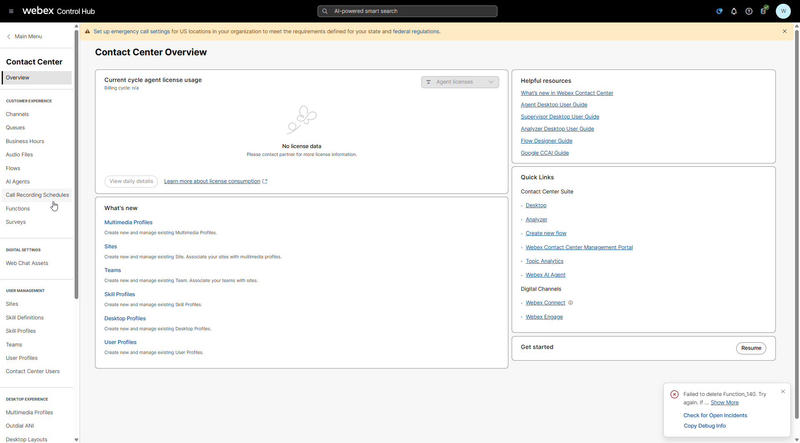

3. Add following variables by clicking **Add Input Variables**:


    - Last purchase date variable:
    
      >
      > Name: **lastPurchase**<span class="copy-static" data-copy-text="lastPurchase"><span class="copy" title="Click to copy!"></span></span>
      >
      > Type: **String**
      >
      > Default Value: *empty*
   
    - Customer pending request variable:
    
      >
      > Name: **pendingServiceRequest**<span class="copy-static" data-copy-text="pendingServiceRequest"><span class="copy" title="Click to copy!"></span></span>
      >
      > Type: **String**
      >
      > Default Value: *empty*

    - Expected resolution date variable:
    
      >
      > Name: **resolutionDate**<span class="copy-static" data-copy-text="resolutionDate"><span class="copy" title="Click to copy!"></span></span>
      >
      > Type: **String**
      >
      > Default Value: *empty*

    - Outstanding account balance variable:
    
      >
      > Name: **outstandingBalance**<span class="copy-static" data-copy-text="outstandingBalance"><span class="copy" title="Click to copy!"></span></span>
      >
      > Type: **String**
      >
      > Default Value: *empty*

4. Add output variable **personalizedMessage**<span class="copy-static" data-copy-text="personalizedMessage"><span class="copy" title="Click to copy!"></span></span> in **Output Variable Definition** field.</br>

    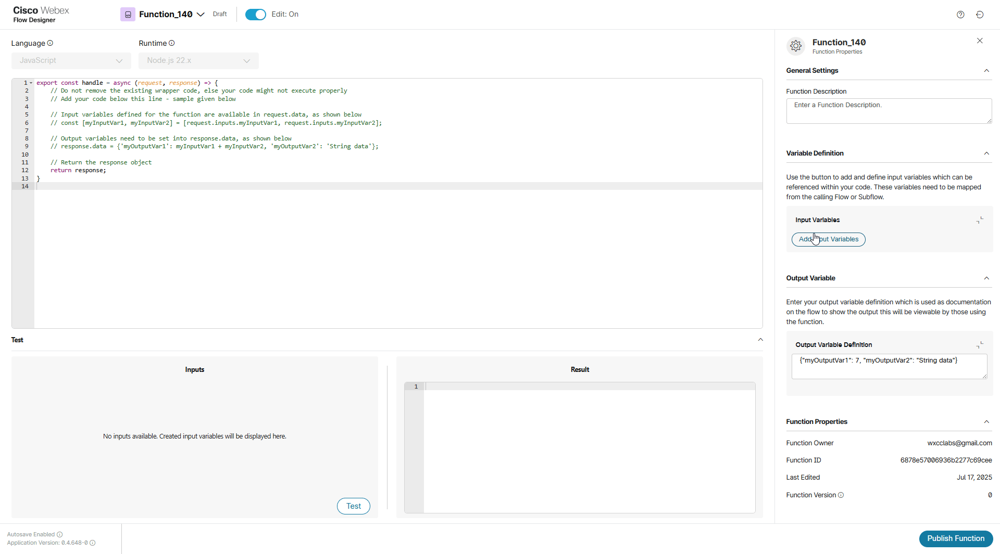


5. Clear the editor from the default code and paste the following JavaScript code into Function editor.

    ``` JSON
     export const handle = async (request, response) => {
        // Retrieve input variables (all as strings)
        var lastPurchase = request.inputs.lastPurchase;  // e.g., '17-03-2025'
        var outstandingBalance = request.inputs.outstandingBalance;  // e.g., '120.50'
        var pendingServiceRequest = request.inputs.pendingServiceRequest;  // e.g., 'Network issue'
        var resolutionDate = request.inputs.resolutionDate;  // e.g., '20-03-2025'
    
        // Convert outstandingBalance to a number safely
        let balanceAmount = parseFloat(outstandingBalance);
        if (isNaN(balanceAmount)) {
            balanceAmount = 0;  // Default to 0 if conversion fails
        }
    
        // Function to convert 'DD-MM-YYYY' to a proper Date object
        function parseDate(dateString) {
            if (!dateString) return null;
            const parts = dateString.split('-'); // Split "17-03-2025" into ["17", "03", "2025"]
            if (parts.length !== 3) return null; // Invalid format
    
            const [day, month, year] = parts.map(num => parseInt(num, 10));
            return new Date(year, month - 1, day); // Month is 0-based in JS Dates
        }
    
        // Format the date to a readable string (e.g., "March 17, 2025")
        function formatDate(date) {
            return date ? date.toLocaleDateString('en-US', { year: 'numeric', month: 'long', day: 'numeric' }) : null;
        }
    
        // Parse and format dates
        let formattedLastPurchase = formatDate(parseDate(lastPurchase));
        let formattedResolutionDate = formatDate(parseDate(resolutionDate));
    
        // Generate the personalized message
        let message = 'Hello, we have some information about your account:';
    
        if (formattedLastPurchase) {
            message += ` Your last purchase was on ${formattedLastPurchase}.`;
        }
        if (balanceAmount > 0) {
            message += ` You have an outstanding balance of $${balanceAmount.toFixed(2)}.`;
        }
        if (pendingServiceRequest) {
            message += ` We also have a pending service request: ${pendingServiceRequest}`;
            if (formattedResolutionDate) {
                message += `, resolution by ${formattedResolutionDate}.`;
            } else {
                message += `.`;
            }
        } else {
            message += ' There are no pending service requests at the moment.';
        }
    
        // Return the generated message
        response.data = { 'personalizedMessage': message };
    
        return response;
        };
    ```

    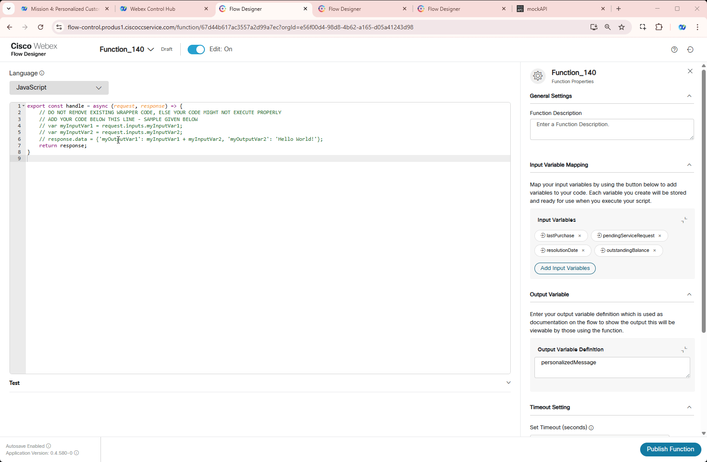

    > **<details><summary>Good to know: Script Breakdown<span style="color: orange;">[Optional]</span></summary>**
    >
    > This script dynamically generates a personalized message for customers based on their account details. In our lab it is a Channel Support Number assigned to you. It is used within Webex Contact Center (WxCC) Flow Designer to enhance customer interactions.
    > 
    > 1. How It Works:</br>
    >    Retrieves input variables from the Flow:</br>
    >      - `lastPurchase` → Date of the last purchase (e.g., `"17-03-2025"`).</br>
    >      - `outstandingBalance` → The amount owed by the customer (e.g., `"120.50"`).</br>
    >      - `pendingServiceRequest` → Details of any unresolved service request (e.g., `"Network issue"`).</br>
    >      - `resolutionDate` → Expected resolution date of the service request (e.g., `"20-03-2025"`).</br>
    > 
    > 2. Processes and formats the data:</br>
    >      - Converts `lastPurchase` and `resolutionDate` from `"DD-MM-YYYY"` format into a more readable format (`March 17, 2025`).</br>
    >      - Ensures `outstandingBalance` is a valid number and avoids errors if it’s missing or invalid.</br>
    > 3. Generates a customer-friendly message:</br>
    >      - If the customer made a purchase, the date is included.</br>
    >      - If an outstanding balance exists, the amount is shown.</br>
    >      - If there’s a pending service request, it’s mentioned, along with a resolution date (if available).</br>
    >      - If no pending issues exist, it confirms that everything is fine.</br>
    > 4. Returns the message to be used in the Flow:</br>
    >      - The script outputs `personalizedMessage`, which can be read out in an IVR or displayed to an agent.</br>
    ></details>
</br>

6. Perform a test to see how you script preforms by clicking on **Test** panel below the editor. Provide following data into respective fields. Then click **Test** button.

    > `lastPurchase`: **17-03-2025**<span class="copy-static" data-copy-text="17-03-2025"><span class="copy" title="Click to copy!"></span></span>
    >
    > `pendingServiceRequest`: **Network issue on Amsterdam location**<span class="copy-static" data-copy-text="Network issue on Amsterdam location"><span class="copy" title="Click to copy!"></span></span>
    >
    > `resolutionDate`: **20-03-2025**<span class="copy-static" data-copy-text="20-03-2025"><span class="copy" title="Click to copy!"></span></span>
    >
    > `outstandingBalance`: **529.51**<span class="copy-static" data-copy-text="529.51"><span class="copy" title="Click to copy!"></span></span>
    >

7. Click on **Publish Function** and again click **Publish Function** in pop up window.

    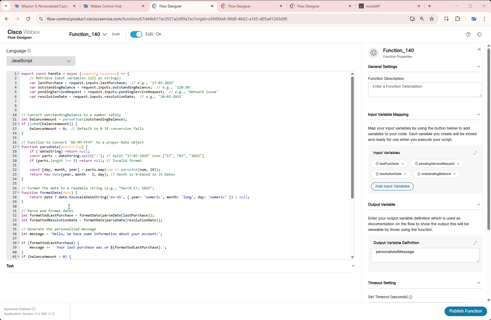

---

## Building Flow

1. Switch to Control Hub, then navigate to **Flows**, click on **Manage Flows** then select **Create Flows** from drop down list. 

2. Select **Start Fresh** then enter flow name **<span class="attendee-id-container">FunctionFlow_<span class="attendee-id-placeholder" data-prefix="FunctionFlow_">Your_Attendee_ID</span><span class="copy" title="Click to copy!"></span></span>**. Click on **Create Flow**.

    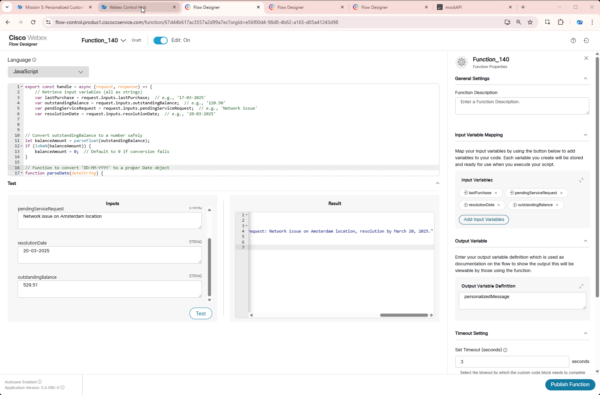


3. Add these flow variables:
  
    - Last purchase date variable:
    
      >
      > Name: **lastPurchase**<span class="copy-static" data-copy-text="lastPurchase"><span class="copy" title="Click to copy!"></span></span>
      >
      > Type: **String**
      >
      > Default Value: *empty*

    - Customer pending request variable:
    
      >
      > Name: **pendingServiceRequest**<span class="copy-static" data-copy-text="pendingServiceRequest"><span class="copy" title="Click to copy!"></span></span>
      >
      > Type: **String**
      >
      > Default Value: *empty*

    - Expected resolution date variable:
    
      >
      > Name: **resolutionDate**<span class="copy-static" data-copy-text="resolutionDate"><span class="copy" title="Click to copy!"></span></span>
      >
      > Type: **String**
      >
      > Default Value: *empty*

    - Outstanding account balance variable:
    
      >
      > Name: **outstandingBalance**<span class="copy-static" data-copy-text="outstandingBalance"><span class="copy" title="Click to copy!"></span></span>
      >
      > Type: **String**
      >
      > Default Value: *empty*


    - HTTP Response variable:
    
      >
      > Name: **HTTPResponse**<span class="copy-static" data-copy-text="HTTPResponse"><span class="copy" title="Click to copy!"></span></span>
      >
      > Type: **String**
      >
      > Default Value: *empty*

    - Personalized message variable:
    
      >
      > Name: **personalizedMessage**<span class="copy-static" data-copy-text="personalizedMessage"><span class="copy" title="Click to copy!"></span></span>
      >
      > Type: **String**
      >
      > Default Value: *empty*

    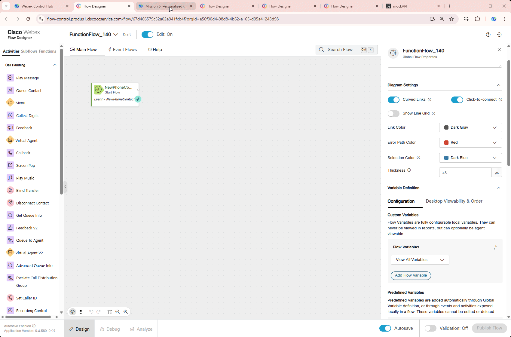


    > **<details><summary>**Test your API Source**<span style="color: orange;">[Optional]</span></summary>**
    > 
    > 1. Test your API resource. **https://674481b1b4e2e04abea27c6e.mockapi.io/flowdesigner/Lab/DynVars?dn={DNIS}**<span class="copy-static" data-copy-text="https://674481b1b4e2e04abea27c6e.mockapi.io/flowdesigner/Lab/DynVars?dn={DNIS}"><span class="copy" title="Click to copy!"></span></span>
    > 
    > 2. Replace DNIS with the provided DNIS number stripping +1
    >
    > <span style="color: orange;">[Example:]</span> If your number **+14694096861**, then your GET Query should be ***https://674481b1b4e2e04abea27c6e.mockapi.io/flowdesigner/Lab/DynVars?dn=4694096861***
    >
    > 3. Open Chrome browser and past your URL. You should get the follwoing result
    > 
    > 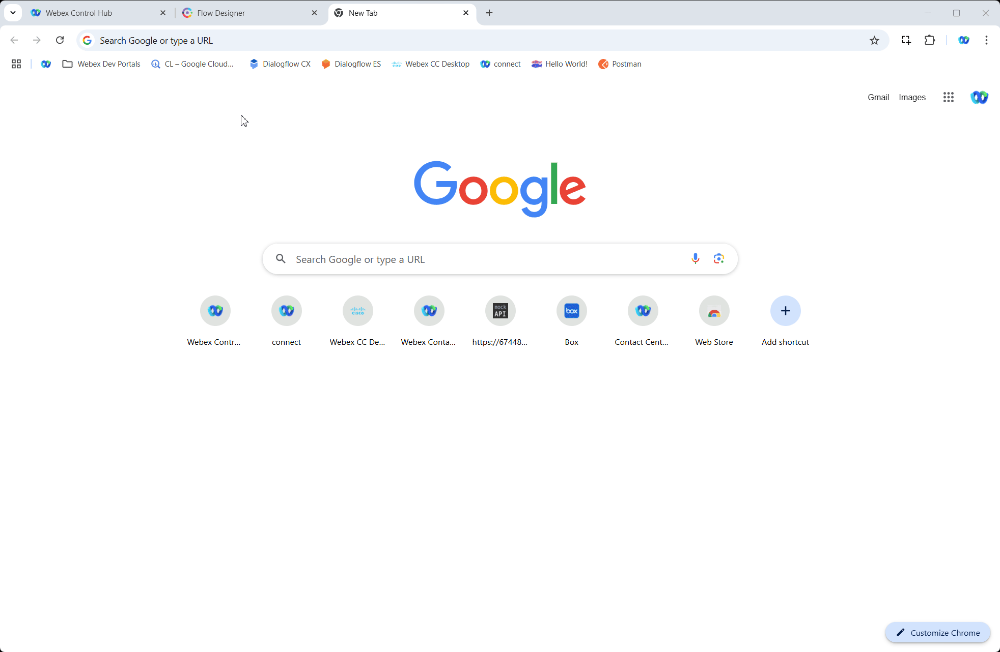
    > 
    > 4. Test JSON Path in the following tool [https://jsonpath.com/](https://jsonpath.com/){:target="_blank"}
    > 
    > 5. Paste your GET URL into the Browser address line and copy the output in square brackets (including brackets)
    >
    > 6. Open [https://jsonpath.com/](https://jsonpath.com/){:target="_blank"} and paste the copied response into **Inputs** window
    >
    > 7. In **JSONPath** box copy and paste one of the path expression from **FetchFlowSettings** to verify your results.
    >
    > 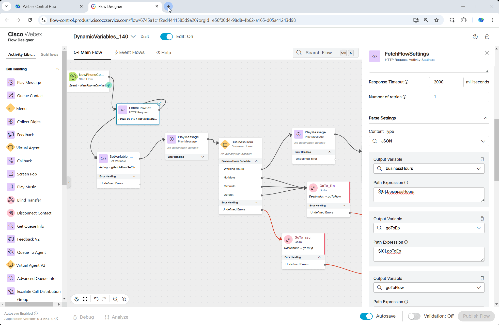
    > </details>


4. Add an **HTTP Request** node. We are going to fetch data and write it into our new created variables `lastPurchase`, `pendingServiceRequest`, `resolutionDate` and `outstandingBalance`.
    
    >
    > Connect **NewPhoneContact** to this HTTP node
    >
    > We will connect **HTTP Request** node in next step
    >
    > Activity Name: **GET_HTTPRequest**<span class="copy-static" data-copy-text="GET_HTTPRequest"><span class="copy" title="Click to copy!"></span></span>
    >
    > Use Authenticated Endpoint: **Off**
    >
    > Request URL: ***https://674481b1b4e2e04abea27c6e.mockapi.io/flowdesigner/Lab/DynVars?dn={{NewPhoneContact.DNIS | slice(2) }}***<span class="copy-static" data-copy-text="https://674481b1b4e2e04abea27c6e.mockapi.io/flowdesigner/Lab/DynVars?dn={{NewPhoneContact.DNIS | slice(2) }}"><span class="copy" title="Click to copy!"></span></span>
    > 
    > Method: **GET**
    > 
    > Content Type: **Application/JSON**
    >
    > **Parsing Settings:**
    >
    > Content Type: **JSON** 
    >>
    >> Output Variable: **`pendingServiceRequest`**<span class="copy-static" data-copy-text="pendingServiceRequest"><span class="copy" title="Click to copy!"></span></span>
    >>
    >> Path Expression: **`$[0].pendingServiceRequest`**<span class="copy-static" data-copy-text="$[0].pendingServiceRequest"><span class="copy" title="Click to copy!"></span></span>
    >
    > Click **Add New**
    >>
    >> Output Variable: **`lastPurchase`**<span class="copy-static" data-copy-text="lastPurchase"><span class="copy" title="Click to copy!"></span></span>
    >>
    >> Path Expression: **`$[0].lastPurchase`**<span class="copy-static" data-copy-text="$[0].lastPurchase"><span class="copy" title="Click to copy!"></span></span>
    >
    > Click **Add New**
    >>
    >> Output Variable: **`outstandingBalance`**<span class="copy-static" data-copy-text="outstandingBalance"><span class="copy" title="Click to copy!"></span></span>
    >>
    >> Path Expression: **`$[0].outstandingBalance`**<span class="copy-static" data-copy-text="$[0].outstandingBalance"><span class="copy" title="Click to copy!"></span></span>
    >
    > Click **Add New**
    >>
    >> Output Variable: **`resolutionDate`**<span class="copy-static" data-copy-text="resolutionDate"><span class="copy" title="Click to copy!"></span></span>
    >>
    >> Path Expression: **`$[0].resolutionDate`**<span class="copy-static" data-copy-text="$[0].resolutionDate"><span class="copy" title="Click to copy!"></span></span>

    

5. Add **Set Variable** node
    
    >
    > Activity Label: **HTTP_Response**<span class="copy-static" data-copy-text="HTTP_Response"><span class="copy" title="Click to copy!"></span></span>
    >
    > Connect **GET_HTTPRequest** to this node
    >
    > We will connect **Set Variable** node in next step
    >
    > Variable: **`HTTPResponse`**<span class="copy-static" data-copy-text="HTTPResponse"><span class="copy" title="Click to copy!"></span></span>
    >
    > Set To Variable: **`GET_HTTPRequest.httpResponseBody`**<span class="copy-static" data-copy-text="GET_HTTPRequest.httpResponseBody"><span class="copy" title="Click to copy!"></span></span>
    >

    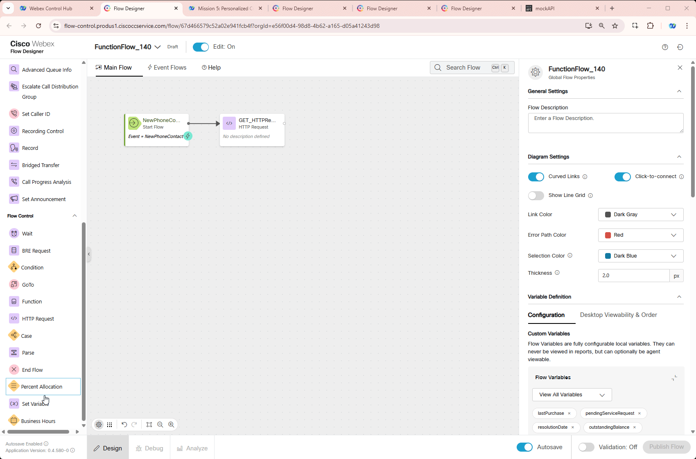

6. Switch to **Functions** tab in the left menu. Then drag **<span class="attendee-id-container">Function_<span class="attendee-id-placeholder" data-prefix="Function_">Your_Attendee_ID</span><span class="copy" title="Click to copy!"></span></span>** node to the canvas.

    >
    > Connect **HTTP_Response** to this node
    >
    > We will connect this node in next step
    >
    > Function Version Label: **Latest**
    >
    > **Function Input Variables** should auto populate
    > 
    > **Output Settings**
    >
    >> Output Variable: **`personalizedMessage`**<span class="copy-static" data-copy-text="personalizedMessage"><span class="copy" title="Click to copy!"></span></span>
    >>
    >> Path Expression **`$.personalizedMessage`**<span class="copy-static" data-copy-text="$.personalizedMessage"><span class="copy" title="Click to copy!"></span></span>

    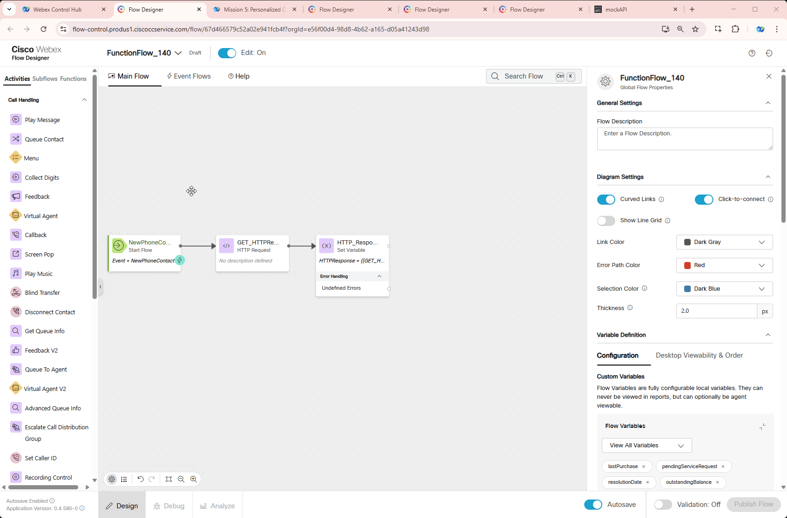

7. Switch to **Activity** tab in the left menu. Add **Play Message** and **Disconnect Contact** nodes 
    
    >
    > Connect the **Function** node edge to this **Play Message** node
    >
    > Enable Text-To-Speech
    >
    > Select the Connector: **Cisco Cloud Text-to-Speech**
    >
    > Click the Add Text-to-Speech Message button
    >
    > Delete the Selection for Audio File
    >
    > Text-to-Speech Message: **{{personalizedMessage}}**<span class="copy-static" data-copy-text="{{personalizedMessage}}"><span class="copy" title="Click to copy!"></span></span>
    >
    > Connect the **Play Message** node edge to this **Disconnect Contact** node
</br>

8.  Publish your flow

    > Turn on Validation at the bottom right corner of the flow builder
    >
    > If there are no Flow Errors, Click **Publish**
    >
    > Add a publish note
    >
    > Add Version Label(s): **Latest** 
    >
    > Click **Publish** Flow

    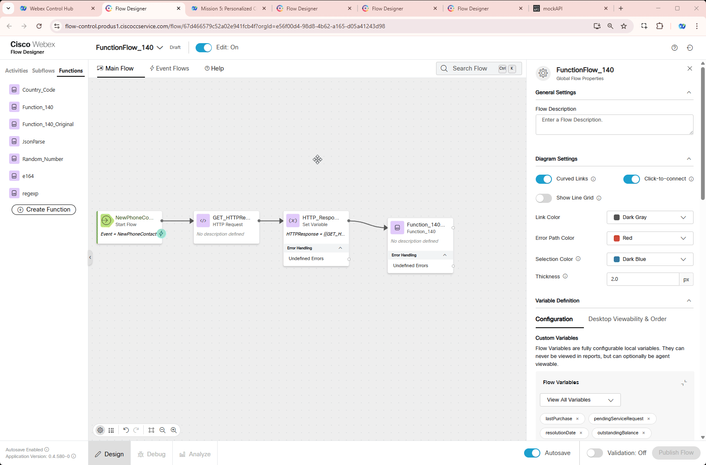
</br>

9. Map your flow to your inbound channel
    
    > Navigate to Control Hub > Contact Center > Channels
    >
    > Locate your Inbound Channel (you can use the search): **<span class="attendee-id-container"><span class="attendee-id-placeholder" data-suffix="_Channel">Your_Attendee_ID</span>_Channel<span class="copy" title="Click to copy!"></span></span>**
    >
    > Select the Routing Flow: **<span class="attendee-id-container">FunctionFlow_<span class="attendee-id-placeholder" data-prefix="FunctionFlow_">Your_Attendee_ID</span><span class="copy" title="Click to copy!"></span></span>**
    >
    > Select the Version Label: **Latest**
    >
    > Click **Save** in the lower right corner of the screen

    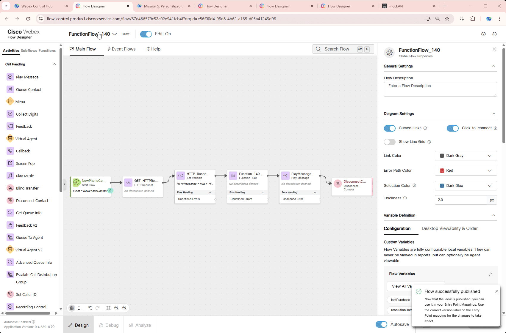

## Testing

1. Open your Webex App and dial the Support Number provided to you, which is configured in your **<span class="attendee-id-placeholder">Your_Attendee_ID</span>_Channel** configuration.

    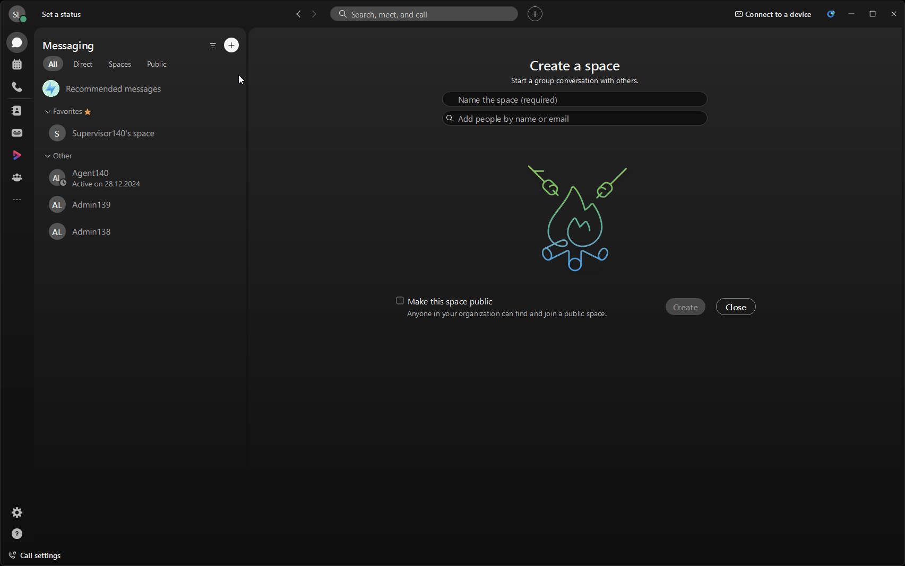

2. Verify if you hear a message built inside your function.

3. Switch to Flow Designer and click Debug tab at the bottom and select last interaction (first in the list)

4. Click on **GET_HTTPRequest** and on the right hand side window scroll to the bottom. Check if **Modified Variables** have values assigned.

5. Click on **HTTP_Response** to see full HTTP response body in **Modified Variables**.

6. Click on **Function** step and check if Modified Variables contains `**personalizedMessage**` built by your function.

    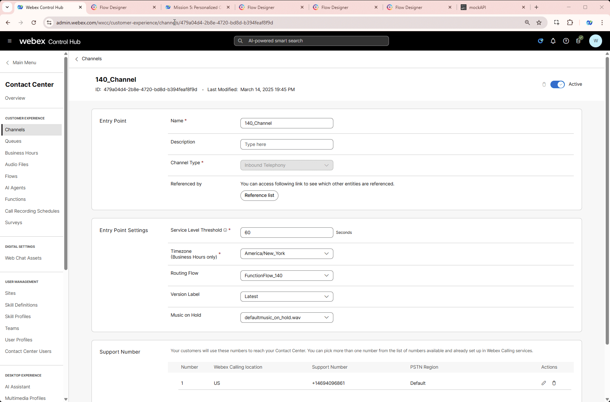

<p style="text-align:center"><strong>Congratulations, you have successfully completed Function mission! 🎉🎉 </strong></p>
