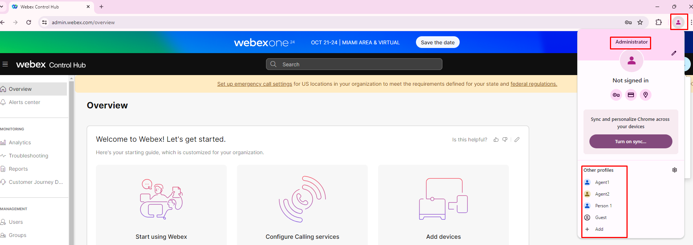
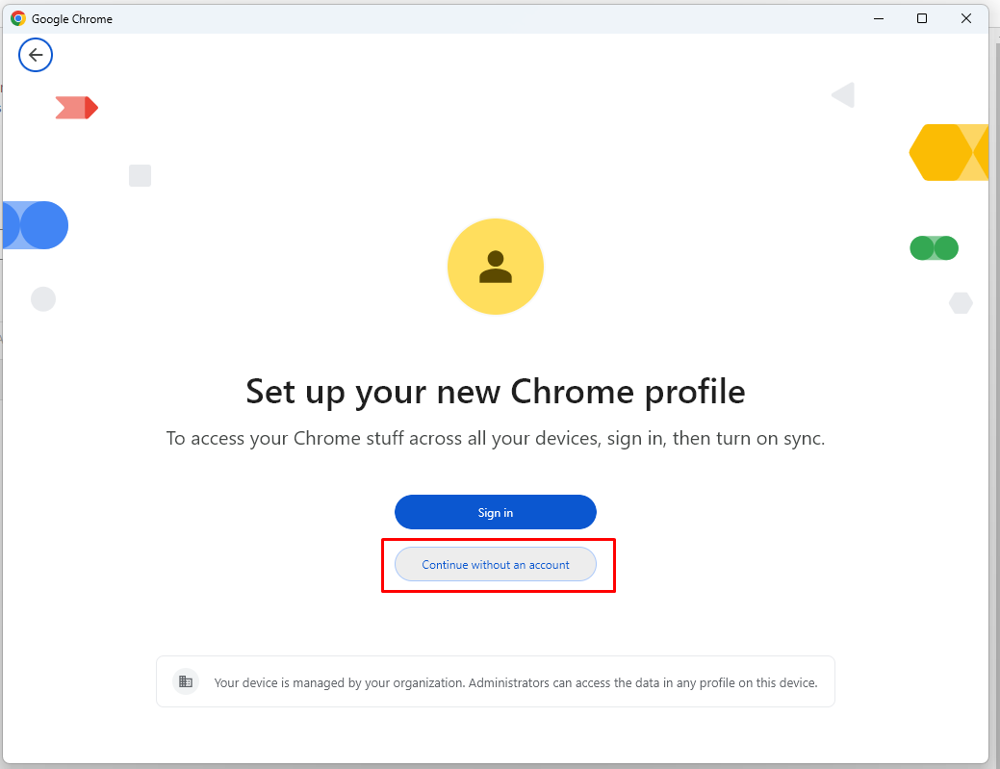
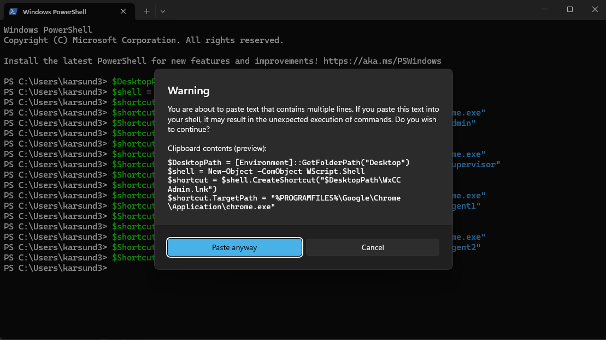
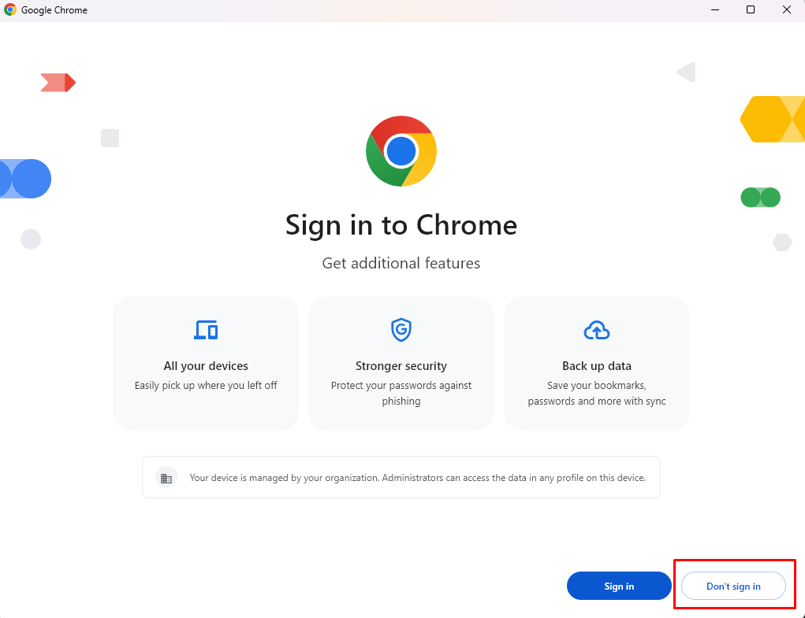
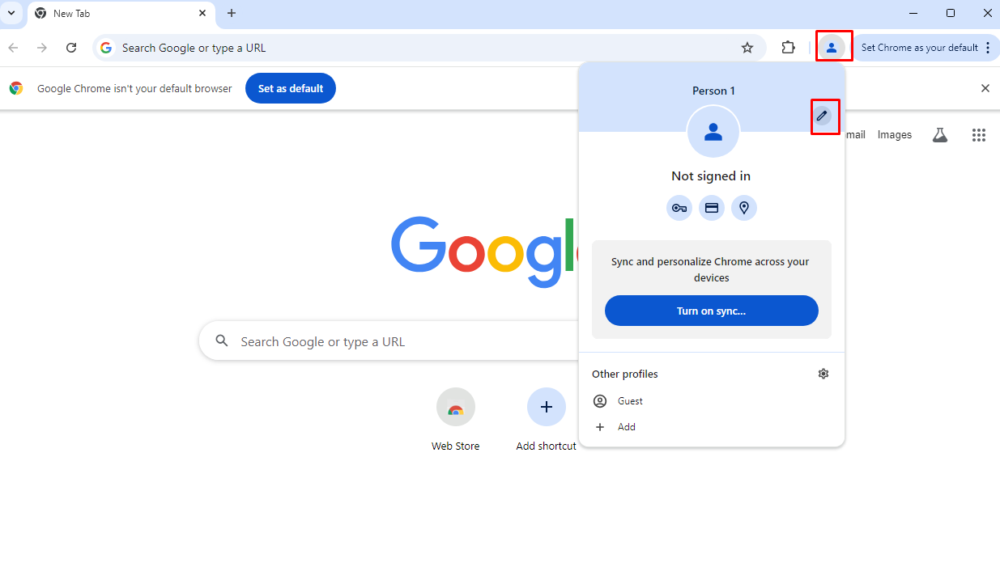

### Browser Setup

Since we will be using the same Chrome browser for different roles we will use the **Chrome Browser profiles** to allow multiple logins into the different components of the Webex contact center. For the control hub, use the Administrator profile created for you in the Chrome browser. Always offer Chrome to **remember your credentials and password** for this lab. For Agent Desktop, use Agent Desktop Application   pre-insalled on your working station by using Agent profile. 
</br>
</br>

We will create the user profiles below - Admin, Agent





---

### Creating Chrome user profiles

Open the Windows Terminal (Windows key and type **Powershell**). Paste and run the following code. You will see 2 new Chrome shortcut icons on the desktop

```
$DesktopPath = [Environment]::GetFolderPath("Desktop")
$shell = New-Object -ComObject WScript.Shell
$shortcut = $shell.CreateShortcut("$DesktopPath\WxCC Admin.lnk")
$shortcut.TargetPath = "%PROGRAMFILES%\Google\Chrome\Application\chrome.exe"
$Shortcut.Arguments = "--user-data-dir=%USERPROFILE%\chromeProfiles\admin"
$Shortcut.Save()
$shortcut = $shell.CreateShortcut("$DesktopPath\WxCC Agent1.lnk")
$shortcut.TargetPath = "%PROGRAMFILES%\Google\Chrome\Application\chrome.exe"
$Shortcut.Arguments = "--user-data-dir=%USERPROFILE%\chromeProfiles\Agent1"
$Shortcut.Save()
```



Check the desktop of your lab PC. You should find 2 Chrome shortcuts created - WxCC Admin, **WxCC Agent1 and WxCC Supervisor**

When you click on the links 



You can customize each profile to be easily identifiable with a name and/or icon of your choice



We will use the **Admin** profile first in the next section.

<script src='../template_assets/load.js'><script>