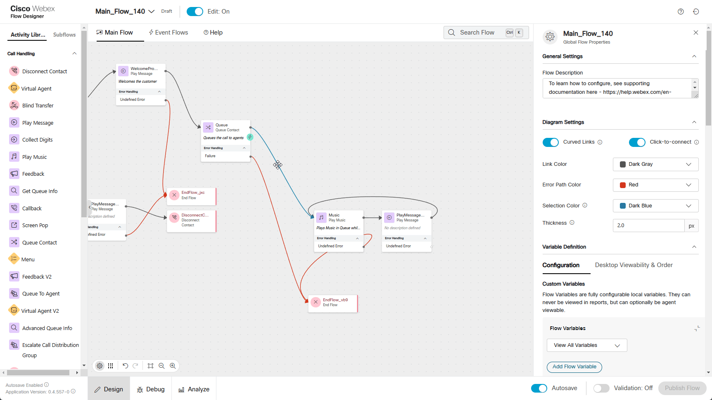
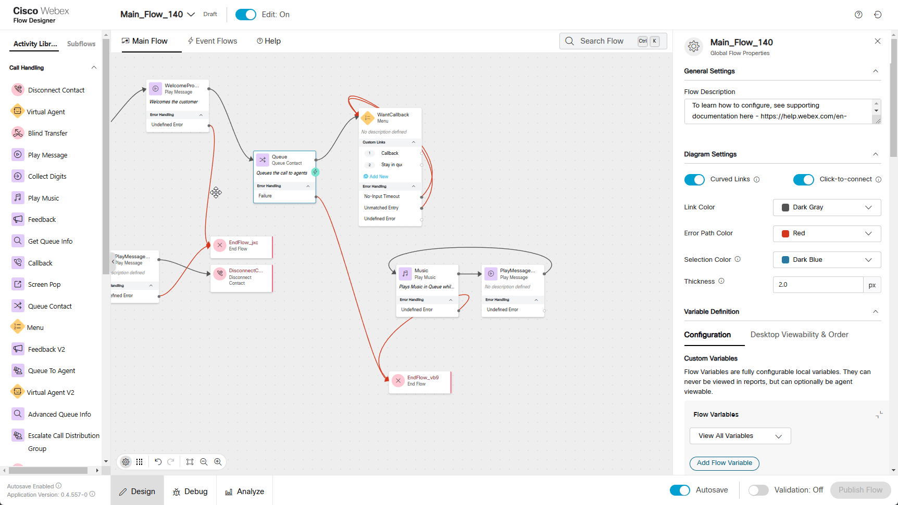
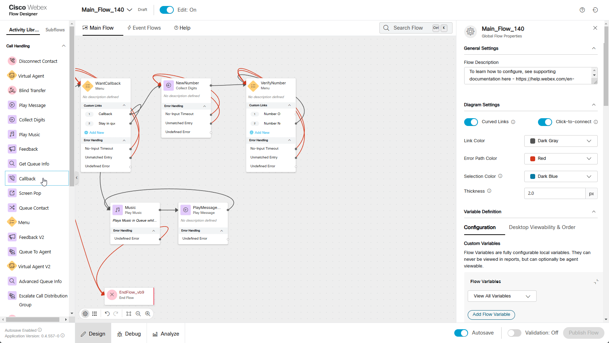

## Story 

Callback functionality is an essential feature in a modern contact center, providing a solution that enhances both customer satisfaction and operational efficiency.

Imagine a customer calls to upgrade their service but faces a 20-minute wait, they can request a callback instead of staying on hold. If no agents are available, they’ll be offered the choice to remain in the queue or opt for a callback. Upon choosing the callback, they provide their number, which is validated, and the system schedules the call. Once an agent is free, the system connects with the customer. This ensures businesses retain leads while providing a seamless customer experience.

## Call Flow Overview

1. A new call enters the flow.  
2. The flow executes the logic configured in previous steps. 
3. The call is routed to the appropriate queue, but no agents are available. 
4. Since no agents are available, a callback option is offered to the caller. 
5. Once an agent becomes available, the callback is initiated to the provided number. 

## Mission Details

Your mission is to:  

1. Continue to use same flow **Main_Flow_Your_Attendee_ID**  
2. Add additional callback functionality to your **Main_Flow_Your_Attendee_ID**.

## Build

1. Switch to the Flow Designer. Open your flow **Main_Flow_Your_Attendee_ID**. Make sure **Edit** toggle is **ON**.
2. Delete  connection from **Queue** node to **Music** 
3. Drag **Menu** node:

    > Rename Activity Label to **WantCallback**
    >
    > Enable Text-To-Speech
    >
    > Select the Connector: **Cisco Cloud Text-to-Speech**
    >
    > Click the Add Text-to-Speech Message button and paste text: ***All agents are busy. Please press 1 if you want to schedule a callback. Press 2 if you want to wait in queue.***
    >
    > Delete the Selection for Audio File
    >
    > Under Custom Menu Links:
    >>
    >> Change first Digit Number **0** to **1**, add Link Description as **Callback** 
    >>
    >> Add New Digit Number as **2** with Link Description **Stay in queue**
    >
    > Connect existing **Queue** node to **WantCallBack** node
    >
    > Connect **No-Input Timeout** to the front of the **WantCallBack** node
    >
    > Connect **Unmatched Entry** to the front of the **WantCallBack** node

    

4. Drag **Collect Digits** nodes
    
    > Rename Activity Label to **NewNumber**
    >
    > Enable Text-To-Speech
    >
    > Select the Connector: **Cisco Cloud Text-to-Speech**
    >
    > Click the Add Text-to-Speech Message button and paste text: ***Please enter your 11 digits phone number to which we should call you back.***
    >
    > Delete the Selection for Audio File
    > 
    > Check **Make Prompt Interruptible**
    >  
    > Advanced Settings:
    >
    >> No-Input Timeout  **5** 
    >>
    >> Minimum Digits: **11**
    >>
    >> Maximum Digits: **11**
    >       
    > Connect **No-Input Timeout** to the front of the **NewNumber** node
    >
    > Connect **Unmatched Entry** to the front of the **NewNumber** node
    >   
    > Connect **Callback** from **WantCallback** node created in step 3 to **NewNumber** node
    >
    > Connect **Stay in queue** from **WantCallback** node created in step 3 to **Music** node

    

5. Drag one more **Menu** node
    
    > Rename Activity Label to **VerifyNumber**
    >
    > Enable Text-To-Speech
    >
    > Select the Connector: **Cisco Cloud Text-to-Speech**
    >
    > Click the Add Text-to-Speech Message button and paste text: ***You entered*** *{{NewNumber.DigitsEntered}}****. Press 1 if the number is correct. Press 2 if you want to re-enter the number.***
    >
    > Delete the selection for Audio File
    >    
    > Custom Menu Links:
    >>
    >> Change first Digit Number from **0** to **1**, add Link Description as **Number OK**
    >>
    >> Add New Digit Number as **2** with  Link Description **Number Not OK**
    >
    > Connect **No-Input Timeout** to the front of the **VerifyNumber** node
    >
    > Connect **Unmatched Entry** to the front of the **VerifyNumber** node
    >    
    > Connect **NewNumber** created in step 4 to **VerifyNumber** node
    >
    > Connect **Number Not OK** from **VerifyNumber** node to **Collect Digits** node created in Step 4.
    
    

6. Add **Callback** node
    
    > Callback Dial Number select  ***NewNumber.DigitsEntered*** from dropdown list
    >    
    > Callback Queue:
    >> Static Queue: **Your_Attendee_ID_Queue**
    > 
    > Callback ANI: Choose any number from dropdown list.
    > 
    > Connect **Number OK** from **VerifyNumber** node created in step 5 to **CallBack** node

7. Add **Play Message** node as follows:
    
    > Enable Text-To-Speech
    >
    > Select the Connector: **Cisco Cloud Text-to-Speech**
    >
    > Click the Add Text-to-Speech Message button and paste text: **Your call has been successfully scheduled for a callback. Good Bye.**
    >
    > Delete the Selection for Audio File
    >
    > Connect **CallBack** node created in step 6 to **Play Message** node
    >
    > Connect **Play Message** to **Disconnect Contact** node
    
    

8. Validate the flow by clicking **Validate**, **Publish** and select the Latest version of the flow

    
## Testing
    
1. Make sure you're logged into the **Agent Desktop** as an Agent and set the status to **Not Available**. In this case, the call will not be assigned to an agent, and a callback will be proposed to the caller.
2. Make a call to the Support Number and if success you should hear configured messages.

3. When callback is proposed, press 1 on Webex App DialPad to request a callback. 

4. When asked, provide a new number for a callback. Because in the current lab we have number limitations, we are going to provide a well-known Cisco Worldwide Support contact number **1 408 526 7209** as a callback number. Use the DialPad to provide the Cisco TAC number, then confirm when asked.
3. Once done, another message about successful scheduling should play.
4. Make your agent **Available**. Contact Center will reserve you right away and propose to answer a callback call.

**Congratulations on completing another mission.**
