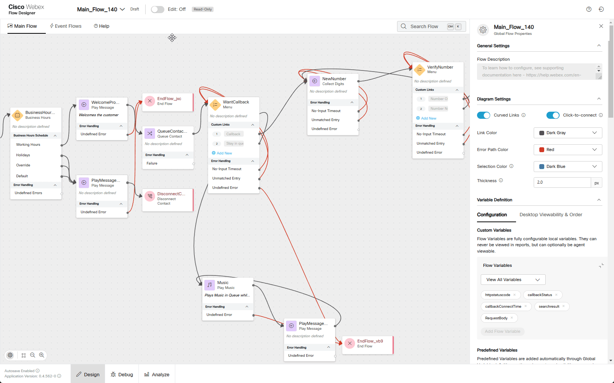
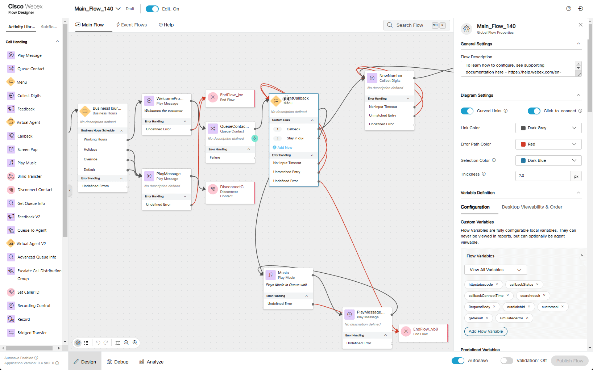
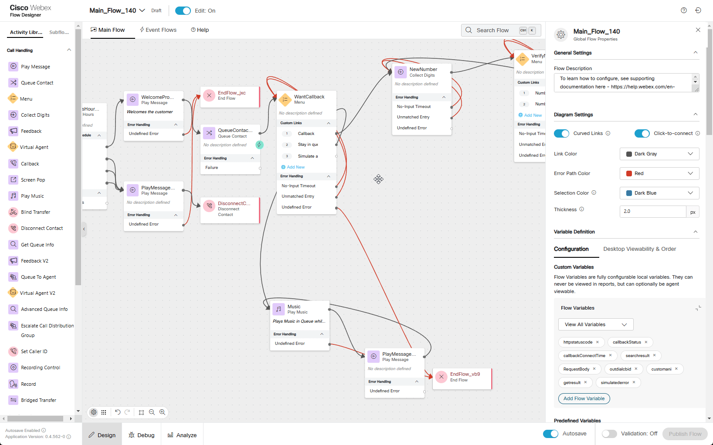
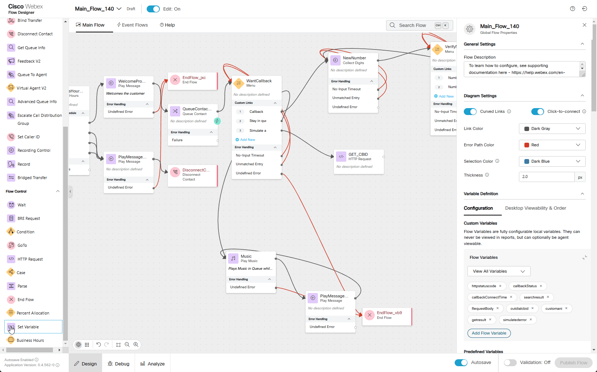
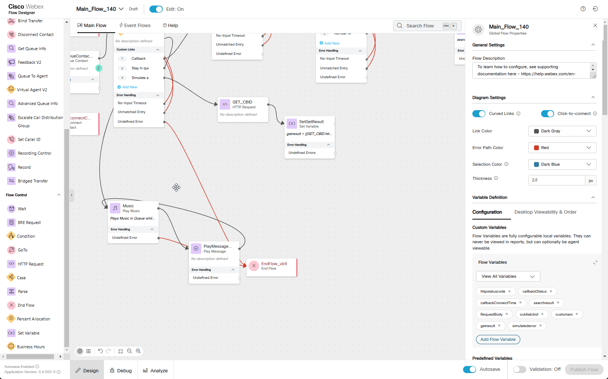
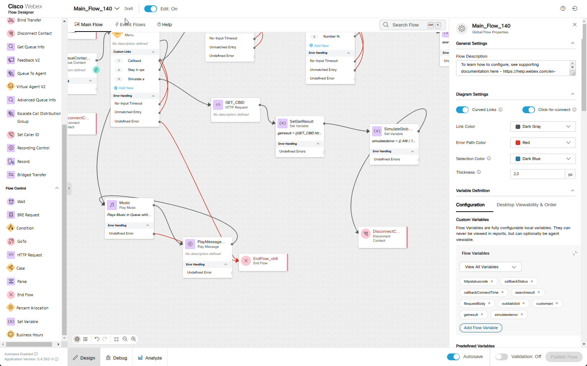
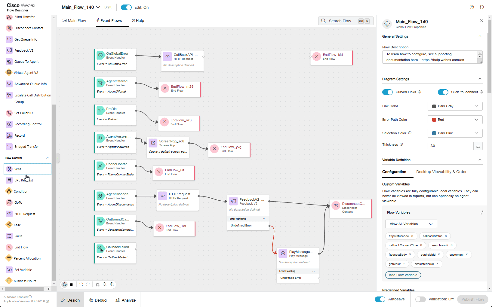

# Mission 3: Callback on Global Error

## Story 
Imagine a caller is navigating an IVR menu when, suddenly, the call drops due to an unexpected error in the flow. This unplanned interruption leaves the customer disconnected without completing their request. In this scenario we are going to configure our flow to schedule a callback to the caller when such failure scenario occurs.


## Call Flow Overview

1. A new call enters the flow. </br>
2. The flow executes the logic by querying external database for Outbound Channel and ANI.</br>
3. The call is routed to the appropriate queue, but no agents are available.</br>
4. On a callback offering a new option should be selected to simulate an error and drop the call. </br>
5. Once an agent becomes available, the callback is initiated to the  number.</br>

## Mission Details

Your mission is to:

1. Simulate a global error scenario to trigger a Global Error Event and initiate a workflow to reconnect with a caller whose call was disconnected due to an undefined error. </br>
2. Configure an API POST request to schedule a callback when global error happens. You cannot rely on the Callback node in Main Flow because the call leg is no longer active after termination. Instead, you must design a custom solution to address this limitation.</br>
3. You do not need to configure Outdial Channel and Outdial Queue as they have been preconfigured for you: </br>
    - **<span class="attendee-id-container">Outdial_<span class="attendee-id-placeholder" data-prefix="Outdial_" data-suffix="_Channel">Your_Attendee_ID</span>_Channel<span class="copy" title="Click to copy!"></span></span>** </br>
    - Outdial queue **<span class="attendee-id-container">Outdial_<span class="attendee-id-placeholder" data-prefix="Outdial_" data-suffix="_Queue">Your_Attendee_ID</span>_Queue<span class="copy" title="Click to copy!"></span></span>** to which your **<span class="attendee-id-placeholder">Your_Attendee_ID</span>_Team** has been assigned. </br>
4. Simulate a real API server. You will use [**MockAPI**](https://mockapi.io/){:target="_blank"} to retrieve the Outdial channel ID and the target callback number. The retrieved Outdial channel ID will then be used in the Callback API POST request.

> **<details><summary>Good to Know <span style="color: orange;">[Optional]</span></summary>**
>
> We are starting to use Webex Contact Center APIs in this mission. More information can be found in the [**Webex Contact Center for Developers**](https://developer.webex-cx.com/){:target="_blank"} portal.
> 
> For more information of how you can use MockAPI please watch these Vidcasts: 
[**[ADVANCED] Use MockAPI to enhance your Demos - PART 1**](https://app.vidcast.io/share/ce058b71-109e-4929-b9ca-46b83d94f7e3){:target="_blank"} and [**[ADVANCED] Use MockAPI to enhance your Demos - PART 2**](https://app.vidcast.io/share/1e259a34-7e9e-44d9-aa5a-5d76e07256a3){:target="_blank"}
> 
> </details>


## Build

!!! Note
    **We are going to extend the same flow by adding additional functionality to simulate a global error scenario which will trigger a callback to a caller.** 


1. Switch to the Flow Designer. Open your flow **Main_Flow_<span class="attendee-id-placeholder">Your_Attendee_ID</span>** and make sure **Edit** toggle is **ON**.
2. On the right-hand side, in the **Global Flow Properties** panel, scroll down to locate the **Flow Variables** section under **Custom Variables**. Click the **Add Flow Variable** button and add the following 4 flow variables:  

    - Outdial Entry Point Variable :
    
      >
      > Name: **outdialcbid**<span class="copy-static" data-copy-text="outdialcbid"><span class="copy" title="Click to copy!"></span></span>
      >
      > Type: **String**
      >
      > Default Value: **empty**
    
    - Custom ANI variable:
      
      >
      > Name: **customani**<span class="copy-static" data-copy-text="customani"><span class="copy" title="Click to copy!"></span></span>
      >
      > Type: **String**
      >
      > Default Value: **empty**

    - HTTP GET Result variable:
      
      >
      > Name: **getresult**<span class="copy-static" data-copy-text="getresult"><span class="copy" title="Click to copy!"></span></span>
      >
      > Type: **String**
      >
      > Default Value: **empty**

    - Simulated Error variable:
      
      >
      > Name: **simulatederror**<span class="copy-static" data-copy-text="simulatederror"><span class="copy" title="Click to copy!"></span></span>
      >
      > Type: **String**
      >
      > Default Value: **empty**

    

3. Click on **WantCallback** node  
  
    > Add Option 3. Name it as **Simulate an error**
    >
    > Text-to-Speech Message: ***All agents are busy. Please press 1 if you want to schedule a callback. Press 2 if you want to wait in queue. Press 3 to simulate global error.***<span class="copy-static" data-copy-text="All agents are busy. Please press 1 if you want to schedule a callback. Press 2 if you want to wait in queue. Press 3 to simulate global error."><span class="copy" title="Click to copy!"></span></span>. We are extending the existing message by adding Option 3.
    
    

4. Add an **HTTP Request** node for our query. We are going to fetch Outbound Channel/Entry Point ID and custom ANI. Remember we used the same Cisco Worldwide Support contact number in Mission 3 of Fundamental labs.
    
    >
    > Connect **WantCallback** Option 3 to this HTTP node
    >
    > We will connect **HTTP Request** node in next step
    >
    > Activity Name: **GET_CBID**<span class="copy-static" data-copy-text="GET_CBID"><span class="copy" title="Click to copy!"></span></span>
    >
    > Use Authenticated Endpoint: **Off**
    >
    > Request URL: ***https://674481b1b4e2e04abea27c6e.mockapi.io/flowdesigner/Lab/DynVars?dn={{NewPhoneContact.DNIS | slice(2) }}***<span class="copy-static" data-copy-text="https://674481b1b4e2e04abea27c6e.mockapi.io/flowdesigner/Lab/DynVars?dn={{NewPhoneContact.DNIS | slice(2) }}"><span class="copy" title="Click to copy!"></span></span>
    > 
    > Method: **GET**
    > 
    > Content Type: **Application/JSON**
    >
    > **Parsing Settings:**
    >
    > Content Type: **JSON** 
    >
    > Output Variable: **outdialcbid**<span class="copy-static" data-copy-text="outdialcbid"><span class="copy" title="Click to copy!"></span></span>
    >
    > Path Expression: **$[0].outboundcallbackep**<span class="copy-static" data-copy-text="$[0].outboundcallbackep"><span class="copy" title="Click to copy!"></span></span>
    >
    > Click **Add New**
    >
    > Output Variable: **customani**<span class="copy-static" data-copy-text="customani"><span class="copy" title="Click to copy!"></span></span>
    >
    > Path Expression: **$[0].tacnumber**<span class="copy-static" data-copy-text="$[0].tacnumber"><span class="copy" title="Click to copy!"></span></span>

    

    > **<details><summary>**Test your API Source**<span style="color: orange;">[Optional]</span></summary>**
    > 
    > 1. Test your API resource. **https://674481b1b4e2e04abea27c6e.mockapi.io/flowdesigner/Lab/DynVars?dn={DNIS}**<span class="copy-static" data-copy-text="https://674481b1b4e2e04abea27c6e.mockapi.io/flowdesigner/Lab/DynVars?dn={DNIS}"><span class="copy" title="Click to copy!"></span></span>
    > 
    > 2. Replace {DNIS} with the provided DNIS number stripping +1
    >
    > <span style="color: orange;">[Example:]</span> If your number **+14694096861**, then your GET Query should be ***https://674481b1b4e2e04abea27c6e.mockapi.io/flowdesigner/Lab/DynVars?dn=4694096861***
    >
    > 3. Open Chrome browser and past your URL. You should get the follwoing result
    > 
    > 
    > 
    > 4. Test JSON Path in the following tool [https://jsonpath.com/](https://jsonpath.com/){:target="_blank"}
    > 
    > 5. Paste your GET URL into the Browser address line and copy the output in square brackets (including brackets)
    >
    > 6. Open [https://jsonpath.com/](https://jsonpath.com/){:target="_blank"} and paste the copied response into **Inputs** window
    >
    > 7. In **JSONPath** box copy and paste one of the path expression from **FetchFlowSettings** to verify your results.
    >
    > 
    > </details>


5. Add **Set Variable** node
    
    >
    > Activity Label: **SetGetResult**<span class="copy-static" data-copy-text="SetGetResult"><span class="copy" title="Click to copy!"></span></span>
    >
    > Connect **GET_CBID** to this node
    >
    > We will connect **Set Variable** node in next step
    >
    > Variable: **getresult**<span class="copy-static" data-copy-text="getresult"><span class="copy" title="Click to copy!"></span></span>
    >
    > Set To Variable: **GET_CBID.httpResponseBody**<span class="copy-static" data-copy-text="GET_CBID.httpResponseBody"><span class="copy" title="Click to copy!"></span></span>
    >

    

6. Add one more **Set Variable** and **Disconnect Contact** nodes. We are going to intentionally configure an incorrect value in the **Set Variable** node to forcibly trigger a Global Error.
    
    >
    > Activity Label: **SimulateGlobalError**<span class="copy-static" data-copy-text="SimulateGlobalError"><span class="copy" title="Click to copy!"></span></span>
    >
    > Connect **SetGetResult** to this node
    >
    > Connect this node to **Disconnect Contact**
    >
    > Variable: **simulatederror**<span class="copy-static" data-copy-text="simulatederror"><span class="copy" title="Click to copy!"></span></span>
    >
    > Set Value: ***{{ ANI | 123}}***<span class="copy-static" data-copy-text="{{ ANI | 123}}"><span class="copy" title="Click to copy!"></span></span>
    >
        

7. Navigate to **Event Flows** and delete connection from **OnGlobalError** to **EndFlow**.
8. Add **HTTP Request** node to the flow. In this step we are going to build a **Create Task** API POST request. See [**Create Task API**](https://developer.webex-cx.com/documentation/tasks/v1/create-task){:target="_blank"} for details.

    > Activity Label: **CallBackAPI_HTTPRequest**<span class="copy-static" data-copy-text="CallBackAPI_HTTPRequest"><span class="copy" title="Click to copy!"></span></span>
    >
    > Connect the **OnGlobalError** output edge node to this node
    > 
    > Use Authenticated Endpoint: **On**
    >
    > Connector: **WxCC_API**
    >
    > Request Path: **/v1/tasks**<span class="copy-static" data-copy-text="/v1/tasks"><span class="copy" title="Click to copy!"></span></span>
    >
    > Method: **POST**
    >
    > Content Type: **Application/JSON**
    >
    > Request Body:
    ``` JSON
    {
        "entryPointId": "{{outdialcbid}}",
        "destination": "{{customani}}",
        "attributes": {"Message":"tester","To Queue":"sales"},
        "outboundType": "CALLBACK",
        "mediaType": "telephony",
        "callback": {
        "callbackOrigin": "web",
        "callbackType": "immediate"
        }
    }
    ```
     

9. Add **Condition** node. In this node we are going to check the status of our API POST request. If HTTP response is **201 Created** the output will be **True** and if other than **201** then **False**.
    
    > 
    > Activity Label: **HTTPStatusCode**<span class="copy-static" data-copy-text="HTTPStatusCode"><span class="copy" title="Click to copy!"></span></span>
    >
    > Connect the output node edge from the **CallBackAPI_HTTPRequest** node to this node
    >
    > Connect both **True** and **False** exists to **EndFlow** node. We will be able to see in Debug tool whether request was succsesful or not. 
    >
    > In the Expression section write an expresion ***{{CallBackAPI_HTTPRequest.httpStatusCode == 201}}***<span class="copy-static" data-copy-text="{{CallBackAPI_HTTPRequest.httpStatusCode == 201}}"><span class="copy" title="Click to copy!"></span></span>
    
10. Validate the flow by clicking **Validate**, **Publish** and select the Latest version of the flow.

     

11.  Switch to **Control Hub**. Navigate to **Channels** under **Customer Experience Section**, locate your channel **<span class="attendee-id-container"><span class="attendee-id-placeholder" data-suffix="_Channel">Your_Attendee_ID</span>_Channel<span class="copy" title="Click to copy!"></span></span>**.
12. Click on **<span class="attendee-id-placeholder">Your_Attendee_ID</span>_Channel**
13. In **Entry Point** settings section change the following, then click **Save** button:
    
    >
    > Routing Flow: **Main_Flow_<span class="attendee-id-placeholder">Your_Attendee_ID</span>**
    >
    > Version Label: **Latest**

## Testing


1. Make sure you're logged into **Agent Desktop** as Agent and set status to **Not Available**. In this case call will not be assigned to an agent and callback will be proposed to a caller.
2. Make a call to the Support Number and if success you should hear configured messages.

3. Next message will propose you options to request callback, stay in queue or simulate an error. Press 3 on Webex App DialPad to simulate an error. 

4. If everything configured correctly your call should be disconnected.
5. Open Debug tool in your **Main_Flow_<span class="attendee-id-placeholder">Your_Attendee_ID</span>** and click on first call in the list which should be the last call you made. Look for **WantCallback** in Activity Name column and make sure the call left **WantCallback** out of Option 3 and continue through **GET_CBID**.

6. Click on either **GET_CBID** node of the flow or on Activity Name **GET_CBID** n the Debug tool and scroll to the bottom the right hand side section of Debug tool. Under **Modified Variables** you should see values assigned to **outdialcbid** and **customani** flow variables. Where **outdialcbid** is ID of your **<span class="attendee-id-container">Outdial_<span class="attendee-id-placeholder" data-prefix="Outdial_" data-suffix="_Channel">Your_Attendee_ID</span>_Channel<span class="copy" title="Click to copy!"></span></span>** and **customani** is a well known Cisco Worldwide Support contact number **1 408 526 7209**. The same number we used in previous exercise.  This time we used an external database as well as GET API call to extract that number.

7. While still on Debug tool, click on **SetGetResult** to see full response from HTTP request that we wrote into **getresult** flow variable.
8. Make sure **SimulateGlobalError** activity name has an **Error** next to it in **Outcome** column. That mean you successfully simulated **Global Error** event.

9. Click on next activity name **GlobalErrorHandling** which goes after **SimulateGlobalError** activity name. Flow Designer automaticaly will open **Event Flows** tab.

10. Observe **Condition** node to make sure exit went out via **True** exit. This tells you that HTTP response is **201 Created** and callback has been scheduled successfully. 

11. On Webex Desktop, make your agent **Available**. Contact Center will reserve your agent right away and propose to answer a callback call.

**Congratulations on completing another mission.**
