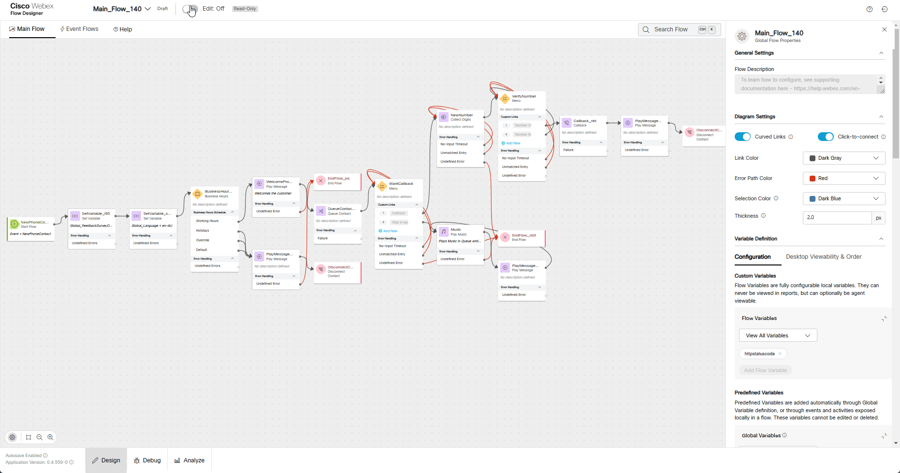

# Mission 4: Preventing Callback duplication

> !!! Note
      This task relies on completing Mission 3 of Core Track. Ensure that mission is completed to have a fully functional callback feature in your flow.


## Story 
If a caller who already has a scheduled callback contacts the contact center again to request another callback, our system can recognize this. It will then notify the caller that a callback is already scheduled and will be completed as soon as the next agent becomes available.

## Call Flow Overview

1. A new call from a caller, who already has a scheduled callback, enters the flow.</br>
2. The flow executes the logic configured in previous missions.</br>
3. The call is routed to the appropriate queue, but no agents are available.</br>
4. Since no agents are available, a callback option is offered to the caller.</br>
5. Once the caller requests for a callback, IVR replies that callback has been scheduled already.</br>

## Mission Details

Your mission is to:

1. Enhance the functionality of the **<span class="attendee-id-container">Main_Flow_<span class="attendee-id-placeholder" data-prefix="Main_Flow_">Your_Attendee_ID</span><span class="copy" title="Click to copy!"></span></span>** by introducing an advanced feature to check if a callback already exists for a specific tested number. 
2. Use **Search API** request to fetch the data from Analyzer database. For more details see [**Search API**](https://developer.webex-cx.com/documentation/search/v1/search-tasks){:target="_blank"} for details.


## Build

1. Switch to the Flow Designer. Open your flow **<span class="attendee-id-container">Main_Flow_<span class="attendee-id-placeholder" data-prefix="Main_Flow_">Your_Attendee_ID</span><span class="copy" title="Click to copy!"></span></span>** and make sure **Edit** toggle is **ON**.

2. On the right-hand side, in the **Global Flow Properties** panel, scroll down to locate the **Flow Variables** section under **Custom Variables**. Click the **Add Flow Variable** button and add the following 3 flow variables: 

    - Callback Status variable:
    
      >
      > Name: **callbackStatus**<span class="copy-static" data-copy-text="callbackStatus"><span class="copy" title="Click to copy!"></span></span>
      >
      > Type: **String**
      >
      > Default Value: **empty**
    
    - Callback Connect Time variable:
      
      >
      > Name: **callbackConnectTime**<span class="copy-static" data-copy-text="callbackConnectTime"><span class="copy" title="Click to copy!"></span></span>
      >
      > Type: **String**
      >
      > Default Value: **empty**
      
    - Search Result variable:
      
      >
      > Name: **searchresult**<span class="copy-static" data-copy-text="searchresult"><span class="copy" title="Click to copy!"></span></span>
      >
      > Type: **String**
      >
      > Default Value: **empty**

      

3. Add an **HTTP Request** node for our query as shown in the following video.
    
    >
    > Remove the existing connection between **VerifyNumber** Option 1 and **Callback** node
    >
    > Connect **VerifyNumber** Option 1 to this HTTP node
    >
    > We will connect this **HTTP Request** node in next step
    >
    > Activity Label: **HTTPRequest_CallBackSearch**<span class="copy-static" data-copy-text="HTTPRequest_CallBackSearch"><span class="copy" title="Click to copy!"></span></span>
    >
    > Select Use Authenticated Endpoint
    >
    > Connector: **WxCC_API**
    > 
    > Path: **/search**
    > 
    > Method: **POST**
    > 
    > Content Type: **GraphQL**
    >
    > Copy this GraphQL query into the request body:
    >
    > Query:
    ```GraphQL
    query callbackSearch($from: Long!, $to: Long!, $filter: TaskDetailsFilters) {
    taskDetails(from: $from, to: $to, filter: $filter) {
      tasks {
        callbackData {
          callbackRequestTime
          callbackConnectTime
          callbackNumber
          callbackStatus
          callbackOrigin
          callbackType
        }
        lastEntryPoint {
          id
          name
          }
        }
      }
    }
    ```

    > Variables: 
      ```JSON
      {
        "from": "{{now() | epoch(inMillis=true) - 15000000}}",
        "to": "{{now() | epoch(inMillis=true)}}",
        "filter": {
          "and": [
            {
              "callbackData": {
                "equals": {
                  "callbackNumber": "{{NewNumber.DigitsEntered}}"
                }
              }
            },
            {
              "lastEntryPoint": {
                "id": {
                  "equals": "{{NewPhoneContact.EntryPointId}}"
                }
              }
            }
          ]
        }
      }

      ```


  

    <!-- ```JSON
    {"query":"query($from: Long!, $to: Long!)\n{\n  taskDetails(\n      from: $from\n      to: $to\n    filter: {\n      and: [\n       { callbackData: { equals: { callbackNumber: \"{{NewNumber.DigitsEntered}}\" } } }\n       { lastEntryPoint: { id: { equals: \"{{NewPhoneContact.EntryPointId}}\" } } }\n      ]\n    }\n  ) {\n    tasks {\n      callbackData {\n        callbackRequestTime\n        callbackConnectTime\n        callbackNumber\n        callbackStatus\n        callbackOrigin\n        callbackType\n      }\n       lastEntryPoint {\n        id\n        name\n      }\n    }\n  }\n}","variables":{"from":"{{now() | epoch(inMillis=true) - 15000000}}","to":"{{now() | epoch(inMillis=true)}}"}}
    ```
    > <details><summary>Expanded Query For Understanding (optional)</summary>
    ```GraphQL
    query($from: Long!, $to: Long!)
    {
      taskDetails(
          from: $from
          to: $to
        filter: {
          and: [
           { callbackData: { equals: { callbackNumber: "{{NewNumber.DigitsEntered}}" } } }
           { lastEntryPoint: { id: { equals: "{{NewPhoneContact.EntryPointId}}" } } }
          ]
        }
      ) {
        tasks {
          callbackData {
            callbackRequestTime
            callbackConnectTime
            callbackNumber
            callbackStatus
            callbackOrigin
           callbackType
          }
           lastEntryPoint {
            id
            name
          }
        }
      }
    }
    ```
    </details> -->

    > Parse Settings:
    >
    > - Content Type: JSON
    > - Output Variable: `callbackStatus`<span class="copy-static" data-copy-text="callbackStatus"><span class="copy" title="Click to copy!"></span></span>
    > - Path Expression: `$.data.taskDetails.tasks[0].callbackData.callbackStatus`<span class="copy-static" data-copy-text="$.data.taskDetails.tasks[0].callbackData.callbackStatus"><span class="copy" title="Click to copy!"></span></span>
    >
    > Click **Add New**
    > 
    > - Output Variable: `callbackConnectTime`<span class="copy-static" data-copy-text="callbackConnectTime"><span class="copy" title="Click to copy!"></span></span>
    >
    > - Path Expression: `$.data.taskDetails.tasks[0].callbackData.callbackConnectTime`<span class="copy-static" data-copy-text="$.data.taskDetails.tasks[0].callbackData.callbackConnectTime"><span class="copy" title="Click to copy!"></span></span>
    >
    </br>
    </br>
    
      
---     

4. Add **Set Veriable** node
    
    >
    > Connect **HTTPRequest_CallBackSearch** to this node
    >
    > We will connct **Set Variable** node in next step
    >
    > Variable: **searchresult**<span class="copy-static" data-copy-text="searchresult"><span class="copy" title="Click to copy!"></span></span>
    >
    > Set To Variable: **HTTPRequest_CallBackSearch.httpResponseBody**<span class="copy-static" data-copy-text="HTTPRequest_CallBackSearch.httpResponseBody"><span class="copy" title="Click to copy!"></span></span>
    >
    

5. Add a **Condition** node
    
      > 
      > Connect **Set Variable** created in previous step to this node
      >
      > Connect **False** exit path to existing CallBack node
      > 
      > We will connect **True** exit path in next step
      >
      > Expression: 
      ``` JSON
      {{ callbackConnectTime == "-1" ? (callbackStatus == "Not Processed" ? (HTTPRequest_CallBackSearch.httpStatusCode == 200 ? "true" : "false") : "false") : "false" }}
      ```


      > !!! Note
          Above expression uses nested ternary logic to combine the checks. This evaluates the first condition and then evaluates the second condition if the first is true and so on. In our case the expression returns True only when httpStatusCode equals **200**, callbackStatus is **Not Processed** and callbackConnectTime is **-1**

    

6. Add **Play Message** and **Disconnect Contact** nodes: 
    
      > Enable Text-To-Speech
      >
      > Select the Connector: **Cisco Cloud Text-to-Speech**
      >
      > Click the **Add Text-to-Speech Message** button and paste text: **The callback for provided number has been scheduled already. Please await for a callback once next agent becomes available. Thank you for your patience.**<span class="copy-static" data-copy-text="The callback for provided number has been scheduled already. Please await for a callback once next agent becomes available. Thank you for your patience."><span class="copy" title="Click to copy!"></span></span>
      >
      > Delete the Selection for Audio File
      >
      > Connect **True** exit path of **Condition** node created in previous step to **Play Message** node
      > Connect this **Play Message** to **Disconnect Contact** node

      

7. Validate the flow by clicking **Validate**, **Publish** and select the Latest version of the flow.

## Testing
    
1. Make sure your Agent either **Logged Out** or in **Not Available** state. In this case call will not be assigned to an agent and callback will be proposed to a caller.
2. Make sure your **<span class="attendee-id-container">Main_Flow_<span class="attendee-id-placeholder" data-prefix="Main_Flow_">Your_Attendee_ID</span><span class="copy" title="Click to copy!"></span></span>** is assigned to **<span class="attendee-id-container"><span class="attendee-id-placeholder" data-suffix="_Channel">Your_Attendee_ID</span>_Channel<span class="copy" title="Click to copy!"></span></span>**. If not, do that (refer to previous very first Mission where this step was explained in details).
3. Make a call to your Support Number and if success you should hear configured messages and ask to provide a new number for a callback. Because in current lab we are having number limitations we are going to provide a well known Cisco Worldwide Support contact number **1 408 526 7209**<span class="copy-static" data-copy-text="+14085267209"><span class="copy" title="Click to copy!"></span></span>
4. While keeping your agent **Not Available**, make another test call to your flow and request for a callback to the same number **1 408 526 7209**<span class="copy-static" data-copy-text="+14085267209"><span class="copy" title="Click to copy!"></span></span>.
5. You should hear a message configured in **Step 6** of the current mission.
6. Click on **Analyze** to visually observe the call flow. Make sure you're viewing latest Published Version.
7. Review the flow and click on **HTTPRequest_CallBackSearch** where you can cross-launch debugger to that particular call.
8. Navigate to **HTTPRequest_CallBackSearch** to see **Modified Variables** at the bottom of right hand side of the debugger. 
9. Click on **Set Variable**, which is the next step after **HTTPRequest_CallBackSearch**, to see full Search API response which we wrote to **searchresult** flow variable on the **Step 6** of the current mission configuration. 


**Congratulations on completing another mission.**
