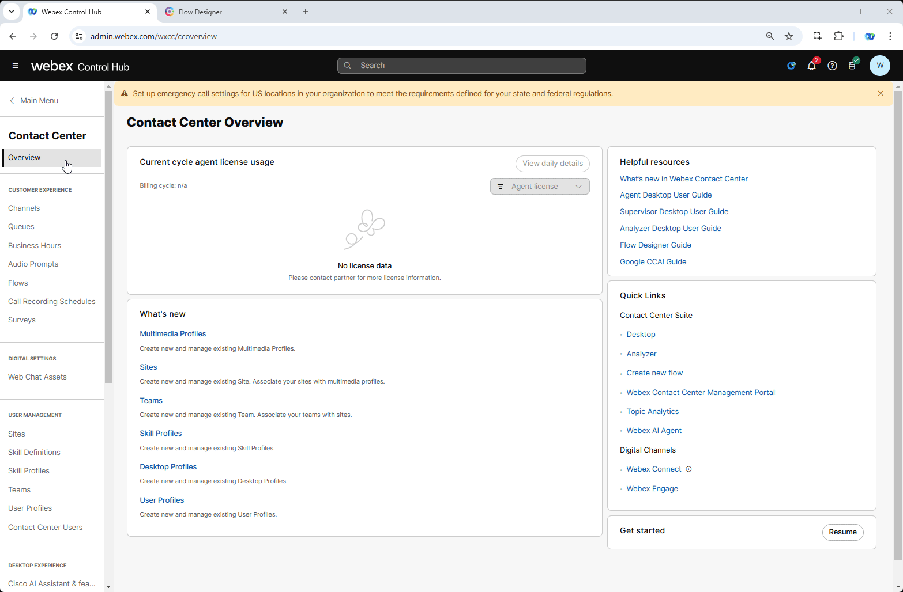
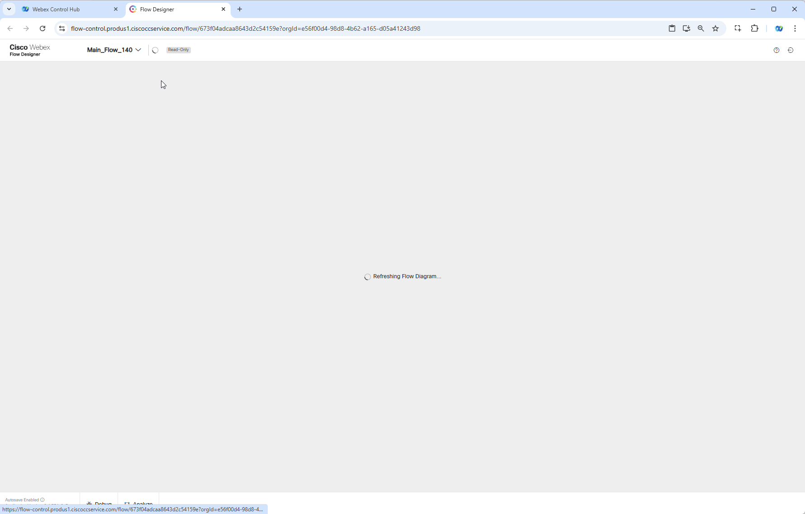
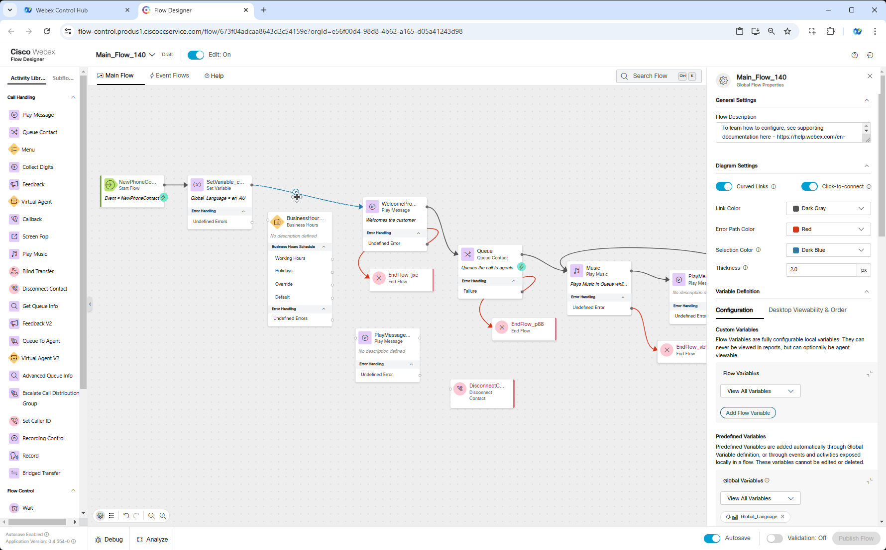
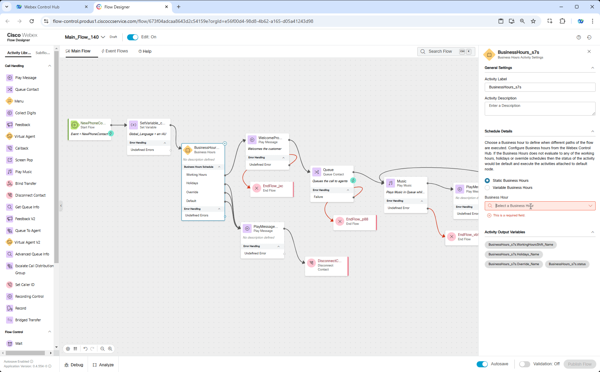
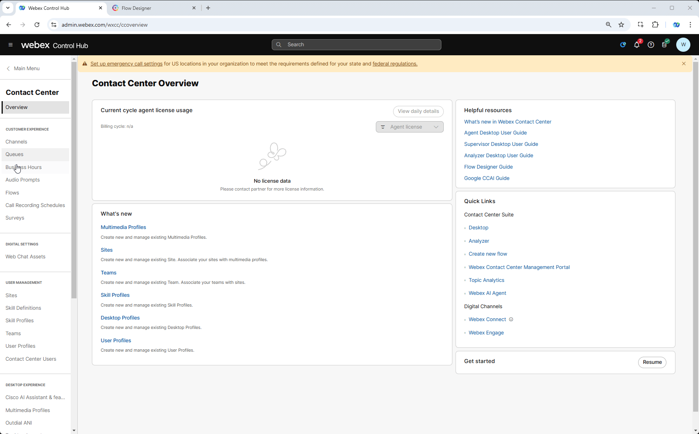
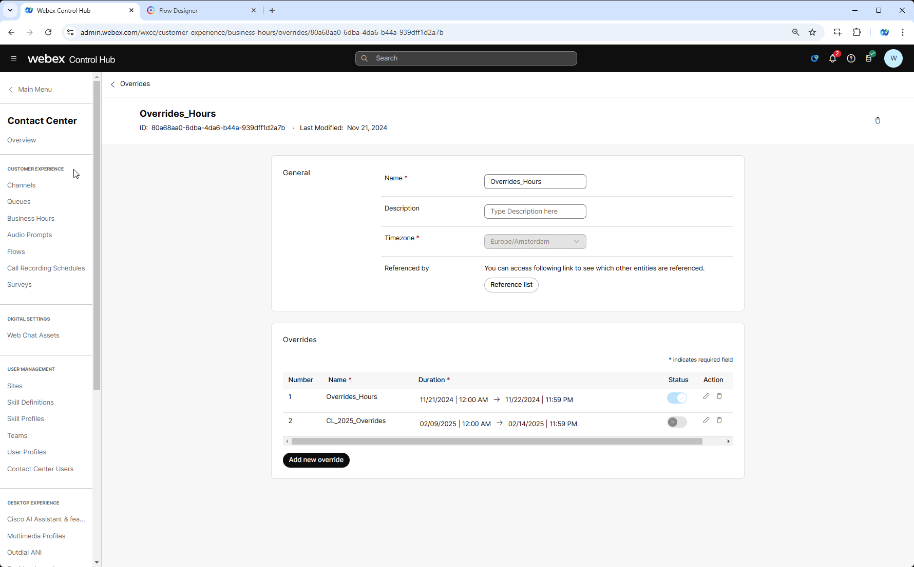

## Story

Business Hours allows you to configure the operational hours of the contact center, offering an enhanced experience in routing strategy configuration and simplifying the routing flow for improved efficiency and customer satisfaction. 

## Call Flow Overview
 
1. A new call enters the flow.  
2. The flow determines the caller's language preference and plays a pre-configured Text-to-Speech (TTS) prompt.  
3. The flow determines whether it is currently within working hours and routes the call appropriately. 
4. The call is routed to the appropriate queue.  

## Mission Details

Your mission is to:

  - Continue to use same flow **Main_Flow_Your_Attendee_ID** we created in previous Mission.

  - Add Business Hours functionality **Your_Attendee_ID_Bussiness_Hours** to your flow. Business Hours entity has been configured for you and contains the following settings:
    
     -  **Working Hours** - Define the time during which the contact center will be operational. Each working hour configuration can include one or more shifts. Different schedules can be set for various time zones.
    
     - **Holidays** - Specify a day or range of days declared as holidays. The entire 24 hours of the selected day(s) are marked as non-operational.
    
     -  **Overrides** - Configure working hours for special cases, such as emergencies or occasions like Christmas, when the contact center operates for additional hours.

## Build

1. Switch to **Control Hub** and navigate to **Business Hours** under Customer Experience section. Locate your **Your_Attendee_ID_Bussiness_Hours**. You will see that currently only **Working Hours** are configured for every working day between 12:00 AM to 11:59 PM".

    

2. Switch to Flow Designer. Open your flow **Main_Flow_Your_Attendee_ID** and make sure **Edit** toggle is **ON**.
3. Drag and drop following nodes to the canvas:

    > - **Business Hours**
    >
    > - **Play Message**
    >
    > - **Disconnect Contact**

    

4. Connect **Set Variable** node to **Business Hours** and **Business Hours** node exits as follow:

    > - **Working Hours** connect to **WelcomePrompt** node
    >
    > - **Holidays**, **Overrides** and **Default** connect to new added **Play Message** node.
    >
    > - New added **Play Message** connect to **Disconnect** contact

    

5. Click on **Business Hours** node and select preconfigured Business Hours Entity **Your_Attendee_ID_Bussiness_Hours** .

6. Configure **Play Message** node as follows:

    > Enable Text-To-Speech
    >
    > Select the Connector: Cisco Cloud Text-to-Speech
    >
    > Click the Add Text-to-Speech Message button and paste text: ***It's not working hours currently. Please call later. Goodbye.***
    >
    > Delete the Selection for Audio File

7. Validate the flow by clicking **Validate**, **Publish** and select the Latest version of the flow
     
    !!! Note
        We haven't changed the flow behavior yet as Working hours covers the current time. You can make a call and accept it on agent desktop to verify.

    

   
8. We are going to use **Override** option to change the logic. Overrides as well as Business hours have been preconfigured for you. Now we need to apply it on your **Your_Attendee_ID_Bussiness_Hours** entity. Switch to Control Hub and open **Your_Attendee_ID_Bussiness_Hours** in **Control Hub**, scroll down to **Additional Settings** and select **Overrides_Hours** from Override dropdown list. Then click **Save**.

    !!! Note
        Override Hours entity was configured to overwrite Working Hours and set to duration of current Technical Summit. 

    

## Testing

1. Open your Webex App and dial the Support Number provided to you, which is configured in your **Your_Attendee_ID_Channel** configuration. Make sure you hear the message we set in ***Step 6***.

### Post Testing steps

1. **[IMPORTANT]** Now we need to revert the configuration we made in ***Step 8*** as we are going to use same flow in upcoming tasks. Open **Your_Attendee_ID_Bussiness_Hours** in **Control Hub**, scroll down to Additional Settings and select **None** from **Override** dropdown list. Then click **Save**.

      

2. Make one more call from Webex App to make sure you hear the original Welcome message you set on first steps of previous Mission.

**Congratulations on completing another mission.**
