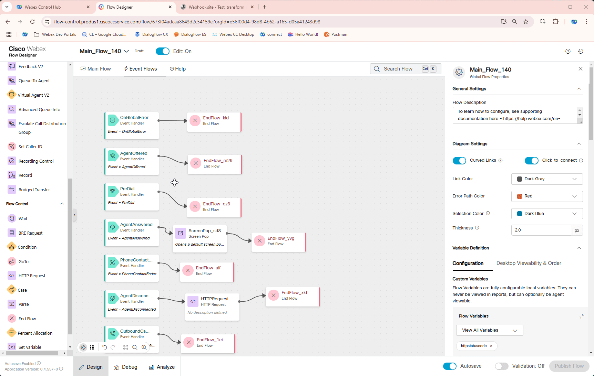

## Story

An Event Flow in Webex Contact Center is a workflow triggered by specific events in the customer interaction process, such as call arrival, agent assignment, call disconnection or actions within the IVR.

Event flows enable a wide range of scenarios, with one common use case being the ability to update an external database with data collected during a call—either from the IVR or through interaction with a live agent.


## Call Flow Overview

1. A new call enters the flow. </br>
2. The flow executes the logic configured in previous steps.</br>
3. When the agent answers the call, they receive a screen pop and can adjust call details on the interaction panel.</br>
4. The flow triggers an event when the agent disconnects from the call.</br>

## Mission Details

1. Continue to use same flow **Main_Flow_<span class="attendee-id-placeholder">Your_Attendee_ID</span>** </br>
2. Configure a screen pop in your flow.</br>
3. Configure an API call to trigger on the AgentDisconnect event.</br>

!!! Note
    In this mission, we’ll utilize **[Webhook.site](https://webhook.site/){:target="_blank"}**, a free online tool that generates a temporary, unique URL for capturing and inspecting HTTP requests. It’s widely used by developers and testers for debugging and testing webhooks or other HTTP-based APIs.

## Build

!!! Note
    The **Global Variable** with name **WhoIsCalling** that we are going to use in this mission has been already created. Switch to **Control Hub** and navigate to **Flows** under Customer Experience section. Select Global Variables on top and search for **WhoIsCalling** to observe it's configuration. You <span style="color: red;">**DO NOT**</span> need to modify it here.
             
1. Open you your **Main_Flow_<span class="attendee-id-placeholder">Your_Attendee_ID</span>** or refresh the Flow Designer page to make sure new created Global Variables are being populated. Make sure **Edit** toggle is **ON**

2. Add **WhoIsCalling**<span class="copy-static" title="Click to copy!" data-copy-text="WhoIsCalling"><span class="copy"></span></span> Global Variable to the flow.
    
    
    

3. Open New Browser tab and paste the following URL **[Webhook.site](https://webhook.site/){:target="_blank"}**. Then click on **Your unique URL** to make a copy of URL. 
**<span style="color: red;">DO NOT close this Tab</span>**

    
    
4. Go back to your flow and navigate to **Even Flows** tab, delete **EndFlow_xkf** node which is connected to **AgentDisconnect** 

5. Add **HTTPRequest** and **DisconnectContact** node in between these nodes.
      
    > 
    > Connect **AgentDisconnect** to **HTTPRequest** node
    >
    > Connect **HTTPRequest** to **DisconnectContact**
    > 

6. Modify **HTTPRequest** node settings:
    
    >
    > Use Authenticated Endpoint: **Off**
    >
    > Request URL: *<span style="color: red;">Paste your unique URL copied on Step 3 from https://webhook.site/</span>*.
    >
    > Method: **POST**
    >
    > Content Type: **Application/JSON**
    >
    > Request Body:  
    ```JSON
    {
    "DNIS": "{{NewPhoneContact.DNIS}}",
    "ANI": "{{NewPhoneContact.ANI}}",
    "InteractionId": "{{NewPhoneContact.InteractionId}}",
    "Language": "{{Global_Language}}",
    "WhoCalls": "{{WhoIsCalling}}"
    }
    ```

    !!! Note
        We are building a dictionary with values generated by flow, language we set in main lab and also WhoIsCalling value which will be provided by agent in agent desktop.
    
    
    
7. Modify **Screenpop** configuration in the same flow

    > Screen Pop URL: **[https://www.cisco.com/site/us/en/index.html](https://www.cisco.com/site/us/en/index.html){:target="_blank"}**<span class="copy-static" title="Click to copy!" data-copy-text="https://www.cisco.com/site/us/en/index.html"><span class="copy"></span></span>
    >
    > Screen Pop Desktop Label: **Cisco Official Web Site**<span class="copy-static" title="Click to copy!" data-copy-text="Cisco Official Web Site"><span class="copy"></span></span>
    >
    > Display Settings: **New browser tab**
  
    
    
8. Validate the flow by clicking **Validate**, **Publish** and select the Latest version of the flow
    
## Testing
    
1. Make sure you're logged into **Agent Desktop** as Agent **wxcclabs+agent_ID<span class="attendee-id-placeholder">Your_Attendee_ID</span>@gmail.com** and set status to **Available**.
2. Make a call to the Support Number and if success you should hear Welcome message and then accept the call by agent.
3. Upon accepting the call, a new browser tab will be opened with the Screen Pop URL configured in **Step 4**.
3. Switch back to the Agent Desktop. In agent interaction panel change **Who Is Calling?** to any text you like then click **Save** and End the call.
4. Switch to the **[Webhook.site](https://webhook.site/){:target="_blank"}** you should see the request which came right after Agent dropped the call with all the needed data 


## Post Testing Steps

We recommend removing the ScreenPop node after testing. Otherwise, every time you make a new call to the Main Flow, a pop-up will appear, which may be distracting.

1. Open your flow **<span class="attendee-id-container">Main_Flow_<span class="attendee-id-placeholder" data-prefix="Main_Flow_">Your_Attendee_ID</span><span class="copy" title="Click to copy!"></span></span>**. Make sure **Edit** toggle is **ON**.

2. Navigate to **Even Flows** and delete **Screenpop** and **End Flow** nodes.

3. Validate the flow by clicking **Validate**, **Publish** and select the Latest version of the flow.


**Congratulations on completing another mission where you have learnt how to use events in your flows.**
