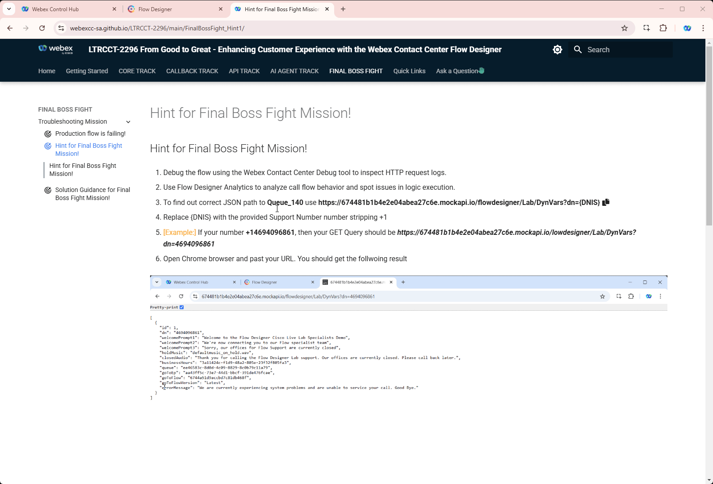
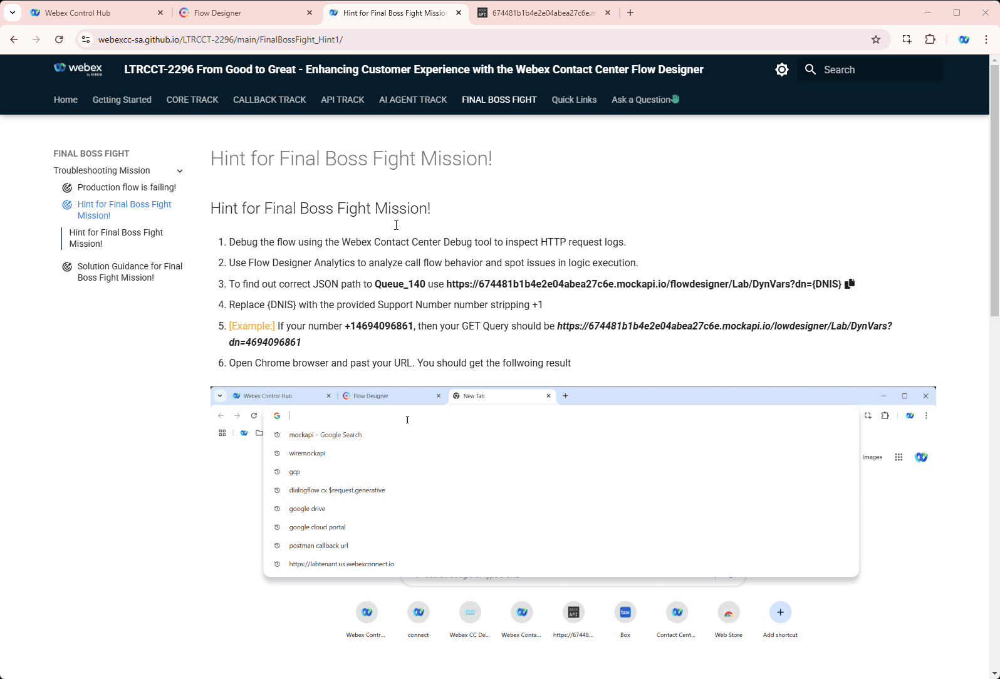

1. Debug the flow using the Webex Contact Center Debug tool to inspect HTTP request logs.

2. Use Flow Designer Analytics to analyze call flow behavior and spot issues in logic execution.

3. To find out correct JSON path to **BossQueue** use **https://674481b1b4e2e04abea27c6e.mockapi.io/flowdesigner/Lab/DynVars?dn={DNIS}**
    
  - Replace {DNIS} with the provided Support Number number stripping +1 
  - [Example:] If your number **+14694096861**, then your GET Query should be ***https://674481b1b4e2e04abea27c6e.mockapi.io/lowdesigner/Lab/DynVars?dn=4694096861*** 
  - Open Chrome browser and past your URL. You should get the follwoing result 
  - 
  - Test JSON Path in the following tool [https://jsonpath.com/](https://jsonpath.com/){:target="_blank"} 
  - Paste your GET URL into the Browser address line and copy the output in square brackets (including brackets) 
  - Open [https://jsonpath.com/](https://jsonpath.com/){:target="_blank"} and paste the copied response into **Inputs** window 
  - In **JSONPath** box copy and paste one of the path expression from **FetchFlowSettings** to verify your results. 
  - 

<script src='../template_assets/load.js'><script>