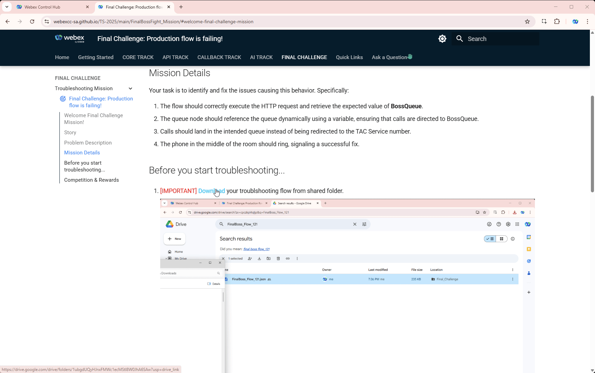
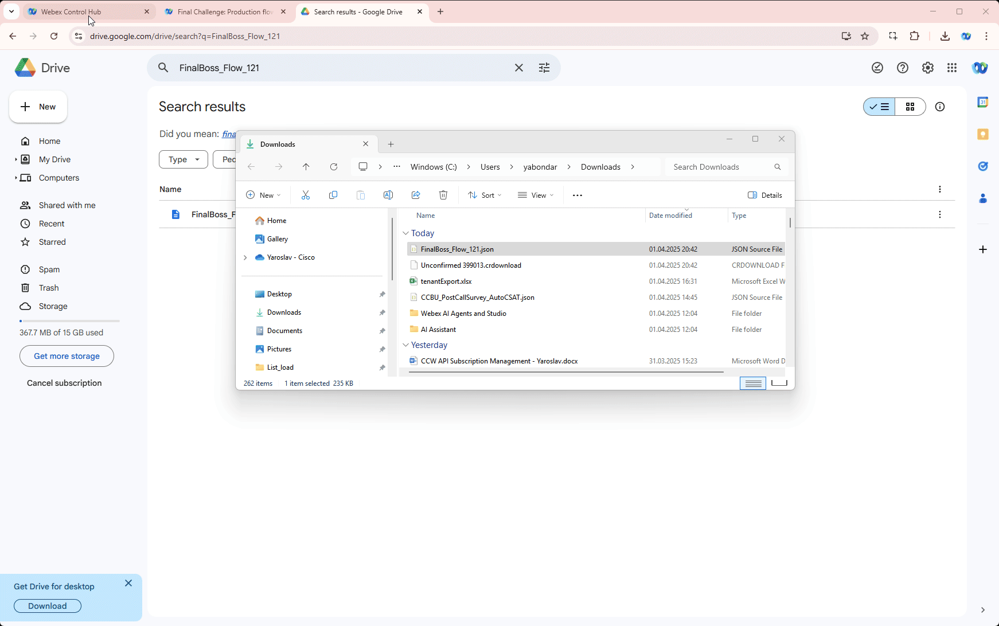
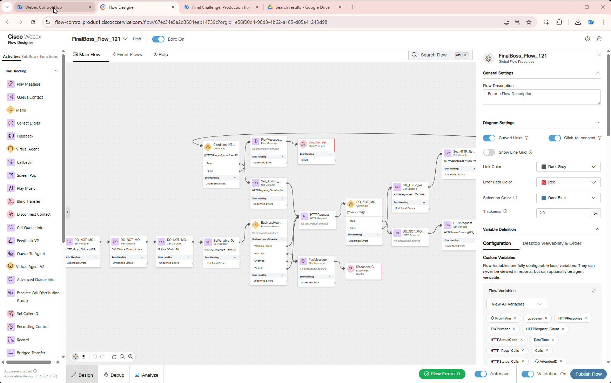

## Welcome Final Challenge Mission!

## Story
In this short troubleshooting task you're are going to play a technical engineer who got a request from end customer regarding broken production flow. You as an engineer must fix the reported issue before contact center opens in just 30 mins.  
So **NO PRESSURE HERE AT ALL!!!**

## Problem Description
A customer reports a critical issue with their call flow: callers cannot land in the queue and are being redirected to the TAC Service number, which is not an intended outcome. Initially, the problem seemed to be related to the queue configuration, but after the customer attempted some adjustments, the situation worsened. Now, callers cannot even reach the queue node, and it seems like the HTTP request has been broken completely.

## Mission Details
Your task is to identify and fix the issues causing this behavior. Specifically:

1. The flow should correctly execute the HTTP request and retrieve the expected value of **BossQueue**. 
2. The queue node should reference the queue dynamically using a variable, ensuring that calls are directed to BossQueue. 
3. Calls should land in the intended queue. 
4. The phone in the middle of the room should ring, signaling a successful fix. 

## Before you start troubleshooting...

1. [IMPORTANT] [Download](https://drive.google.com/drive/folders/1ubgdUQyHJnxFMWc1ecMStl8W0JhA6SAw?usp=drive_link){:target="_blank"} your troubleshooting flow from shared folder.

2. In **Search in Drive** line search for **FinalBoss_Flow_Your_Attendee_ID**. Then download the file to your local drive.

     

3. Switch to **Control Hub** and navigate to **Flows**. Click on **Manage Flows**, then select **Import Flows**.

4. Click on **Choose a file**, then navigate to the folder where you saved your **FinalBoss_Flow_Your_Attendee_ID**. Select the file and click **Open**

5. Click **Import**. This step will create your personal troubleshooting flow.

6. Switch **Edit** from  **Off** to **On**. Switch **Validation** from  **Off** to **On**. Then **Publish** your flow.

     

7. Assign **FinalBoss_Flow_Your_Attendee_ID** to your **Your_Attendee_ID_Channel**.

     

8. Open the **FinalBoss_Flow_Your_Attendee_ID** and you're ready to start troubleshooting.

## Competition & Rewards
A real IP phone is placed in the middle of the room, and an agent logs into Webex Desktop using that phone as the telephony option. Once the call flow is successfully fixed, the phone will ring, and the agent will accept the call. 
The first 2 participants to successfully make the phone ring—**WITHOUT CHEATING** and by following the rules explained previously—will win a prize. This encourages fast and accurate troubleshooting, making the exercise more engaging and competitive.

---

This exercise will help attendees practice debugging and resolving common Webex Contact Center API integration issues. Ensure they document their troubleshooting steps to reinforce learning.
<script src='../template_assets/load.js'><script>