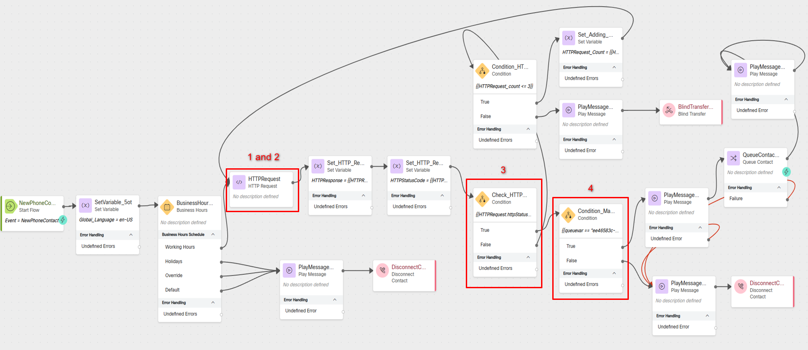

1. **Missing GET URL**: Ensure the **HTTPrequest** node is configured as unauthenticated and has URL configured ***https://674481b1b4e2e04abea27c6e.mockapi.io/flowdesigner/Lab/DynVars?dn={{NewPhoneContact.DNIS | slice(2) }}***

2. **Wrong Parsing**: Ensure **HTTPRequest** has the following **Parse Settings**
    
    >
    > - Content Type: **JSON**
    >
    > - Output Variable: `queuevar`
    >
    > - Path Expression: `$[0].bossqueue`

3. **Wrong condition**: Ensure **Check_HTTP_Status_Code** status check is looking for ***200***, not ***201***. Adjust the condition logic accordingly. 

4. **Queue ID verification**: In **Condition_MatchingQueue** `queuevar` must have a value of BossQueue **ID** in order to exit via **True** node edge.

      

<script src='../template_assets/load.js'><script>