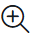
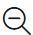
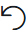

## Canvas, Main Flow, and Event Flows

The Canvas is the gray working space on which you drop the activities. Use the controls in the bottom left side of the screen to move around the canvas and zoom in and zoom out. There are no constraints on the flow size or canvas usage.

Flow Designer has two tabs that allow extra canvas space:
  - Main Flow
  - Event Flows

These tabs logically separate different paths of your flow and create a more organized workspace.

### Main Flow

Use the Main Flow tab to script the primary flow based on the Trigger Event defined in the Start Flow activity. In the Main Flow tab, configure the end-to-end experience for a caller, starting from the Cisco Unified IP Interactive Voice Response (IVR) menu, until opting out or wrapping up the call. The flow contains predictable steps that the system executes in a sequence.

### Event Flows

At any point during the execution of the Main Flow, the system triggers events that interrupt the Main Flow. For example, when an agent answers a phone call, the caller’s experience in the queue is interrupted. If you want to define unique behavior when these events are triggered, you can script optional Event Flows. Event Flows are asynchronous to the Main Flow. You can’t predict if or when an Event Flow will be triggered. For this reason, Event Flows are optional and are intended to extend the Main Flow functionality.

!!! Note
    You can configure multiple event handling flows in the Event Flows canvas. Each event flow must have a unique start and end, with no shared activities.

### Zoom Toolbar

The zoom toolbar in Flow Designer has **Global Properties**, zoom-in, and zoom-out buttons to display the Global Properties pane, and minimize or maximize the contents in the canvas.

  - **Global Properties**: Click the  icon to open the Global Properties pane.
  
  - **Zoom-in**: Click the icon  on the toolbar. When you reach the maximum limit, the button is disabled.

  - **Zoom-out**: Click the icon on the toolbar. When you reach the maximum limit, the button is disabled.

  - **Fit to View**: Click the icon  in the toolbar to adjust the canvas view so the entire flow is visible.

  - **Copy and paste activities**: Click the icon  on the toolbar to copy and paste selected activities on the canvas.

  - **Undo**: Click the icon  on the toolbar to undo the last performed action.

  - **Redo**: Click the icon  on the toolbar to redo the last performed action.

  - **Arrange All**: Click the icon   on the toolbar to organize all the activities in the flowdesigner canvas.

### Canvas control actions and shortcut keys

To enhance the efficiency and productivity of flow developers, the Flow Designer canvas provides the following options:

  - **Undo-redo actions**: To undo and redo up to last 10 actions. Use the undo, redo buttons in thezoom toolbar or right-click on the canvas for the context menu.
  
  - **Cut, copy, and paste**: To cut, copy, and paste activites and links within and across flows, event flows, and subflows.
  
  - **Auto arrange**: To automatically organize all activities in the canvas for better understaning and easy maintenance.
  
  - **Display gridlines**: To change the background of the canvas from dot grid to line grid and vice-eversa.
  
  - **Snap to grid**: To align the activity to the grid line.
  
  - **Keyboard shortcuts**: To edit quickly using keyboard shortcuts. Click the help icon. Choose **Keyboard shortcuts** to view the list of available keyboard shortcuts.

### Keyboard Shortcuts

The Flow Designer canvas provides the following keyboard shortcuts:

| **Shortcut Key** 			| **Description**		|
| :-------------------------| :---------------------|
| **General**               | 						|
| Open Keyboard Shortcuts 	| Ctrl + Alt + K		|
| **Tools**                 |                       |
| H 						| Hand tool				|
| Shift + A 				| Auto arrange			|
| **Edit**                  | 						|
| Ctrl + C 					| Copy					|
| Ctrl + X 					| Cut					|
| Ctrl + V 					| Paste					|
| Ctrl + Z 					| Undo					|
| Ctrl + Shift + Z 			| Redo					|
| Backspace					| Delete				|
| Ctrl + A 					| Select All			|
| **View**                  | 						|
| Ctrl + + 					| Zoom in				|
| Ctrl + - 					| Zoom out				|
| Ctrl + Scroll 			| Zoom in or out		|
| Shift + Scroll 			| Scroll left or right	|
| Shift + 1 				| Fit to view			|