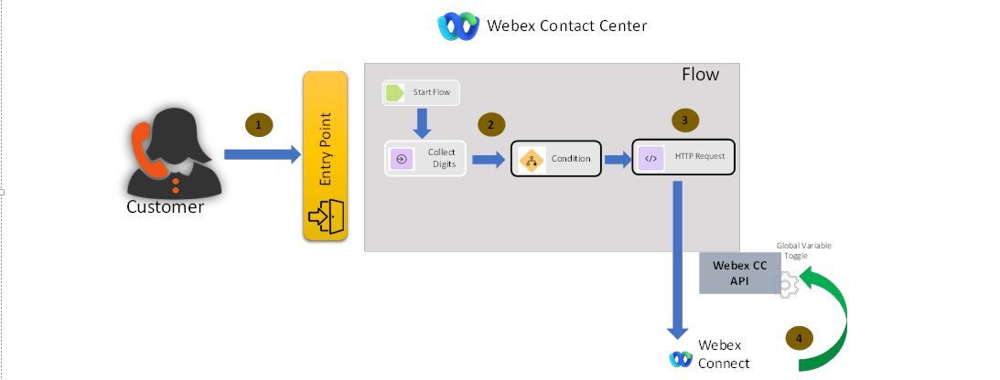
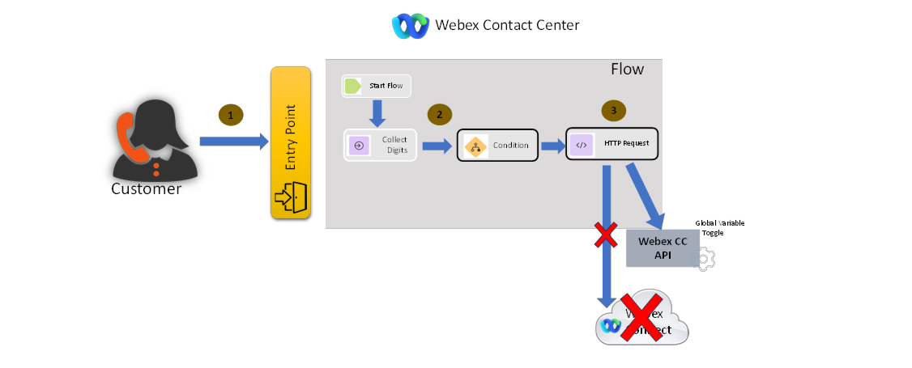

Previously, it was not possible to make calls directly from a Flow to the WxCC API Gateway. Instead, a third-party application, such as WxConnect, was required to make an API call back to the WxCC API Gateway. The third-party application utilized the HTTP POST method to communicate with the WxCC API Gateway.
Now, this functionality is directly supported within the Flow, allowing API calls to be made to the WxCC API Gateway without the need for an intermediary application. This simplifies the configuration process and eliminates an additional potential point of failure.

### How it was

   

### How it is now

   
---
